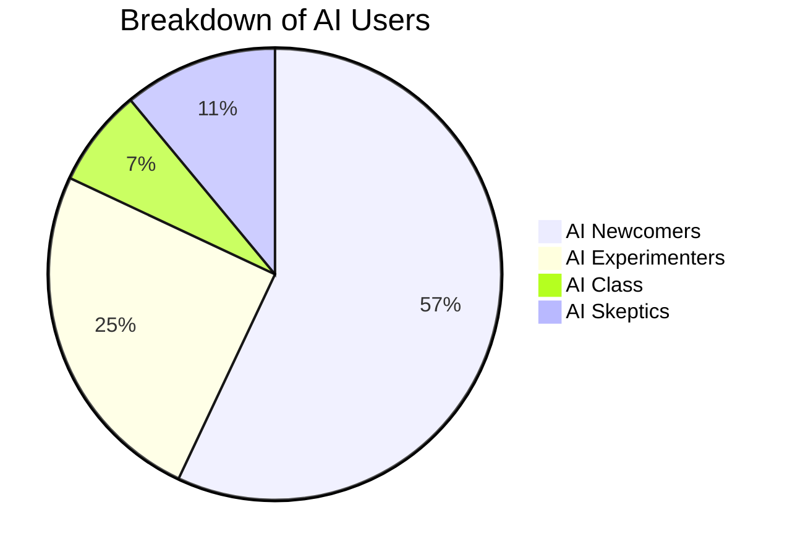
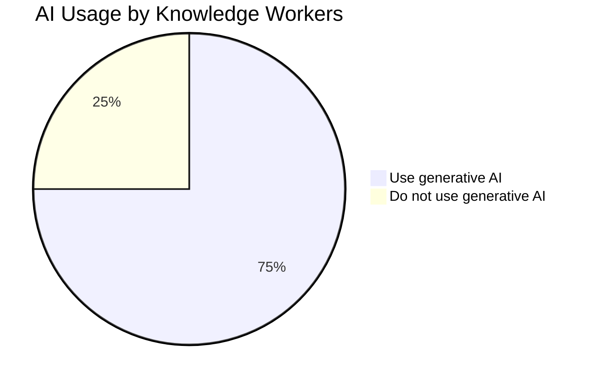

# AI Knowledge Bank: A Comprehensive Overview

## Table of Contents

1. [AI Proficiency Report](#ai-proficiency-report)
2. [AI Data Privacy](#ai-data-privacy)
3. [Where's the Value in AI?](#wheres-the-value-in-ai)
4. [Streamlining AI in Business](#streamlining-ai-in-business)
5. [AI Strategy and Education](#ai-strategy-and-education)
6. [90-Day AI Integration Plans](#90-day-ai-integration-plans)
7. [Five Phases of AI Adoption](#five-phases-of-ai-adoption)
8. [SHINE AI Evaluation Framework](#shine-ai-evaluation-framework)
9. [AI Manifesto Template](#ai-manifesto-template)
10. [AI Deep Dive for Business](#ai-deep-dive-for-business)

---

## AI Proficiency Report

### Key Insights

- The emergence of an "AI Class" (7% of the workforce) actively leveraging AI for productivity.
- 60% of professionals are AI Newcomers, with minimal integration of AI in workflows.
- AI Class users save up to 12 hours per week through AI adoption.

### AI Adoption Breakdown

### Read More
The AI Class is a small but growing segment of the workforce that uses AI daily to enhance productivity. These individuals have mastered prompting techniques, primarily using tools like ChatGPT-4, Perplexity, and Claude. Organizations that invest in AI training and provide access to AI tools see a significant increase in efficiency. AI Experimenters and Newcomers, while not fully integrating AI, benefit from limited exposure. Companies should focus on structured AI training programs to transition employees into higher proficiency levels.

---

## AI Data Privacy

### Challenges

- Data privacy and IP concerns with AI usage.
- AI hallucinations can mislead organizations.
- Bias in AI models remains a critical issue.

### Enterprise AI Data Privacy Strategies

| Approach           | Description                                        |
| ------------------ | -------------------------------------------------- |
| Closed AI Instance | AI does not use inputs for training models.        |
| AI Policy          | Defines approved AI usage and data-sharing limits. |
| Enterprise Buyout  | Companies purchase private AI models.              |

### Read More
Many organizations struggle with AI privacy concerns, including data leakage, unauthorized access, and intellectual property misuse. Enterprise AI solutions offer enhanced security through private instances, strict policies, and controlled access. Businesses can also implement anonymization techniques to protect sensitive data. A well-documented AI policy ensures compliance with regulations like GDPR and CCPA while maintaining operational security.

---

## Where's the Value in AI?

### AI Value Creation by Sector

- **Financial Institutions:** $1B in productivity gains by 2030.
- **Biopharma:** AI-driven cost reductions worth $1B by 2027.
- **Automotive:** 2% cost reduction in manufacturing.

### Read More
Organizations that effectively implement AI see increased revenue, reduced operational costs, and improved decision-making. The key to AI-driven success is a strong digital foundation, strategic investments, and a focus on AI integration within core business processes. Leaders in AI adoption report 50% higher revenue growth and 60% higher shareholder returns compared to their peers. The most value is extracted when AI is embedded across operations, sales, R&D, and customer service.

---

## Streamlining AI in Business

### Steps for Effective AI Integration

1. Identify business challenges and define AI use cases.
2. Develop a structured AI framework (Who, What, When, Where, Why).
3. Train employees and engage stakeholders.
4. Focus on data governance and AI security policies.

### Read More
A structured AI strategy ensures smooth adoption and minimizes resistance. By mapping AI capabilities to business needs, companies can prioritize the highest-impact initiatives. Regular training, stakeholder engagement, and robust governance frameworks help sustain AI-driven transformation. AI should be tested in pilot projects before scaling across the organization.

---

## AI Strategy and Education

### Key Areas of Focus

- **Empowering Families & Educators:** AI literacy in early education.
- **Reskilling Workforce:** AI training programs for all employees.
- **Business Optimization:** AI-driven automation and decision-making.

### Read More
Education and workforce training are critical for AI adoption. Schools and universities must integrate AI into curricula, while businesses should provide hands-on training for employees. AI literacy enables informed decision-making and ethical usage, ensuring that professionals can navigate an AI-driven workplace effectively.

---

## 90-Day AI Integration Plans

### Implementation Phases

| Phase         | Key Activities                                   |
| ------------- | ------------------------------------------------ |
| First 30 Days | Survey AI readiness, create AI tool inventory.   |
| First 60 Days | Launch pilot programs, monitor metrics.          |
| First 90 Days | Scale successful AI solutions, refine workflows. |

### Read More
AI adoption plans should be structured into phases. The first 30 days focus on assessing readiness and setting objectives. The next phase involves piloting AI tools in key departments. By the 90-day mark, organizations should have enough insights to scale successful implementations and refine best practices.

---

## Five Phases of AI Adoption

### Read More
Organizations and schools adopt AI in phases, from initial exploration to full-scale integration. The maturity model ensures a structured approach, reducing risks associated with unregulated AI adoption. Companies that reach the AI Leadership phase benefit from continuous innovation and competitive advantages.

---

## SHINE AI Evaluation Framework

### Read More
SHINE evaluates AI tools based on suitability, oversight, data transparency, necessity, and ethics. Organizations should use this framework before adopting new AI solutions to ensure alignment with business goals and compliance requirements.

---

## AI Manifesto Template

### Read More
An AI manifesto helps organizations define AI’s role in their operations. It sets clear guidelines on responsible AI usage, ethical considerations, and employee training expectations. Companies should revisit their AI policies regularly to adapt to evolving technologies.

---

## AI Deep Dive for Business

### Read More
Understanding AI at different levels enables businesses to scale AI usage effectively. Prompt engineering helps optimize AI responses, while API integrations enable automation. Fine-tuning models ensures AI aligns with industry-specific needs. Some enterprises may even develop their own AI models for proprietary advantages.

---

## Conclusion
This document serves as a roadmap for understanding AI's impact across industries, from proficiency reports to AI privacy, business strategies, and integration frameworks. Organizations can use these insights to navigate their AI adoption journey and maximize AI-driven value.

# BCG Where's the Value in AI?
Where’s the Value
in AI?
October 2024
By Nicolas de Bellefonds, Tauseef Charanya, Marc Roman Franke, Jessica Apotheker,
Patrick Forth, Michael Grebe, Amanda Luther, Romain de Laubier, Vladimir Lukic,
Mary Martin, Clemens Nopp, and Joe Sassine

Contents
01
Who’s Getting Results from AI
and Why?
• A Steep Curve
• What Leaders Do Differently
• Incumbents Reap Value
05
The Surprising Sources of Value
from AI
• In the Core
• Sector Matters
13
The Playbook for Winning
with AI
• Overcoming Tough Challenges
• The Capabilities Required for Success
• Jump-Starting Your Journey to AI Value
• How Two Companies Applied the
Playbook for Success
17
Appendix
20
Acknowledgments

BOSTON CONSULTING GROUP
1
Who’s Getting Results from AI
and Why?
A
fter all the hype over artificial intelligence (AI), the
value is hard to find. CEOs have authorized invest-
ments, hired talent, and launched pilots—but only
26% of companies have advanced beyond the proof-of-
concept stage to generate value. This report yields import-
ant insights into what AI leaders are doing to drive real
value from the technology, where others fall short, where
the value is coming from, how individual sectors are per-
forming, and how companies can change their own
AI trajectories.
Consider these examples of the value being created by AI,
including generative AI (GenAI), from companies in three
different sectors. A financial institution is committed to
achieving $1 billion in productivity improvements, in addi-
tion to enhanced risk outcomes and better client and
employee experiences, by 2030. A biopharma company is
chasing $1 billion in value potential (revenues and costs)
by 2027. A major automaker expects to cut its cost of
goods sold by up to 2% and accelerate new product devel-
opment time by 30%.

2
WHERE’S THE VALUE IN AI?
These results are typical of the value that leaders across
industries are achieving by building digital capabilities to a
level at which they can implement AI programs at scale.
BCG’s latest research into AI adoption, a continuation of
our studies into digital transformation and AI maturity,
found that of the 98% of companies that are at least exper-
imenting with AI, only 26% have developed the necessary
capabilities to move beyond proofs of concept and begin
extracting value. (For more on how we define AI and our
research methodology, see the Appendix.) And only 4% are
at the forefront of AI innovation, systematically building
cutting-edge AI capabilities and scaling them across the
organization.
Here’s our latest look at who the top 26% of companies are
and how they are generating superior value from AI. The
two chapters of the report that follow look at where com-
panies are extracting value and what you need to do to
move your company up the AI maturity curve.
A Steep Curve
Building AI capabilities is a complex challenge. Our latest
research, involving more than 1,000 companies worldwide,
shows that only 4% have developed cutting-edge AI capa-
bilities across functions and are using them to consistently
generate substantial value. (See Exhibit 1.) Another 22%
have an AI strategy and advanced capabilities and are
starting to generate value. We call these companies lead-
ers. The remaining 74% have yet to show tangible value
from their use of AI.
These categorical distinctions are important because lead-
ers far outperform the others. Over the past three years,
leaders’ revenue growth has been 50% greater than the
overall average. Their total shareholder returns are 60%
higher, and they gain 40% higher returns on invested capital.
These companies also excel on nonfinancial factors, such as
patents filed and employee satisfaction, and they are in pole
position to benefit as AI platforms and tools mature.
Exhibit 1 - Leaders Have Built the Capabilities Needed to Implement AI at
Scale, Reaping Diverse Benefits over Less Mature Companies
Source: BCG Build for the Future 2024 Global Study (merged with DAI).
Note: “Leaders” include AI future-built and AI scaling companies; “less mature” or “other” companies” include AI stagnating and AI emerging
companies. RoIC = return on invested capital; TSR = total shareholder return.
AI stagnating
25
49
22
4
AI emerging
AI scaling
AI future-built
Value achieved
Revenue
50%
higher revenue growth
(3-year average)
60%
higher 3-year TSR
40%
higher RoIC
(3-year average)
1.9x
more patents
1.4x
better overall
Glassdoor indicator
Total
shareholder
return
Returns
Innovation
Employee
satisfaction
0
Are taking minimal
or no AI action,
lack foundational
capabilities, and are
not generating value
Maturity stage (% of companies)
Have developed
foundational
capabilities and
started initial
experimentation
but are struggling
to scale and
generate value
Have developed an AI
strategy and advanced
capabilities, and are
scaling them effectively
while starting to
generate value
Are at the forefront
of AI innovation,
systematically
building cutting-edge
AI capabilities across
functions and
consistently
generating
substantial value
25
50
75
100

BOSTON CONSULTING GROUP
3
What Leaders Do Differently
Leaders have six differentiating characteristics.
They focus on the core business processes as well as
support functions. A common misconception is that AI’s
value lies mainly in streamlining operations and reducing
costs in support functions. In fact, its greatest value lies in
core business processes, where leaders are generating 62% of
the value. Leveraging AI in both core business and support
functions gives these companies competitive advantage.
They are more ambitious. Leaders’ expectations for
revenue growth from AI by 2027 are 60% higher than those
of other companies, and they expect to reduce costs by
almost 50% more. Three-quarters of the most forward-
looking companies focus on company-level innovation core
to the business. In contrast, only 10% of other companies
do so—and if they leverage AI at all, it is mainly for produc-
tivity. Leaders look beyond pure productivity plays and back
their ambitions with investment in AI and workforce en-
ablement, doubling down on several aspects of AI, relative
to their peers. (See Exhibit 2.) They make twice the invest-
ment in digital, twice the people allocation, and twice the
number of AI solutions scaled.
They invest strategically in a few high-priority oppor-
tunities to scale and maximize AI’s value. Data on AI
adoption shows that leaders pursue, on average, only
about half as many opportunities as their less advanced
peers. Leaders focus on the most promising initiatives,
and they expect more than twice the RoI in 2024 that other
companies do. In addition, leaders successfully scale
more than twice as many AI products and services across
their organizations.
They integrate AI in efforts both to lower costs and to
generate revenue. Almost 45% of leaders integrate AI in
their cost transformation efforts across functions (com-
pared with only 10% of nonleaders). And more than a third
of leaders focus on revenue generation from AI, compared
with only a quarter of other companies. (See Exhibit 3.)
“We have a program under which every business unit is
required to submit three to five projects each year—and
since 2020, they have all had to focus on AI,” said the
enterprise product director of an alternative energy compa-
ny. “These projects need to demonstrate how they would
improve the company either through cost savings, in-
creased operational efficiency, or revenue generation.”
Exhibit 2 - Compared with Their Peers, Leaders Are Allocating More of Their
Budget and Resources to Digital and AI Capabilities in 2024
Source: BCG Build for the Future 2024 Global Study (merged with DAI).
Note: FTEs = full-time equivalent employees.
2.0x
2.2x
Budget
AI stagnating or AI emerging
AI scaling or AI future-built
Revenue share
invested in
digital and AI
2024 increase
in AI/GenAI
investments
vs 2023
Share of FTEs
dedicated to
digital and
AI work
Share of digital
FTEs dedicated
to AI/GenAI
roles today
Share of FTEs
to be upskilled
in AI/GenAI
Time to market
for new digital
and AI products
Share of AI/GenAI
products scaled
across the
organization
5.0%
10.1%
2.0x
4.6%
9.1%
1.9x
5.1%
9.6%
1.6x
8.9%
13.8%
8.2%
18.2%
1.1x
6.3
months
5.5
months
1.6x
12.3%
19.2%
People
Innovation

4
WHERE’S THE VALUE IN AI?
They direct their efforts more toward people and
processes than toward technology and algorithms.
Leaders follow the rule of putting 10% of their resources
into algorithms, 20% into technology and data, and 70%
into people and processes, which our data shows are the
key capabilities underpinning success.
They have moved quickly to focus on GenAI. Leaders
use both predictive AI and GenAI, and they are faster in
adopting GenAI, which opens opportunities in content
creation, qualitative reasoning, and connecting other tools
and platforms—in part because their more advanced
capabilities facilitate putting the prerequisites (such as
large language models) in place.
Incumbents Reap Value
Not all AI leaders are hyperscalers and digital natives, com-
panies that include AI as part of their product or services
offering. More than half of the top-performing 26%, includ-
ing the ones described at the beginning of this chapter, are
traditional incumbents that have strengthened their capa-
bilities and are using them to build differentiated competi-
tive advantage. The sectors with the biggest percentages of
AI leaders tend to be those that were among the first to
experience digital disruption a decade and half ago and got
the earliest start on building digital capabilities. They
include fintech (49% are leaders), software (46%), and
banking (35%).
But AI’s impact extends to all industries. For example, a
leading automaker used GenAI to accelerate tender docu-
ment drafting and adjustments by 50% while improving
document quality and consistency. GenAI also increased
the automaker’s speed in analyzing competing offers (by
50%) and reduced the time necessary to search knowledge
assets (by 50% to 75%).
Leaders are blazing the AI trail, but other companies can
catch up if they take a page from the leaders’ playbook and
focus on the areas that offer them the best opportunities
and on the capabilities they need to build in order to capi-
talize. We explore these factors in the next two chapters.
Exhibit 3 - Leaders Integrate AI with Broader Cost Transformation Efforts
and Have a Greater Focus on Revenue
Integration of AI with broader cost transformation efforts (%)
AI stagnating
AI emerging
AI leaders
AI stagnating
AI emerging
AI leaders
AI investment split between cost reduction and revenue growth (%)
47
52
44
27
21
20
26
27
36
53
30
17
More AI
integration
Greater
revenue
focus
43
4
55
40
15
43
Without GenAI
Exploratory
Multiple functions
Revenue
Equal
Cost
Source: BCG Build for the Future 2024 Global Study (merged with DAI).

BOSTON CONSULTING GROUP
5
L
eading companies are dreaming big. By 2027, the top
26% of companies in our survey of AI maturity expect
to achieve 45% more value via cost reduction and 60%
more value via revenue growth than other firms. Even in
2024, leaders expect to realize more than twice the RoI
from AI initiatives than other companies do, resulting in a
5% reduction in addressable operational expenses and a
5% increase in addressable revenues.
The common narrative for AI involves support functions—
HR, IT, legal, and the like—where automating relatively
low-level and repetitive functions creates significant value.
But the companies that are generating the most value are
not only deploying productivity plays in support functions
but also focusing on reshaping their core business process-
es and inventing new revenue streams. They are achieving
results from AI across a wide range of functions, from R&D
to operations and from sales and marketing to customer
service. Because they have built the necessary capabilities,
they can more readily identify, pilot, and scale up value-
creating use cases. For example, one chemicals company
expects to create more than $500 million in value from an
end-to-end transformation that will implement AI across
operations, site services, and procurement.
The Surprising Sources of Value
from AI

6
WHERE’S THE VALUE IN AI?
In the Core
Overall, the companies in our survey derive 62% of the
value they obtain from AI and generative AI in core busi-
ness functions, including operations (23%), sales and
marketing (20%), and R&D (13%). Support functions gener-
ate 38% of the value, with customer service (12%), IT (7%,)
and procurement (7%) leading the way.
In some sectors the spread between core and support is even
wider. (See Exhibit 4.) Software, media, fintech, insurance,
telecommunications, and biopharma generate 70% to 90% of
their AI-related value in core business processes. Although we
found wide variation among sectors, the overall results are
consistent—even most of the sectors in the bottom quartile
generate 40% to 60% of AI value in core processes.
Sector Matters
Companies in different sectors also benefit from identify-
ing the domains in which AI can produce the most value.
Our research shows that they vary widely by industry. (See
“AI in Insurance and Biopharma.”)
Sales and marketing, for example, is fast emerging as a
major source of AI value in such sectors as software (31%
of AI value generated), travel and tourism (31%), media
(26%), and telecommunications (25%). Specific roles and
the scale of impact differ by industry, but AI offers compa-
nies a near-term opportunity to reshape the sales function
with next-best action recommendations, talk tracks, and
basic workflow automation. In the medium term, AI and
GenAI will enable real-time assisted selling and autono-
mous selling via digital sales avatars, with limited human
involvement. Such automation will permit human staff to
focus on strategic and relationship selling, while virtual
assistants cover more transactional tasks. As predictive
smart selling becomes the norm, traditional silos dividing
marketing, sales, and pricing will dissolve. Our experience
indicates that resulting increases in customer lifetime
value and go-to-market efficiencies could almost double
profit margins.
Exhibit 4 - To Realize Value from AI, Companies Focus on Core Business
Processes, with Sector-Specific Variability
Source: BCG Build for the Future 2024 Global Study (merged with DAI).
Core business function
Support function
Where companies are achieving or see business value
Sectors
Software
Core business processes (%)
Global average: 62%
Support functions (%)
Media
Fintech
Insurance
Telecommunications
Biopharma
Banking
Airlines
Retail
Automotive
Transport and logistics
Medtech
Consumer products
Oil and gas
Chemicals
Machines and automation
Power, utilities, and renewables
94
87
85
77
71
70
68
65
63
62
61
57
59
49
48
40
21
6
13
15
23
29
30
32
35
37
38
39
43
41
51
52
60
79

Leaders are not only deploying
productivity plays but reshaping
core business processes and
inventing new revenue streams.

8
WHERE’S THE VALUE IN AI?
The impact on marketing will be equally profound and will
encompass four key processes:
• Insight to Innovation. Automated data collection
and analysis will speed identification of market oppor-
tunities and increase marketers’ ability to develop new
product design.
• Concept to Creation. Workflows will accelerate asset
creation and feedback loops, seamlessly adapting, local-
izing, and disseminating content.
• Campaign Setup and Execution. Hyper-segmentation
and real-time execution that responds to trends and
feedback will speed campaign creation and automatical-
ly track progress against key objectives.
• Marketer Productivity. Marketers will spend less time
on time-consuming, repetitive, administrative tasks and
more time on strategic decision making.
For example, a leading North American telco is already
using AI to analyze call recordings to identify opportunities
for cost savings and higher customer satisfaction. The
company has reduced call center interaction time by 20%
and cut call transfers to live agents by 25%. AI-powered
chatbots now handle 30% of calls, and the telco expects to
reduce total costs in the relevant business unit by 25%.
Predictably, AI is having a big impact in R&D in research-
intensive sectors such as biopharma (27% of value creat-
ed), medtech (19%), and automotive (29%, in an industry
undergoing a major transition to software-driven vehicles).
A medtech company vice president told us, “Generative AI
has allowed us to generate images for training purposes
that mimic real diseases that humans can have. We start-
ed deep diving into generating thousands of images that
aren’t coming from patients but are being generated by the
generative model mimicking real-life cases. Our predictive
AI model improved accuracy by 4% to 5% because of this
generative AI approach.”
In the R&D function of the future, we expect individual-,
team-, and company-level changes to improve concept
R&D, product development and industrialization, and prod-
uct evolution. AI will accelerate and automate each step by
shortening iteration loops, democratizing access to exper-
tise across teams and organizations, fast-tracking explora-
tion of new concepts, simulating product designs, and
forecasting procurement orders, among other changes.
In one current instance, a global pharmaceuticals compa-
ny is using AI to accelerate its drug discovery capabilities.
The initial vision was to build, test, and validate an AI
prototype with chemists to quantify the value impact in the
discovery workflow. The company assessed the potential of
state-of-the-art models to find new preclinical candidates
faster, and then it built its own machine learning algorithm
to rapidly screen over 1 billion drug compounds and a
genetic algorithm to power a lead optimization pipeline for
molecular chemists. The project generated value of $100
million a year through faster launches, including a 25%
reduction in cycle time. The company expanded its library
of molecules by 100 times, increasing the visibility of novel
compounds to its researchers.
Customer service is already a significant source of AI-
generated value in insurance (24% of the value created)
and banking (18%). Companies are using AI to boost pro-
ductivity, reducing the need for multiskilled frontline teams
and redesigned agent journeys. We are seeing near-term
increases of 30% to 40% in productivity and a profit-and-
loss impact of 10% to 20% for the function.
Ambitions run much bigger. Leading companies expect to
realize long-term increases in productivity of up to 60%.
The impact of integrating AI into customer service process-
es will reverberate throughout the value chain. Customer
service functions will be able to preempt issues and
self-heal by fixing problems before customers detect them,
and they will enable customers to resolve their own issues
through self-help. If the customer still needs human assis-
tance, AI will support the agent’s response with augmented
capabilities such as optimizing the conversation in real-
time by considering the customer’s needs in context and
making offers where relevant.
A leading international bank needed to modernize its
customer management system to improve service quality,
reduce operational costs, and enhance revenue generation.
It turned to GenAI to reshape both customer interactions
and backend processes, including deploying GenAI for chat
support, enhancing agent efficiency, improving service
quality, and increasing conversion rates. It also integrated
GenAI into its APIs and apps for smooth and scalable opera-
tions. Results included a reduction of almost 20% in interac-
tion time between customers and agents; a drop of 4 min-
utes in average service time while retaining similar levels of
customer satisfaction, an increase of 28 points in conversion
rates, and a doubling in breadth of products sold.

BOSTON CONSULTING GROUP
9
Consumer products and retail companies are making big
gains with AI-driven personalization (19% of the value
created for the former and 22% for the latter). About 30%
of consumer companies in our survey have adopted AI for
personalized marketing (among other functions) and are
seeing productivity gains of about 30% from such activities
as marketing content generation, marketing mix and RoI
optimization, and data-driven digital marketing. As a re-
sult, leaders are doubling down in other areas at two to
four times the rate of slower movers, applying AI to genera-
tive product design, and manufacturing optimization.
Within each process or function, it’s critical to define spe-
cific use cases and associated business value. In most
sectors, more than half of GenAI’s value potential lies in
two or three functional domains. In insurance, 55% of the
value lies in in policy administration, underwriting, and
claims management. In biopharma, 57% of the value is
found in R&D and in sales and marketing.
The critical challenge for companies is to identify the key
use cases within each function. For example, 43% of insur-
ance companies leverage AI in scoring, fraud assessment,
and triage while 42% of biopharma companies use AI in
systematic protein and drug molecule generation (at least
for pilots and proofs of concept). The highest value use
cases typically involve a mix of predictive AI and GenAI.
A
lthough companies in each sector may be generating
the greatest value from use cases in one or two do-
mains, most are still experimenting—and obtaining mea-
surable results in up to half a dozen domains in the core
business, including customer relations and experience,
content production and management, and product man-
agement. In more than a few sectors—including oil and
gas, utilities, and machinery and automation—support
functions are a significant source sources of value, too.
There are many routes to value. Chapter 3 explores how
your company can efficiently find its most productive paths.

10
PUBLICATION TITLE
At the business process, function, and use-case level, value
creation from AI is already taking different directions in
different sectors, highlighting the importance to each com-
pany of independently identifying where its best opportuni-
ties lie. Consider the evidence that our survey gathered in
two very different sectors: insurance and biopharma.
The average AI maturity of both sectors falls in the middle
of the maturity curve, not far off the all-sector average.
Companies in both sectors generate an average of 70% or
more of AI value from core business processes and 30% or
less from support functions. But the similarities end there.
Insurance
Insurers are focusing on operations (policy administration,
underwriting, and claims management), customer service,
and marketing and sales. (See the AI factsheet for insur-
ance.) So far, the widest adoption of predictive AI at the
individual-opportunity level has occurred in the areas of
scoring, fraud assessment, and triage and policy automa-
tion. Adoption of GenAI is strongest in the use of chatbots
to resolve questions and summarize customer interactions.
In line with their overall scores, insurers’ biggest challenges
involve people and processes: improving staff AI literacy,
prioritizing opportunities over other concerns, and estab-
lishing RoI for identified opportunities. They also wrestle
with the tasks of integrating AI with existing IT systems
and of increasing the accuracy and reliability of AI models.
An Asian life and health insurance company with a strong
track record in digital transformation sought to demon-
strate the benefits that GenAI could have on its operations
by identifying and executing a couple of high-impact, high-
use cases. The insurer prioritized the possibilities on the
basis of a high-level analysis of potential impact. It select-
ed two opportunities, one in customer-service call center
operations and the other in sales and marketing. The
former achieved a 30% reduction in call center search
times and the latter a 30% to 40% reduction in marketing
and sales material creation time.
AI in Insurance and Biopharma

BOSTON CONSULTING GROUP
11
Biopharma
Biopharma tells a different story. More than half of the
value in this sector comes from commercial/sales and
marketing (30%), and R&D (27%). Biopharma companies
are using GenAI for systematic protein, drug, and biological
processes generation, real-time hyperpersonalized engage-
ment with health care practitioners, and personalized
outreach to patients and providers. They are using AI and
GenAI together for analyzing and documenting customer
interactions and for targeting patient identification via
biological data. (See the AI factsheet for biopharma.)
Once again, the biggest challenges in applying the technol-
ogy relate to people and processes: prioritizing opportuni-
ties over other concerns, advancing staff AI literacy, acquir-
ing available talent and skills, and establishing RoI on
identified opportunities. The top algorithm and technology
issues involve integrating AI with existing IT systems, and
maximizing the accuracy and reliability of models.
AI Factsheet for Insurance
Key challenges
Respondents citing the challenge (%)
Where does insurance stand on the AI maturity curve?
Main challenges
Top challenges across people and processes, technology, and algorithms
Maturity stage (% of companies)
Global average
Insurance average
Insurance companies have emerging AI capabilities slightly ahead
of the global average
Where are the value pools in my sector?
Distribution of AI value potential along functional domains (%)
AI stagnating
9
AI emerging
64
AI scaling
25
AI future-built
2
Lack of accurate/reliable models
15
0
25
50
75
100
25
35
45
55
65
75
Lack of access to high-quality data
Difficulty integrating with existing IT systems
Difficulty ensuring security and compliance
IT budgets limiting investments in AI
Insufficient platform capabilities for
at-scale testing
Insufficient AI literacy
Difficulty prioritizing opportunities vs other concerns
Difficulty establishing RoI on identified opportunities
Difficulty reimagining workflows and processes
Lack of specialized AI engineers
Lack of available talent and skills
Difficulty measuring predetermined KPIs
Difficulty sequencing opportunities into
a roadmap
Weak governance structures to steer
responsible AI
Difficulty identifying short- and
long-term next steps
Focus areas
BCG’s 10-20-7
model
Algorithms
10%
Technology
20%
People and
processes
70%
Core business
functions
Customer service
and policy
administration 24
Underwriting
16
Claims
management
15
Product
management
9
Marketing,
sales,
distribution 13
77
Support
functions
23
HR
IT
Legal
Procurement
Finance
5
4
4
4
6
Source: BCG Build for the Future 2024 Global Study (merged with DAI).

12
WHERE’S THE VALUE IN AI?
AI Factsheet for Biopharma
Global average
Health care average
Biopharma average
Key challenges
Respondents citing the challenge (%)
Where does biopharma stand on the AI maturity curve?
Maturity stage (% of companies)
Biopharma companies have emerging AI capabilities on a
par with the global average
Where are the value pools in my sector?
Distribution of AI value potential along functional domains (%)
AI stagnating
27
AI emerging
46
AI scaling
19
AI future-built
8
Lack of accurate/reliable models
15
0
25
50
75
100
25
35
45
55
65
75
Lack of access to high-quality data
Difficulty integrating with existing IT systems
Difficulty ensuring security and
compliance
Insufficient platform capabilities for
at-scale testing
Difficulty prioritizing opportunities vs other concerns
Insufficient AI literacy
Lack of available talent and skills
Difficulty establishing RoI on identified opportunities
Lack of leadership alignment,
communications, and behavior modeling
Lack of specialized AI engineers
Difficulty making a business case for
scaling initiatives
Lack of a clear AI case for change
Difficulty identifying short- and
long-term next steps
Difficulty reimagining workflows
and implementing processes
Focus areas
BCG’s 10-20-7
model
Algorithms
10%
Technology
20%
People and
processes
70%
Core business
functions
Commercial/sales
and marketing
30
Manufacturing
13
Research and
development
27
70
Support
functions
30
Finance
IT
HR
Legal
6
Customer
service
7
7
4
3
3
Procurement
Main challenges
Top challenges across people and processes, technology, and algorithms
Source: BCG Build for the Future 2024 Global Study (merged with DAI).

BOSTON CONSULTING GROUP
13
L
eading companies are well on their way to creating
significant value and advantage from AI. For example,
a consumer products company applied GenAI to re-
duce costs by $300 million through productivity gains and
agency cost savings. A global consumer goods company
expects to generate $100 million in additional sales from a
GenAI-powered virtual conversational assistant, the first in
its sector. A North American telco achieved a 10% reduc-
tion in call handling time and cut the cost of customer
retention by more than 30%, leading to $200 million in
annualized savings.
Meanwhile, the 70% of companies that are struggling, wait-
ing, planning, and experimenting have an urgent need to
accelerate their efforts to overcome barriers and catch up as
their competitors improve their productivity, revenues, and
customer experience. As leaders and aspiring leaders ex-
pand their AI capabilities and as GenAI models and tools
mature, less capable companies will fall farther behind.
Here’s an AI playbook that all companies can follow.
The Playbook for Winning with AI

14
WHERE’S THE VALUE IN AI?
Overcoming Tough Challenges
Our survey highlights the most difficult challenges that
companies face in implementing AI initiatives. They fall
into four groups:
• Difficulties in defining clear priority use cases with com-
pelling returns for the anticipated investments
• A host of issues related to moving from plans to action
and delivering value, such as prioritizing investments,
scaling solutions across functions and businesses, over-
coming resistance to adoption, and realizing the benefits
• People and skills issues, including building specific AI
skills and broader AI literacy
• Integrating AI solutions with existing IT systems, and
enabling access to high-quality data
Our experience, corroborated by our new research, indi-
cates that about 70% of the challenges relate to people
and process, about 20% are technology issues, and only
10% involve AI algorithms (which often occupy a lot more
organizational time and resources). (See Exhibit 5.) The
survey confirms our long-held view that when companies
undertake digital or AI transformations, they need to focus
70% of their effort and resources on people-related capabil-
ities, 20% on technology, and 10% on algorithms. Too often,
companies make the mistake of prioritizing the technical
issues over the human ones—which helps explain why many
of them do not achieve the results they are looking for.
Challenges evolve over time, of course, as companies build
their capabilities. But while less AI-capable companies
focus on getting the basics right, leaders are more con-
cerned with ensuring security and compliance, implement-
ing responsible AI, and resolving technical issues such as
guardrails for large language models, high model latency,
and run costs.
Exhibit 5 - The Biggest Challenges Relate to People and Processes, Such
as Prioritizing Opportunities and Establishing RoI
Key challenges
Respondents citing the challenge (%)
Lack of accurate/reliable models
20
25
30
35
40
45
50
55
60
65
70
Lack of access to high-quality data
Difficulty integrating with existing IT systems
IT budgets limiting investments in AI
Difficulty ensuring security and compliance
Expensive scaling due to high model run costs
Difficulty establishing RoI on identified opportunities
Difficulty prioritizing opportunities vs other concerns
Difficulty making a business case for scaling initiatives
Difficulty realizing cost takeout/savings
Resistance and fear that AI will impact jobs
Lack of a clear AI case for change
Difficulty measuring predetermined KPIs
Lack of leadership alignment and communications
Difficulty reimagining workflows and processes
Insufficient AI literacy
Lack of specialized AI engineers
Focus areas
BCG’s 10-20-70 model
Algorithms
10%
48%
43%
56%
48%
46%
37%
66%
59%
56%
54%
48%
42%
38%
37%
37%
37%
37%
Technology
20%
People and
processes
70%
Source: BCG Build for the Future 2024 Global Study (merged with DAI); n = 1,000.

BOSTON CONSULTING GROUP
15
The Capabilities Required for Success
We analyzed the self-reported capabilities of AI leaders
compared with those of other companies. This assessment
revealed empirical evidence about the most important
capabilities for implementing AI at scale. Most relate to
peoples and processes—change management, product
development skills, and workflow capabilities such as new
technologies, role clarity, process reimagination, AI talent,
and responsible AI governance. (See Exhibit 6.) The most
important technology capabilities are related to data and
platforms, and the most important algorithm capability is
AI model quality and performance. As a senior executive of
a leading AI player said, “We strongly believe that the key
capabilities for success revolve around talent and process
excellence. You need to have specific skills, such as data
science, general enthusiasm for innovation, and the ability
to reimagine and implement new approaches. The AI
technology is amazing, but we try not to get dazzled by it.”
Jump-Starting Your Journey to AI Value
After assessing the capabilities and approaches of the lead-
ing companies, we have compiled a playbook for how any
company can drive value quickly and effectively from AI.
The approach has seven critical steps:
1. Set a bold strategic commitment from the top, and be
prepared to support it over multiple years.
2. Maximize the potential value of AI with a balanced
portfolio of initiatives that include streamlining everyday
business processes, transforming entire business func-
tions, and developing AI-native offerings that unlock new
business models.
3. Focus on fewer but higher-impact lighthouse programs,
starting with implementation with one to three high-RoI,
easy-to-implement initiatives to fund the journey.
BCG's 10-20-70 model
Relative importance of capabilities1
Data science capabilities
to develop and
implement algorithms
Model quality and performance
Data analytics
Data management
AI platforms
Cybersecurity
AI tools
Secure ML/LLM operations
Data security and protection
Third-party risk management
Change management
Product development pipeline and cycles
Adoption of emerging technologies
Roles and responsibilities
Process reimagination
AI talent
Responsible AI governance
Risk-informed culture
AI model guardrails
AI implementation guardrails
Innovative culture
Data governance
Product/platform orientation
AI strategy
Further capabilities2
Scalable and modernized
stack that supports
business needs
Effective processes
supported by
talent and change
management practices
Algorithms
10%
Technology
20%
People and
processes
70%
8%
4.9%
3.5%
7.2%
4.8%
4.4%
2.2%
1.0%1.9%
0.4%
8.4%
7.1%
7.0%
6.9%
5.5%
5.1%
5.1%
5.1%
3.6%
3.1%
3.0%
3.0%
2.6%
2.4%
2.0%
22%
70%
Exhibit 6 - To Get an AI Transformation Right, 70% of the Focus Should Be
on People and Processes
Source: BCG 2024 Global Study on AI and Digital maturity; n = 1,000.
Note: LLM = large language model; ML = machine learning.
1Based on regression against probability of being an AI and GenAI value creator, defined as the average of expected cost savings and revenue uplift
from AI and GenAI initiatives being ≥5%.
2“Further capabilities” summarizes all capabilities that fall into the “people and processes” category but individually received an importance score of
less than 2%.

16
WHERE’S THE VALUE IN AI?
4. Ensure that the minimal viable infrastructure required
for these initiatives exists, especially with respect to inte-
gration with IT systems and access to quality data.
5. Identify your company’s capability gaps vis-à-vis the
leaders in the known critical capabilities for success, and
invest in parallel to build these capabilities. It may be
necessary initially to focus on issues related to tech-
nology and data, but capabilities involving people and
processes are critical and demand close and prolonged
attention.
6. Ensure that implementation governance focuses on
end-to-end transformation and on people and processes,
including redesigning ways of working, cultivating talent,
reimagining processes, strengthening effective decision
making, and addressing reluctance to adopting new
solutions.
7. Set up guardrails to deploy AI responsibly in all initia-
tives through transparency, control, and accountability
to ensure ethical and legal compliance and to manage
business risks.
How Two Companies Applied the Playbook for
Success
Here’s how two big companies in very different industries
and states of maturity used this playbook to jump-start
their AI journeys.
A global financial institution is applying GenAI to increase
value of its data by boosting productivity and consistency
in data governance, improving the employee data-
management work experience, and reimagining its data
management operation. Its ability to use data to create
business value was constrained by governance procedures
that covered only 10% of its available data. Scalability was
limited by manual processes to generate metadata and
capture data lineage.
The company turned to GenAI to automate and optimize
data management processes, such as capturing data lin-
eage, generating business metadata, and tagging sensitive
data elements. It implemented the project in three waves
of use-case deployment: building foundations, enriching
context, and generating insights. The first phase involved a
ten-week proof of concept to test feasibility and demon-
strate value using automated metadata labeling and accel-
erating the capture of cross-system data lineage (source
and quality) information. On the basis of the lessons
learned in the pilots, the company embarked on a multi-
month journey to scale the solution in production and to
pilot it within critical data domains to measure the impact
delivered and determine the further investment required
for expansion.
So far, the company has built the production-grade solution
and plan to deploy, and it has achieved a productivity gain
on the order of 40% to 70% in specific activities such as
metadata generation and lineage creation. It realized a net
productivity gain of 20% to 25% in onboarding data with
end-to-end data governance controls and has accelerated
the inclusion of data under governance by more than five
years. It also reimagined the operating model to be imple-
mented as part of a pilot program, further accelerating
impact delivery across more than 10 data domains and
more than 200 data management experts globally.
A major European automaker faced heightened competi-
tion from rivals in Asia whose required time to market had
dropped by as much as 45%. The company was well along
its path toward digital transformation and was ready for
the next stage—a journey to leverage AI to reshape its
R&D function and become a next-generation OEM leader.
It defined a clear ambition to identify where and how to
integrate AI to achieve gains in scale and speed, with a
particular focus on R&D. The automaker prioritized 11
high-impact changes, including high-fidelity simulation, AI
generation of initial designs, and accelerated software
performance checking. It then brought its well-established
process improvement capabilities to bear on the challenge.
The company so far has reduced time from idea to produc-
tion by 30% (equivalent to one year) and saved up to 40%
in the industrialization ramp-up of new products. It has
also reduced its cost of goods sold by 1.5% to 2% overall.
T
hree-quarters of companies have yet to generate value
from AI. They need to act or risk falling far behind. The
good news is that AI leaders are showing the way forward
in adopting valuable AI solutions at scale. The myriad
challenges are clear, as are the ways to address them.
Companies in any sector and at any level of AI maturity
can tailor our playbook, which is compiled from a trove of
empirical evidence, to their particular needs. They can start
by conducting an AI maturity assessment—a focused
health check for AI readiness across the organization—to
helps the C-suite understand the company’s starting point
and how to move from pilots to scale.
As AI technologies continue to mature, and as adoption
increases, time is of the essence for companies to make
rapid progress.

BOSTON CONSULTING GROUP
17
Definitions
In this report, when we refer to AI, generative AI (GenAI), and
predictive AI, we are using the definitions detailed below.
AI refers to all artificial intelligence technologies
and applications.
Predictive AI refers to the use of artificial intelligence
products and systems to analyze historical and current
data to make predictions about future events or trends.
These systems use data analytics, machine learning, and
various statistical algorithms to identify patterns and rela-
tionships in data, which can then be used to forecast out-
comes with a certain level of probability.
GenAI refers to the use of products and programs that can
generate new realistic content, such as text and images.
Examples include ChatGPT for text generation and DALL-E
for image generation. Essential to GenAI are foundational
models that include large language models (LLMs)—a
subset of deep-learning algorithms that leverage break-
through algorithm development in self-supervised and
transfer learning.
Appendix
Definitions and Methodology

18
WHERE’S THE VALUE IN AI?
Methodology
We designed our 2024 Build for the Future survey following
the AI Tritad, which focuses on the AI capabilities necessary to
support strategic objectives, deliver significant business value,
and identify and capitalize on new market possibilities.
In this context, our comprehensive AI maturity score is
built on 30 enterprise foundational capabilities, each mea-
sured along four clearly defined maturity stages. (See the
exhibit.) We then applied robust statistical methods to
calculate individual weights for each capability, on the
basis of their overall contribution to the AI value genera-
tion that respondents reported. Next we sorted the weight-
ed scores into four categories:
• AI stagnating: score of 0–25
• AI emerging: score of >25–50)
• AI scaling: score of >50–75)
• AI future-built: score of >75–100)
When we refer to AI leaders in the report, we are combining the
top two categories of AI-scaling and AI future-built companies.
In our survey, we asked 1,000 CxOs and senior executives
across more than 20 sectors to estimate their companies’
AI maturity along the 30 foundational capabilities. In addi-
tion, they assessed outcomes in ten dimensions in re-
sponse to sector-specific questions. Respondents came
from 59 countries in Asia, Europe, and North America and
from ten industries: consumer goods, energy, financial
services, health care, industrial goods, insurance, public
sector, technology, media, and telecommunications.
Methodology: Underlying Framework Along Enterprise Foundational
Capabilities and Outcomes
AI and GenAI enterprise foundational capabilities
Outcomes
Customer experience
Governance
Talent and skills
Culture and change
Operating model
GenAI pricing
Customer journey
Customer service
Digital marketing
Next-generation sales
Secure ML/LLM operations
Product/platform orientation
Roles and responsibilities
Partnership ecosystem
C-suite expertise
Talent sourcing and skills plan
AI talent
Innovative culture
Risk-informed culture
Change management
Process reimagination
AI and GenAI strategy
Data governance
Responsible AI
Tech innovation
Operations
Digital supply chain
Digital support function
Industry 4.0
Procurement
Service process reimagination
AI delivery office
AI and GenAI portfolio
Partner/vendor selection
AI deployment guardrails
Rapid ideation and testing
New product build
Cybersecurity
Risk and responsible AI
practices and tools
Data and AI/GenAI platform
Data analytics
Data management
AI and GenAI platforms
Model quality performance
Third-party risk management
Data security and protection
Cybersecurity, including AI
and GenAI
AI and GenAI tools
GenAI compliance (RAI)
GenAI model guardrails
Source: BCG Build for the Future 2024 Global Study (merged with DAI), n = 1,000.
Note: LLM = large language model; ML = machine learning; RAI = responsible AI.

BOSTON CONSULTING GROUP
19
About the Authors
Nicolas de Bellefonds is a managing director and senior
partner in the Paris office of Boston Consulting Group. You
may contact him by email at debellefonds.nicolas@bcg.com.
Marc Roman Franke is a partner and associate director,
AI and digital transformation, in BCG’s Berlin office. You
may contact him by email at franke.marcroman@bcg.com.
Patrick Forth is a senior advisor and senior partner
emeritus in BCG’s Sydney office. You may contact him by
email at forth.patrick@advisor.bcg.com.
Tauseef Charanya is an offer director, (Gen)AI and digital
transformation, in the firm’s Austin office. You may contact
him by email at charanya.tauseef@bcg.com.
Jessica Apotheker is a managing director and partner, and
the global CMO for BCG X, in the firm’s Paris office. You may
contact her by email at apotheker.jessica@bcg.com.
Michael Grebe is a managing director and senior partner
in the firm’s Munich office. You may contact him by email
at grebe.michael@bcg.com.

20
WHERE’S THE VALUE IN AI?
Amanda Luther is a managing director and partner in
BCG’s Austin office. You may contact her by email at
luther.amanda@bcg.com.
Vladimir Lukic is a managing director and senior partner
in BCG’s Boston office. You may contact him by email at
lukic.vladimir@bcg.com.
Clemens Nopp is an offer senior manager, AI and digital
strategy, in BCG’s Vienna office. You may contact him by
email at nopp.clemens@bcg.com.
Romain de Laubier is a managing director and senior
partner in the firm’s Singapore office. You may contact him
by email at delaubier.romain@bcg.com.
Mary Martin is a managing director and senior partner in
the firm’s Denver office. You may contact her by email at
martin.mary@bcg.com.
Joe Sassine is a project leader in the firm’s New York office.
You may contact him by email at sassine.joe@bcg.com.
For Further Contact
If you would like to discuss this report, please contact the
authors.
Acknowledgments
The authors would like to thank Abhinaba Dam, Ignacio
Gonzalez, Anagha Kumar, Michael Leyh, Clementine Remy,
and Julia Tristan for their valuable contributions to this
report.

Boston Consulting Group partners with leaders in business
and society to tackle their most important challenges and
capture their greatest opportunities. BCG was the pioneer
in business strategy when it was founded in 1963. Today,
we work closely with clients to embrace a transformational
approach aimed at benefiting all stakeholders—empowering
organizations to grow, build sustainable competitive
advantage, and drive positive societal impact.
Our diverse, global teams bring deep industry and functional
expertise and a range of perspectives that question the
status quo and spark change. BCG delivers solutions
through leading-edge management consulting, technology
and design, and corporate and digital ventures. We work
in a uniquely collaborative model across the firm and
throughout all levels of the client organization, fueled by
the goal of helping our clients thrive and enabling them
to make the world a better place.

# Empowering Education Leaders
Empowering
Education Leaders:
A Toolkit for Safe, Ethical, and Equitable
AI Integration
October 2024

Empowering Education Leaders: A Toolkit for Safe, Ethical, and Equitable AI
Integration
Miguel A. Cardona, Ed.D.
Secretary, U.S. Department of Education
Roberto J. Rodriguez
Assistant Secretary, Office of Planning, Evaluation and Policy Development
October 2024
Examples Are Not Endorsements
This document provides non-regulatory, education-specific guidance that is not intended to be
comprehensive nor exhaustive. The examples and resource materials provided are intended for the
user's convenience. The inclusion of any specific material is not intended to endorse any views
expressed or products or services offered. These materials may contain the views and
recommendations of various subject matter experts as well as contact addresses, websites, and
hypertext links to information created and maintained by other public and private organizations.
The opinions expressed in any of these materials do not necessarily reflect the positions or policies
of the U.S. Department of Education. The U.S. Department of Education does not control or
guarantee the accuracy, relevance, timeliness, or completeness of any information from other
sources that are included in these materials. Other than statutory and regulatory requirements
included in the document, the contents of this guide do not have the force and effect of law and are
not meant to bind the public.
Contracts and Procurement
This document is not intended to provide legal advice or approval of any potential Federal
contractor's business decision or strategy in relation to any current or future Federal procurement
and/or contract. Further, this document is not an invitation for bid, request for proposal, or
other solicitation.
Licensing and Availability
This guide is in the public domain and available on a U.S. Department of Education website at
https://tech.ed.gov.
Requests for alternate format documents such as Braille or large print should be submitted to the
Alternate Format Center by calling 1-202-260-0852 or by contacting the 504 coordinator via email
at om_eeos@ed.gov.
Notice to Persons with Limited English Proficiency
If you have difficulty understanding English, you may request language assistance services for U.S.
Department of Education information that is available to the public. These language assistance
services are available free of charge. If you need more information about interpretation or
translation services, please call 1-800-USA-LEARN (1-800-872-5327) (TTY: 1-800-437-0833); email us
at Ed.Language.Assistance@ed.gov; or write to U.S. Department of Education, Information Resource
Center, LBJ Education Building, 400 Maryland Ave. SW, Washington, DC 20202.
How to Cite
While permission to reprint this publication is not necessary, the suggested citation is as follows:
U.S. Department of Education, Office of Educational Technology, Empowering Education Leaders: A
Toolkit for Safe, Ethical, and Equitable AI Integration, Washington, D.C., 2024.

Acknowledgements
Project Team
Empowering Educational Leaders: A Toolkit for Safe, Ethical, and Equitable AI Integration was developed
under the leadership and guidance of Roberto J. Rodríguez, Assistant Secretary for the Office of
Planning, Evaluation and Policy Development, Anil Hurkadli, Interim Deputy Director for the
Office of Educational Technology, and Bernadette Adams, Senior Policy Advisor for the Office of
Educational Technology.
This work was developed with support from Digital Promise under contract (91990019C0076) and
led by Pati Ruiz and Jeremy Roschelle with: Sana Karim, Babe Liberman, Gabrielle Lue, Eric
Nentrup, Anthony Baker, Teresa Solorzano, Sarah Martin, and Carolina Belloc. Graphics were
developed by Manuel Herrera with additional figures developed by Laura Cox.
Contributing Members of the Educational Leader Community
●
Erik Burmeister, Fremont Unified School
District
●
Dr. Kip Glazer, Mountain View-Los Altos
Union School District
●
Dr. Nneka McGee, San Benito Consolidated
Independent School District
●
Gina Fugate, Maryland School for the Blind
●
Krystal Chatman, Jackson Public School
District
●
Melissa Moore, El Segundo Unified School
District
●
Dr. Mary Catherine Reljac, Fox Chapel Area
School District
●
Michael Hower, Fox Chapel Area School
District
●
Sallie Holloway, Gwinnett County Public
Schools
●
Andrew Fenstermaker, Iowa City Schools
●
Dr. Patrick Gittisriboongul, Lynwood
Unified
●
Michael Nagler, Mineola Public Schools
●
Mario Andrade, Nashua School District
●
Dr. Mark Buckner, Oak Ridge School District
●
Dr. Nathan L. Fisher, Roselle Public Schools
●
John Malloy, San Ramon Valley Unified
Digital Promise Support Staff
●
Amanda Armstrong
●
Merijke Coenraad
●
Diane Doersch
●
Judi Fusco
●
Marci Giang
●
Keun-Woo Lee
●
Kelly Mills
●
Sierra Noakes
●
Yenda Prado
●
Heather Singmaster
●
D’Andre Weaver
●
Josh Weisgrau
Advisors
●
James Basham
●
Sarah Burriss
●
Kristina Ishmael
●
Nicole Hutchins
●
Rohit Kataria
●
Eleazar (Tre) Vasqez
We also thank the many educators and nonprofit organizations that attended our listening sessions
and contributed their ideas for translating the Department’s recommendations for Artificial
Intelligence in education into practical guidelines.

Table of Contents
Introduction ................................................................................................................................... 1
Mitigating Risk: Safeguarding Student Privacy, Security, and
Non-Discrimination .................................................................................................................... 5
Module 1: Opportunities and Risks ....................................................................................................................................................................................... 5
Opportunities ................................................................................................................................................................................................................................... 5
Risks......................................................................................................................................................................................................................................................... 6
Discussion Points and Questions................................................................................................................................................................................... 11
Module 2: Privacy and Data Security ................................................................................................................................................................................ 12
Monitoring Privacy and Security with AI.................................................................................................................................................................. 14
Discussion Points and Questions................................................................................................................................................................................... 15
Module 3: Civil Rights, Accessibility, and Digital Equity .................................................................................................................................... 17
Connecting AI with Educational Equity ................................................................................................................................................................... 20
Accessibility and Assistive Technology.............................................................................................................................................................. 20
Bias and Algorithmic Discrimination ...................................................................................................................................................................... 20
Discussion Points and Questions.................................................................................................................................................................................. 22
Building a Strategy for AI Integration in the Instructional Core ..................... 23
Module 4: Understanding the Evidence ....................................................................................................................................................................... 23
Connecting Evidence to AI-Enabled Interventions ....................................................................................................................................... 25
Discussion Points and Questions.................................................................................................................................................................................. 26
Module 5: Considering the Instructional Core ......................................................................................................................................................... 27
Discussion Points and Questions.................................................................................................................................................................................. 29
Module 6: Planning Your AI Strategy .............................................................................................................................................................................. 30
Inform and Listen....................................................................................................................................................................................................................... 30
Preparing for the Listening Session ............................................................................................................................................................................ 31
During the Listening Session ........................................................................................................................................................................................... 32
After the Listening Session................................................................................................................................................................................................ 32
Planning an Approach to Prioritization .................................................................................................................................................................... 33
Discussion Questions ............................................................................................................................................................................................................. 33
Specifying Factors .................................................................................................................................................................................................................... 34
Module 7: Guide and Support ............................................................................................................................................................................................... 35
Planning a Task Force ........................................................................................................................................................................................................... 35
Ethics as a Cornerstone........................................................................................................................................................................................................ 36
Creating a Charter ..................................................................................................................................................................................................................... 37
Maximizing Opportunity: Guiding the Effective Use and
Evaluation of AI ......................................................................................................................... 40
Module 8: Building AI Literacy for Educators ........................................................................................................................................................... 40
Defining AI Literacy................................................................................................................................................................................................................... 41
Activity 2: Evaluating AI......................................................................................................................................................................................................... 44
Activity 3: Integrating AI into Classrooms .............................................................................................................................................................. 46
Additional Considerations for AI Literacy .............................................................................................................................................................. 47
Module 9: Updating Policies and Advocating for Responsible Use...................................................................................................... 50

What Is a Responsible Use of Technology Policy?....................................................................................................................................... 50
How to Refine and Implement a RUP ...................................................................................................................................................................... 50
Establish a baseline ............................................................................................................................................................................................................. 50
Design or update the RUP .............................................................................................................................................................................................. 51
Implement the RUP and periodically improve it ......................................................................................................................................... 52
Advocating for Responsible Use with Technology Partners ................................................................................................................ 52
Module 10: Ambitious Action Plans .................................................................................................................................................................................. 54
Why Build an Organization-Wide Plan for AI? .................................................................................................................................................. 54
What Should be Included in an Organization-Wide Plan? ..................................................................................................................... 54
How can educational leaders define an organization-wide plan? ................................................................................................... 57
Appendix 1: Key Terms and Acronyms ........................................................................ 59
Appendix 2: Building on Foundational Initiatives ....................................................61
Appendix 3: Reacting and Shaping Use Scenarios ................................................ 62
Accessibility ......................................................................................................................................................................................................................................... 62
Digital Tools Empowering Real-World Accessibility ................................................................................................................................... 62
Assessment Accommodations via Emerging Technologies ................................................................................................................ 63
Cyberbullying ..................................................................................................................................................................................................................................... 63
Deep Fake Images from GenAI ..................................................................................................................................................................................... 64
Threatening Messages from GenAI ........................................................................................................................................................................... 64
Impersonation Campaigns................................................................................................................................................................................................. 65
Informed Adoption ......................................................................................................................................................................................................................... 65
The “Wow” Factor .....................................................................................................................................................................................................................66
The New Kid on the Block .................................................................................................................................................................................................66
“...now with GenAI!” ...................................................................................................................................................................................................................66
Cost-Effectiveness ................................................................................................................................................................................................................... 67
It’s About Assessment ........................................................................................................................................................................................................... 67
Monitoring and Surveillance .................................................................................................................................................................................................. 68
Keeping an Eye on Them ................................................................................................................................................................................................... 69
Digital Profiling............................................................................................................................................................................................................................. 69
De-anonymizing Anonymous Posts .......................................................................................................................................................................... 69
References ................................................................................................................................... 71

1
Introduction
The U.S. Department of Education (Department) is committed to supporting innovative
advances in educational technology (edtech) to improve teaching and learning across the
nation’s education systems and to support educators as they incorporate emerging technology
into their learning communities. Artificial Intelligence (AI) in education is a complex and
rapidly expanding topic because individuals have different knowledge, opinions, and
perspectives on using AI, which has implications for all members of school communities.
Who are educators and educational leaders?
In this toolkit, we use “educators” to represent all educators. This includes teachers (regardless of
certification area), teacher leaders, school principals, paraprofessionals, librarians, school-based
mental health professionals, and other school-based educational personnel. Representation of all
educators and teaching roles in a district best supports the needs of diverse student populations.
With this representation in mind, the toolkit is meant for a broad swath of educational leaders
including superintendents and school administrators, curriculum and technology leaders, school
principals, educators, parents and caregivers, and engaged community members. These educational
leaders can be found in a variety of learning communities.

2
What is a learning community?
We use "learning communities" to refer broadly to schools, school districts, and other formal learning
organizations, as well as informal learning organizations such as community centers and afterschool
programs. The guidance in this document is relevant for multiple settings in which students learn.
Building on the Department’s prior report, Artificial Intelligence and the Future of Teaching
and Learning: Insights and Recommendations (“AI Report”), this toolkit is designed to help
educational leaders make critical decisions about incorporating AI applications into student
learning and the instructional core. The AI Report provides definitions and illustrates broad
classes of opportunities, along with explaining key tensions and risks of including AI. This
document sets forth and expands upon the material in the AI Report and connects broad ideas
about AI to the establishment of school and district use policies that will guide its effective
implementation. This toolkit provides guidance for the effective use and integration of AI in
teaching and learning and presents an overview of Federal laws and considerations that are
essential to anchoring and ensuring the use of AI in a safe, secure, and non-discriminatory
manner. Finally, the toolkit promotes the principles of transparency and awareness in the use of
AI in schools, and emphasizes the importance of providing students, teachers, and parents
opportunities to opt out of AI-enabled applications in school.
Defining AI
In this toolkit, the term “artificial intelligence” or “AI” has the meaning set forth in 15 U.S.C. 9401(3): a
machine-based system that can, for a given set of human-defined objectives, make predictions,
recommendations, or decisions influencing real or virtual environments. Artificial intelligence systems
use machine- and human-based inputs to perceive real and virtual environments, abstract such
perceptions into models through analysis in an automated manner, and use model inference to
formulate options for information or action.
Defining Generative AI
We also use “Generative AI” (GenAI) in this toolkit. We define this term using the language from The
White House Executive Order on the Safe, Secure, and Trustworthy Development and Use of Artificial
Intelligence:
“The term ‘GenAI’ means the class of AI models that emulate the structure and characteristics of input
data in order to generate derived synthetic content. This can include images, videos, audio, text, and
other digital content.”
Through listening sessions and attendance at many public events in the past year, the
Department heard educators say that AI is here to stay, AI will keep changing, and safely
integrating AI in educational settings will require informed leadership at multiple levels across
the education system. In particular, this toolkit is informed by public listening sessions held
from December 2023 to March 2024 that engaged 90 educators, who actively hold positions in
PK-12 schools across the United States (e.g., classroom teachers, instructional coaches, or school

3
administrators), in broad discussions of the issues. Between December 2023 and March 2024,
the Department’s Office of Educational Technology also hosted 12 roundtable discussions on
the use of AI in education with educators and educational leaders from across the nation to
better understand their current perspectives and needs. Where this toolkit refers to listening
sessions, it includes all these opportunities to hear from constituents.
This toolkit is organized into three distinct sections, each containing modules that can be
accessed and revisited in any order depending on an educational leader’s unique needs
and priorities:
1.
Mitigating Risk: Safeguarding Student Privacy, Security, and Non-Discrimination
(Modules 1-3). Awareness of applicable Federal laws, rules, and regulations is an essential
first step when planning for the use of AI in schools and classrooms. Educational leaders
should know how existing Federal policies apply to the use of AI in their specific
situations. This section invites leaders to learn about privacy and data security
requirements; how civil rights, accessibility, and digital equity relate to AI; and a close
consideration of the opportunities and risks associated with the use of AI. This section is
relevant for an educational leader who wants to understand how proactively addressing
student safety, privacy, and security can help shape their plans to use AI
2. Building a Strategy for AI Integration in the Instructional Core (Modules 4-7). New
forms of AI have already permeated educational settings widely, and exploring AI
firsthand is necessary to understanding it. Educators in our listening sessions strongly
recommended that districts use the knowledge they have gained from past advances in
edtech to build a clear and coherent strategy tied to the instructional core as a first step
in planning for the use of AI, and then revising that strategy as they learn more about AI.
That strategy should be informed by multiple sources of evidence on the use of AI.
Leaders identified three additional steps for further informing their strategy for the
effective use of AI-enabled tools in a manner that suits the needs of their students: (1)
listen to and inform their communities, (2) establish priorities and pace for their
community, and (3) guide and support implementation of a community’s strategy via
task force. This section provides resources to support educational leaders in considering
the evidence supporting AI-enabled tools, and guiding leaders through each of these
three essential steps. This path makes sense for an educational leader engaged in or
beginning the strategic planning process around the use of AI.
3. Maximizing Opportunity: Guiding the Effective Use and Evaluation of AI (Modules 8-
10). Although exploration and building coherent strategy are important early steps, the
Department also urges educational leaders to be active in guiding the effective use of AI
to enhance teaching and student learning, whether such tools are used for educator
productivity or instruction. Educational leaders stressed three initial steps for shaping AI
use: (1) developing AI literacy for educators, (2) revising responsible use policies, and (3)
building a system-wide plan. This section is appropriate for an educational leader who
has a clear strategy in place for the use of AI, and who is ready to focus on guiding,
shaping, and continually evaluating the use of AI in their community.

4
Consider the metaphor of a mountain trek to represent the journey of incorporating AI in
education. Like preparing for a challenging climb, achieving AI success requires careful
planning, teamwork, and risk management. The trek-themed graphics in the toolkit highlight
this proactive approach, reminding educational leaders of the importance of safety, ethics and
equity no matter where they are on their AI journeys.
Regardless of which path an educational leader initially takes in this AI journey, we recommend
navigating to the other modules in due course because the knowledge, questions, and actions in
each of these three sections are designed to reinforce the others, together supporting the
effective use of AI in education.1
1 This guide is responsive to President Biden’s October 30, 2023, Executive Order on the Safe, Secure, and Trustworthy Development
and Use of Artificial Intelligence, which states:
To help ensure the responsible development and deployment of AI in the education sector, the Secretary of Education shall, within 365
days of the date of this order, develop resources, policies, and guidance regarding AI. These resources shall address safe, responsible,
and non-discriminatory uses of AI in education, including the impact AI systems have on vulnerable and underserved communities, and
shall be developed in consultation with stakeholders as appropriate.

5
Mitigating Risk: Safeguarding
Student Privacy, Security, and
Non-Discrimination
The modules in this section will help educational leaders weigh the opportunities and risks
associated with AI-enabled tools in schools and enhance understanding of Federal laws, rules,
and regulations that safeguard the rights and well-being of students as they use AI in a school
setting. The modules end with discussion points and questions to facilitate conversations
tailored to the local education agency. Later modules build on this content with an eye toward
action. Modules 1-3 cover the following topics:
●
Module 1 highlights the range of opportunities and risks.
●
Module 2 reviews privacy and data security in existing Federal policy.
●
Module 3 covers student civil rights, accessibility, and digital equity.
An educational leader reading this section can ask: How might these safeguards inform and
shape my strategy for using AI or AI-enabled tools in my educational setting?
Module 1: Opportunities and Risks
In its AI Report, the Department notes that educational decision-making similarly requires
evaluation of both opportunities and risks.
Opportunities
The AI Report highlights numerous opportunities for the effective use of AI-enabled tools to
enhance student assessment, address learner variability (i.e., that all learners vary along myriad
factors across the whole learner, and that these strengths and challenges can vary by context), or
enhance adaptivity of academic content (personalization, differentiation, or individualization).
Specific opportunities that applications of AI might also address:

6
●
Adapting instructional approaches and content based on students’ strengths and not just
their needs.
●
Adapting to the needs of groups who learn together and supporting social learning.
●
Adapting for students with disabilities, including support for neurodiverse learners.
●
Adapting to support learners on active, open, and creative tasks (whereas prior products
tended to adapt for short-answer or multiple-choice tasks).
●
Adapting to support self-regulation, collaboration, and communication skills in addition
to more discrete academic skills.
For educators, the AI Report emphasizes how AI-enabled tools can be used to reduce
administrative burden, extend instruction in accordance with a teacher’s plan, or make teacher
professional learning more fruitful. The AI Report also explores the opportunity for AI-enabled
tools to improve feedback loops that inform students and educators about how they can
improve their knowledge and skills. Opportunities include using AI to capture better
information about what students know and can do, to assist in analyzing that information, and
to present the information to students and educators in more useful forms.
In its listening sessions, the Department heard about many opportunities educational leaders
are considering to incorporate AI-enabled tools into a strategy for student and teacher supports,
including the use of AI image generators to practice understanding concepts; AI-enhanced
systems supports that simplify and facilitate strategic systems planning; and AI-enabled tools
that assist with lesson planning or improve classroom materials, including language translations.
Several states have produced their own policy guidance about the use of AI-enabled tools in
education, as have many localities. State guidance reveals additional opportunities for the
effective use of AI to translate materials to familiar languages for students and their families, as
well as more detail on the administrative labor that could be reduced through use of GenAI
(Rochelle et al., 2024). Although it is too early to determine which opportunities will be most
fruitful, the AI Report advises educational leaders to focus on using AI as an educational tool to
supplement existing structures rather than replacing the role of educators and other traditional
educational systems.
The AI Report also advises districts to focus on aligning uses of AI to a shared vision for
teaching and learning. The Department heard from many educational leaders who affirmed the
importance of a human-centered, strategic vision for education.
Risks
Balancing the multiple potential benefits of AI in education, the AI Report also presented
potential risks that are worthy of consideration in the use of AI related to safety, privacy,
accuracy of information, fairness, and lack of evidence. Specific tensions were noted as well,
such as:
●
Between collecting information to personalize vs. enabling inappropriate levels or kinds
of surveillance.

7
●
Between a teacher exercising active judgment and decision-making in the use of an AI-
enabled tool vs. technology automating educational or instructional decisions.
●
Between sharing information for transparency vs. protecting student privacy.
●
Between attending to how context varies across education settings vs. scalable solutions
for all learners.
Certain uses of AI may pose a higher risk to the rights or safety of individuals when used in
educational settings. Below is a non-exhaustive list of examples where the use of AI has posed
an enhanced risk to the safety, privacy, or rights of students. In these and other instances,
educational leaders should carefully consider whether AI is the right solution. Because AI-
enabled systems may offer to automate processes for longer periods of time or with broader
scope than in previous generations of edtech, the negative consequences of unmanaged risks
with AI-enabled tools can be greater. It is essential that educational leaders employ robust AI
risk management practices with any AI-enhanced tool, product, or strategy.
●
Detecting student cheating or plagiarism
●
Influencing admissions processes
●
Monitoring students’ physical movements or online activity
●
Projecting student progress or outcomes
●
Recommending disciplinary interventions
●
Determining access to educational resources or programs
●
Determining eligibility for student aid or federal education or facilitating surveillance
(whether online or in person)
●
Utilizing biometric identification, such as facial recognition, to gate access to accounts or
assignments, to take attendance, or enhance security
Risks can occur at multiple levels in an educational setting. Some risks are harmful to individual
students or educators and may also constitute a violation of laws governing privacy, security, or
civil rights. An individual student experiencing discrimination due to a biased algorithm is an
example. Other uses and applications of AI may pose risks to the educational system or to
norms important in the school culture, such as undermining the role of educators in
establishing relationships with students or machine-automated instructional decisions absent
important teacher judgment and humans-in-the-loop. Additional risks could undermine trust
in the broader learning community. For example, trust and confidence can be undermined if a
school or district uses AI-enabled tools or systems that provide inaccurate or biased information
to parents and caregivers.
Educational leaders should strengthen their approaches to risk management related to the use
of technology in educational settings. One starting point for strengthening risk management
comes from The National Institute of Standards and Technology (NIST). This starting point is
not specific to education; rather, it addresses the use of AI across industries and applications. To
guide discussions about risk management, NIST created the NIST AI Risk Management
Framework, which has four elements: Govern, Map, Measure, and Manage.

8
Module 10 of this toolkit suggests how to use these risk management elements in an educational
setting.
The following non-exhaustive list provides real-world examples of various risks associated with
the use of AI in schools and educational settings. As AI technologies continue to evolve and as
their use expands, additional and unanticipated risks may also emerge.
Transparency About AI Risks: In some cases, educational leaders have not been able to obtain
transparent information about how their AI-enabled too ls or systems function and collect data
including essential information about the tool or system’s performance, evaluation practices,
and processes to mitigate bias. This lack of information presents a significant challenge in
providing transparency to educators, parents, students, and their wider educational
communities.
Bias and Fairness: Some test proctoring systems that rely on facial recognition algorithms have
unfairly and disproportionately flagged non-white students and students with disabilities for
cheating. AI in education has shown potential to reinforce existing inequities, biases, and
unfairness due to biased training data, algorithmic discrimination, and insufficient diversity in
AI development. Product developers have more recently undertaken efforts designed to address
these issues, including improving data diversity, developing fairness-aware algorithms, and
promoting diversity in AI development.
Harmful Content: Students often use AI to create images for their school projects. However,
GenAI has been found to perpetuate negative and harmful stereotypes based on race, sex, and
disability when given prompts to construct images representing different student cohorts.
Malicious Use: GenAI has been used to perpetuate cyberbullying by students, including creating
false and negative narratives about others, or generating “deep fake” fabricated images depicting
peers and later posting these images on social media. Some have also used AI to impersonate
officials in communicating malicious, false, or harmful messages to the broader school
community.

9
Hallucination Risk and Wrong Information: Despite ongoing research, GenAI has still been
found to produce inaccurate or factually incorrect outputs at times, such as narratives
describing historical figures who never existed or wrong answers to math problems.
Overreliance: Educators who rely on AI-enabled tools and systems to identify students who
may be "at risk" and in need of extra support might sometimes overlook valuable insights
regarding context, background, or alternate risk factors not recognized or accounted for in
these systems.
Urgency to Adopt: GenAI chatbots became widely available to schools before adequate
guidance was provided to help educators and students use them responsibly. This distracted
educators from managing the core functions of teaching and learning. Educational leaders have
faced pressure to allow various AI-enabled technologies into schools due to rapid interest and
the fear of falling behind.
Managing Risks
Additionally, we provide a non-exhaustive list of practices to manage the risks of AI use to
protect rights and safety in the use of AI. These practices mirror the minimum risk
management practices that Federal agencies must implement in their own use of rights- or
safety-impacting AI. For example, the Office of Management and Budget recently put out
Memorandum OMB M-24-10, “Advancing Governance, Innovation, and Risk Management for
Agency Use of Artificial Intelligence,” which directs agencies to manage AI risks and ensure that
AI applications are safely deployed, transparent, and aligned with ethical standards. We
recommend similar considerations for educational leaders to ensure responsible AI use in
education and to safeguard student rights and privacy. As AI technologies evolve, so too should
effective practices for mitigating risk in the use of AI.
1.
Complete an AI impact assessment. Educational leaders should document the intended
purpose for the AI and its expected benefit; the potential risks of using AI; and the
quality and purpose of the data used to develop, train, test, and operate the AI.
a.
Especially for predictive AI models, the decision about which intervention to use
based on the AI model is a major factor in ensuring effective and equitable
outcomes. Models based on historical data are insufficiently reliable and carry
greater risk for impacting rights if used for punitive interventions (such as
disciplinary action) or significant opportunities (such as admissions decisions) as
opposed to supportive interventions (such as tutoring services).
2. Test the AI for performance in a real-world context. Educational leaders should
conduct tests to demonstrate that the AI will achieve its expected benefits and that
associated risks will be sufficiently mitigated. Testing conditions should mirror as closely
as possible the conditions in which the AI will be deployed.
a.
Educational leaders are also encouraged to leverage pilots and limited releases
with strong monitoring, evaluation, and safeguards in place to carry out the final
stages of testing before a wider release.

10
3. Independently evaluate the AI. Educational leaders should obtain independent
assessments that the system works appropriately as intended and that its expected
benefits outweigh the potential risks.
4. Conduct ongoing monitoring. In addition to pre-deployment testing, educational
leaders should institute ongoing procedures to monitor degradation of the AI’s
functionality and to detect changes in the AI’s impact on rights or safety.
5. Regularly evaluate risks from the use of AI. The ongoing monitoring process should
include periodic human reviews to determine whether the deployment context, risks,
benefits, and agency needs have evolved. Human review is especially helpful after
significant modifications to the AI or to the conditions or context in which the AI is used.
6. Mitigate emerging risks to rights and safety. Educational leaders should take steps to
mitigate risks identified through ongoing monitoring or periodic review. Steps may
include updating the AI to reduce its risks or implementing procedural or manual
mitigations, such as more stringent human intervention requirements.
7.
Ensure adequate human training and assessment. Educational leaders should ensure
there is sufficient training, assessment, and oversight for operators of the AI to interpret
and act on the AI’s output, combat any automation bias, and ensure human-based
components of the system effectively manage risks from the use of AI.
8. Provide additional human oversight, intervention, and accountability as part of
decisions or actions that could result in a significant impact on rights or safety.
Educational leaders should determine whether there are decisions or actions in which
the AI is not permitted to act without additional oversight and implement appropriate
human oversight, intervention, and accountability accordingly.
9. Provide public notice and plain-language documentation. Educational leaders should
provide reasonable and timely notice to affected populations when an AI system is being
used. Educational leaders should also provide information to members of the
educational community on how the AI was trained and tested, and on how risk
mitigation practices were implemented.
10. Identify and assess AI’s impact on equity and fairness and mitigate algorithmic
discrimination when it is present. Educational leaders should determine whether the AI
model results in significant disparities in the model’s performance across demographic
groups. Educational leaders should mitigate disparities that lead to, or perpetuate,
unlawful discrimination or harmful bias.
11. Consult and incorporate feedback from affected communities and the public.
Educational leaders should consult affected communities, including underserved
communities, and solicit public feedback in the design, development, and use of AI.
12. Conduct ongoing monitoring and mitigation for AI-enabled discrimination.
Educational leaders should monitor for AI-enabled discrimination against protected
classes during ongoing monitoring.
13. Notify negatively impacted individuals. Educational leaders should notify individuals
in a clear and accessible manner when the use of AI results in an adverse decision or
action that specifically concerns them, such as placement in a particular class or
identifying cheating within a student’s response to an assignment.

11
14. Maintain human consideration and remedy processes. Educational leaders should
provide a fallback and escalation system in the event that an impacted individual would
like to appeal or contest the AI’s negative impacts on them. These remedy processes
should not place unnecessary burden on the impacted individual.
15. Maintain options to opt out for AI-enabled decisions. Educational leaders should
provide and maintain a mechanism for individuals to conveniently opt out from AI
functionality in favor of a human alternative. Opt-out mechanisms should be
prominent, readily available, and accessible.
Discussion Points and Questions
These discussion points and questions are intended to catalyze conversations within learning communities
regarding Opportunities and Risks.
Discussion Points:
●
Discuss why it is important to frame the conversation about using AI in terms of both
opportunities and risks.
●
Invite members of your learning community to share opportunities they have explored
and are excited about.
●
Involve members of your learning community in elaborating their concerns about risk.
Use examples to illustrate that risks can extend beyond privacy and data security and
include significant negative impacts to individual people and the integrity and trust of
the learning community.
●
Explore how your learning community presently manages risks due to use of
technologies and how this approach could be upgraded to address the breadth and depth
of risks that may emerge as AI is adopted.
Discussion Questions:
●
Which opportunities to use AI best align to values and vision for the educational system
that our educational leadership team serves?
●
How can our educational leaders obtain information about risks related to each
educational opportunity, for example, from students, educators, community members,
vendors, researchers, or through local risk study teams?
●
How can the recommended minimum risk management practices and the NIST AI Risk
Management Framework inform the processes our leadership team will establish locally
to manage risk?
●
How can our leadership team manage the tensions between desire among students,
parents, or staff to use (or not use) AI and incomplete or worrisome information
about risks?
●
How can we make sure that vulnerable populations are not disproportionately affected
by the risks of AI?

12
Module 2: Privacy and Data Security
In order to ensure the effective use of AI in education, educational leaders must be well versed
and current in their knowledge regarding relevant laws, rules, and regulations related to privacy
and data security. In order to maintain compliance and safeguard their communities of
students, families, educators, and school staff, the Department regularly provides information
about privacy and data security legal requirements and best practices through its Student
Privacy Policy Office (SPPO). SPPO offers extensive information on protecting student privacy,
including protecting students’ education records and the personally identifiable information
(PII) contained therein.
Visit the SPPO website for resources offered through SPPO’s Privacy Technical Assistance Center
(PTAC) that address the Family Educational Rights and Privacy Act (FERPA) and Protection of Pupil
Rights Amendment (PPRA).
Visit the Department's Office of Educational Technology website for content and events to support
edtech developers in safeguarding student data.
In addition to updating their knowledge and understanding of state and local privacy and data
security laws, educational leaders can begin their work on privacy and data security when using
AI by reviewing and updating their understanding of the following Federal laws and policies:
●
Children’s Online Privacy Protection Act (COPPA): Enforced by the Federal Trade
Commission (FTC), COPPA imposes requirements on operators of websites or online
services directed to children under 13 years of age, and on operators of other websites or
online services that knowingly collect personal information online from a child under 13
years of age. Presently, FTC is engaged in new rulemaking which considers how industry
developers incorporate children’s data in AI technology creation and in the deployment
of AI systems, who should be authorized to access and use that data, and how these
systems interact with children.
●
Family Educational Rights and Privacy Act (FERPA): Educators must consider whether
the information about students shared with or stored in an AI-enabled system (i.e.,
information about student background or interests) is subject to Federal privacy laws
such as FERPA. Enforced by the U.S. Department of Education, FERPA governs the
privacy of students’ education records and the PII contained therein, as maintained by
educational agencies and institutions (such as school districts, colleges, and universities)
or by parties acting for such agencies or institutions. FERPA applies to agencies and
institutions that receive funds under any program administered by the U.S. Department
of Education. Among other things, FERPA generally requires educational agencies and
institutions to obtain prior written parent or “eligible student” consent before disclosing
such records and PII, with certain defined exceptions. Certain edtech products may
utilize AI or other technologies to collect lengthy back-and-forth dialogues with

13
students; absent the proper safeguards, these exchanges and data may contain more
sensitive information collected without student or parent consent.
●
Individuals with Disabilities Education Act (IDEA): Implemented by the U.S.
Department of Education, this law enacted in 1975 governs special education and related
services provided to children with disabilities, as well as early intervention services
provided to infants and toddlers with disabilities and their families. IDEA contains
confidentiality requirements to protect the privacy interests of children with disabilities
from birth until age 21 who are referred for services. Like FERPA, IDEA requires that a
parent provide prior written consent before PII is disclosed to a third party and that
educators obtain informed consent from parents (with some specific exceptions). For
example, “alt text” can support understanding information from images, and with
GenAI, it will become possible to synthesize or customize alt text to the needs of specific
learners; however, issues related to the unauthorized release of PII through use of alt
text, such as data being shared with third-party vendors, will need to be addressed. The
toolkit discusses IDEA further in the “Civil Rights, Accessibility, and Digital Equity”
module.
●
Children’s Internet Protection Act (CIPA): The Federal Communications Commission
provides oversight of CIPA, a law that imposes requirements on schools or libraries that
receive E-Rate discounts for internet access. CIPA requires schools receiving discounts
offered by the E-Rate program to adopt an internet safety policy addressing
unauthorized disclosure, use, and dissemination of personal information regarding
minors. Such safety policies will likely need updating as the value of data about students
increases and cybersecurity threats correspondingly increase. The Federal
Communications Commission’s CIPA Guide offers a more in-depth understanding of
CIPA requirements.
●
Protection of Pupil Rights Amendment (PPRA): Enforced by the U.S. Department of
Education, PPRA affords parents of students certain rights regarding, among other
things, participation in surveys and the collection and use of information for marketing
purposes. PPRA requires local educational agencies receiving Federal funds from the
Department to develop and adopt policies, in consultation with parents, that afford
parents the right to inspect any instructional materials (excluding academic tests or
academic assessments) used by the local educational agency as part of the educational
curriculum, upon request.
As they implement a strategy to guide the use of AI in schools, educational leaders will likely
need to seek further guidance on data privacy and security in order to ensure compliance with
these and other statutes. Many reputable organizations, including non-governmental and
nonprofit organizations, provide additional information that could be helpful.

14
Monitoring Privacy and Security with AI
Educational leaders have effectively addressed student privacy and security in the wake of prior
waves of technological advancement and use of edtech tools in schools. However, with the
advent of AI-enabled technologies, issues related to student privacy and data security can
become significantly more complicated and involved. For example:
●
AI-enhanced products and services may inappropriately or even inadvertently collect or
generate student data that contains PII.
●
AI-enhanced products and services may not adequately answer the questions parents,
students, educators, and others may have about data collection and use (or where
necessary, obtain consent from the relevant user).
●
AI-enhanced products and services may not be transparent in disclosing how and why
they collect student data or PII, and educators, students, or parents may not be provided
an affirmative option to opt out of data collection.
●
AI-enhanced products may not adequately protect student data, resulting in wrongful
use or disclosure of student information.
●
AI-enhanced products could result in students under the age of 13 accessing
inappropriate or harmful content.
Further, within emerging applications that incorporate AI, these issues may intensify, and new
threats may appear. Drawing on information relayed in listening sessions with educators and in
public conferences, the Department notes the following enhanced concerns, separate and apart
from potential violation of applicable privacy laws:
●
AI-enhanced products may collect new and highly sensitive forms of data, such as a
students’ physical characteristics or their whereabouts, and even the questions that
students informally ask. This is in contrast to more traditional edtech tools and products,
which collected more limited or discrete input, such as keyboard touch and mouse
input, in response to structured educational prompts. Disclosure of a student’s voice or
face could result in harm if, for example, synthesized content shows them falsely
expressing something they did not say through methods such as “deep fakes.”
●
AI-enhanced products may collect extensive data about students’ activities and locations,
enabling new access into students’ lives and broader activities. This data enhances the
potential for individual surveillance and, if data are leaked, could result in bad actors’ use
of these details to harass, bully, or otherwise harm students.
●
AI-enhanced products collect high volumes of student data, and applying algorithms to
this volume of data may enable making broad inferences about students’ future
behavior, such as what kinds of products they might later buy. Further, even data
without obvious PII may disclose a student’s identity because identity can be inferred
from a large volume of data points. Experts have already reported seeing an increase in
scale and frequency of cyberattacks in schools due to the increasing value of student data
for non-educational uses (United States Government Accountability Office, 2022).

15
●
AI-enhanced products may collect data through communications and interfaces that
mimic human social interaction, including chats and other human-like forms of
interaction. This may result in educational participants being less careful about what
they input. For example, a well-intended teacher could inadvertently put sensitive and
private information about a student’s disability into an unprotected or unencrypted chat
interface in order to obtain a customized lesson plan or an Individualized Education
Program (IEP), without being aware of how the data could be used by the developer or
by others granted access to the data.
●
In AI-enhanced products, it may be difficult to inspect how an algorithm or AI system
collects and makes use of data, since data is not being collected via more traditional or
familiar means such as fixed surveys, fields within the curricular pages, or other pre-
determined formats. The data in these systems may be a “black box.” For example, an
AI-based product might synthesize a new dialogue that obtains PII from students, even if
the dialogues previously observed in a product demonstration or inspection did not
do so.
Discussion Points and Questions
These discussion points and questions are intended to catalyze conversations about Privacy and Data
Security.
Discussion Points
●
Identify relevant Federal, state, and local laws and their key provisions. Describe steps
your institution has already taken with regard to Federal, state or local laws with AI or
prior waves of edtech, and what you plan to do now.
●
Discuss community concerns about privacy from the various roles and perspectives
within the school district. This should include representation from the district’s various
demographic groups, educators and staff across different teaching assignments and
years of tenure, and community members including students’ family or guardians.
●
Review past actions to address privacy and data security, such as actions taken in
response to data breaches, or previous plans to address potential breaches.
●
Elaborate ways in which risks are intensifying in an age of AI. Consider why bad actors
may have stronger incentives to breach data privacy, the new kinds of private
information that AI-based systems may store, and the quantity of detailed information
about students’ activities that may be available.
Discussion Questions
●
With AI use increasing, what new kinds of privacy incidents might occur in our
educational settings? How might guidance from trusted learning organizations be
leveraged to design responses when an incident does occur? For example, some
educational leaders leverage resources developed by The Consortium for School
Networking (CoSN), including their tools and resources.

16
●
For existing products widely used in our schools, how is AI being incorporated in each
respective vendor’s product roadmaps, and how transparently can they explain any
changes to privacy and data security risks? For example, consider the sample vendor
letter shared by Advanced Learning Partners.
●
What key privacy and data security risks do we observe when students, educators, and
community members use products that include AI? For example, how are risks, such as
those in the Center for Democracy & Technology report, being experienced and
addressed?
●
How might we use existing communication channels to inform our community about
privacy and data security risks in a way that respects their concerns and provides
information and resources that build confidence about privacy and data security?
●
How might we support educators and other adults to protect student privacy and
security? For example, implementing resources developed by CoSN including the
Student Data Privacy Toolkit.

17
Module 3: Civil Rights, Accessibility, and Digital Equity
Fairness is an important American value, upheld by laws and educational policies that promote
a national culture of equitable systems. Educational leaders should understand interplay
between at least three key areas of policy to practice fairness in their schools or districts as it
relates to AI: Civil Rights, Accessibility, and Digital Equity. This module highlights Federal laws,
rules, and regulations as they relate to Civil Rights, Accessibility, and Digital Equity; there is
potential overlap across the three topics.
Civil Rights
The Department’s Office for Civil Rights (OCR) enforces civil rights laws that protect students
against discrimination based on race, color, national origin, sex, disability, and age. These laws
prohibit discrimination inside and outside the classroom. OCR handles a wide variety of cases
and responds to potential violations of civil rights law, including those related to discriminatory
discipline, racial harassment, unequal access to educational resources, denial of language
services to English learners, and other denials of equal educational opportunities based upon
race, color, national origin, sex, and disability. Across all of these civil rights laws, public schools
and universities receiving federal funds, as well as private schools and universities receiving
federal funds, are required to address discrimination that unfairly blocks students from
participating in or learning from educational activities. For example: Title VI of the Civil Rights
Act of 1964 prohibits discrimination on the basis of race, color, or national origin; Title IX of the
Education Amendments of 1972 prohibits discrimination based on sex; and the Age
Discrimination Act of 1975 prohibits discrimination based on age in programs receiving federal
funding. Together, these statutes emphasize the need for AI in education to be inclusive, free
from bias, and accessible to all across various demographics.
Accessibility for Individuals with Disabilities
On April 24, 2024, the Department of Justice issued its final rule revising the Title II regulations
for implementing the Americans with Disabilities Act (ADA). The rule establishes specific
requirements, including the adoption of technical standards to make services, programs, and
activities offered through web and mobile applications by state and local government entities
accessible to people with disabilities. This includes content provided by public schools and
universities. This regulation adopts an internationally recognized accessibility standard for web
access, the Web Content Accessibility Guidelines (“WCAG”) 2.1.
The U.S. Department of Education’s Office of Special Education and Rehabilitative Services
administers programs and services supporting millions of children, youth and adults with
disabilities, including programs authorized under the IDEA. The IDEA assists states and public
agencies in the delivery of early intervention, special education, and related services to more
than 7.6 million (as of school year 2022–23) eligible infants, toddlers, children, and youth with
disabilities. In addition to early intervention services to eligible children, ages birth through 3,
the law makes available a free appropriate public education to eligible children with disabilities
throughout the nation and ensures special education and related services to those children. The

18
IDEA also provides substantive protections on various aspects of a student's educational
placement and experience, including the development of an IEP, the delivery of appropriate
services, review of potential disciplinary actions, and more that may be impacted by the
adoption of AI tools in the educational setting.
The IDEA highlights the importance of educational resources that leverage students’ strengths
and resources to address their needs. The Department provides guidance and technical
assistance on improving results and outcomes for children and youth with disabilities served
under IDEA and Section 504. This includes resources such as the Center for Innovation, Design,
and Digital Learning (CIDDL), which has provided guidance on the application of AI in
education, specifically in special education in their Inclusive Intelligence: The Impact of AI on
Education for All Learners report. Additionally, Section 504 of the Rehabilitation Act of 1973
prohibits discrimination on the basis of disability by recipients of federal financial assistance,
and Title II of the ADA prohibits discrimination on the basis of disability by public entities
whether or not they receive such financial assistance. In the context of AI, IDEA and Section 504
underscore the need to design tools that are inclusive, adaptable, and compliant with
accessibility standards, ensuring fair and effective support for students with disabilities. Learn
more about these statutes on the U.S. Department of Education website.
Digital Equity
Digital equity ensures that everyone has fair access to technology, internet connectivity, and
digital literacy resources, regardless of socioeconomic status, geography, or other factors.
Recent legislation, including the Bipartisan Infrastructure Law and the Digital Equity Act, aims
to close the digital divide by funding broadband access and digital skills programs across
underserved communities. Achieving digital equity is essential to maximizing the benefits of AI
in education, ensuring all students and educators can access and effectively use digital tools to
enhance learning.
The National Educational Technology Plan (NETP), along with other related Department
publications, includes guidance on addressing digital equity. NETP identifies three distinct but
interconnected equity “divides” to better understand the relevant issues, all of which are
discussed in more detail below.
●
The Digital Access Divide addresses unequal access to hardware, connectivity, content,
and experiences using technology in education.
●
The Digital Use Divide addresses differential access to high-quality uses of technology
that provide students with meaningful opportunities to explore, create, and engage in
critical analysis of academic content and knowledge.
●
The Digital Design Divide addresses allocations of professional development and
resources to involve educators in designing appropriate uses of technology for their
students.
The three digital divides outlined in the NETP express themselves in new ways with AI, as
follows:

19
●
Digital Access and AI. Building and running the underlying models that power GenAI
are presently very expensive, and the business models for recovering these costs are not
fully established. Additionally, subscription models for premium services are often
affordable only to some schools and/or families and not others. Likewise, GenAI-based
tutoring models that require high bandwidth access to a Large Language Model (LLM)
may generate high per-student costs, which can result in unaffordable pricing for most
students. Although GenAI may appear to be free, it is not, and the costs may be
distributed in ways that present a barrier to equitable access.
●
Digital Use and AI. Uses of AI may differ depending on multiple factors, including
existing digital access or access to financial resources. In listening sessions and at
national conferences, the Department has heard concerns from educators that students
in schools serving higher-poverty communities with fewer resources will experience AI
as a cost-cutting measure and substitute for human educators and mentors, while those
attending schools serving wealthier communities will experience AI as augmenting what
human educators provide. Alternatively, AI may be used exclusively in remedial roles
with some students, while in more expansive and developmental roles with others. In
addition, due to bias in AI-systems, educators are concerned that students with
disabilities or students of color may have a higher chance of being accused of using AI
inappropriately, such as overusing AI. Educational leaders should seek evidence to
ensure that any negative consequences of using or misusing AI do not
disproportionately impact students from protected groups. Leaders should seek
evidence that AI use is fair to all students.
●
Digital Design and AI. In its AI Report, the Department recommends centering
educators in the design of AI-enabled tools and systems and in how AI is used in
education. AI Literacy (see Module 8) is a prerequisite for building the capacity of
educators to contribute in a meaningful and effective manner in the design of
educational experiences with technology. Additional professional learning relevant to
the specific educational content, pedagogical approach, and technology should also be
provided to educators. Engaging educators in working groups or task forces is one way
to accomplish this goal. In general, educators need time, access, knowledge, and
dedicated resources to participate in design.
These examples point to the general fact that AI is entering learning communities that have
existing digital divides impacting student opportunities and learning. For more than a decade,
schools have used AI-related systems to predict student test scores, reading levels, and other
achievement characteristics. School leaders have seen both the benefits and the potential bias in
such systems. Local educational leaders will need to elaborate how the features of their specific
system will come into play as AI becomes prominent in their local educational practices—and
what they can do throughout their system to advance digital equity.

20
Connecting AI with Educational Equity
Accessibility and Assistive Technology
Universal Design for Learning (UDL) is a set of widely recognized evidence-based learning
principles and a “framework to improve and optimize teaching and learning for all people
based on scientific insights into how humans learn” (CAST, 2024). UDL-informed AI tools can
support learning for all students by providing multiple means of representation, engagement,
action, and expression. Federal laws such as IDEA, the Every Student Succeeds Act (ESSA), and
the 21st Century Assistive Technology (AT) Act call for equitable access to assistive technologies
for students with disabilities and learning differences. The Department’s Office of Special
Education Programs (OSEP) provides resources such as training and consultations to encourage
assistive technology use that support student access, learning, and assessment. See the OSEP
website to learn more.
AI can accelerate the integration and use of UDL and AT into teaching and learning to reduce
learning barriers, benefitting students with disabilities and neurodiverse learners. Importantly,
GenAI is evolving to support multimodality—the combination of various communication
modes to create meaning and applies in many contexts. With AI, multimodality presents itself
in technology interfaces that can listen to speech, provide captioning, translate languages, and
even recognize American Sign Language. Further, AI may assist students with visual
impairments by producing reliable “alt text” that describes images. It can render increasingly
higher quality speech-to-text and can carry out dialogues with students through conversation
and accelerate UDL. In turn, multimodality could power important new assistive technologies.
However, to date, accountability for accessibility and WCAG standards for educational
resources is uneven. Therefore, educational leaders may need to urge developers using AI to
build on their strengths and meet the needs of their learners.
Bias and Algorithmic Discrimination
With the growing use of AI in schools and its ability to operate on a mass scale, schools may
create or contribute to discrimination.
Algorithmic discrimination happens when automated systems treat people unfairly, or
negatively impact them, because of their race, ethnicity, gender, religion, disability, or other
legally protected characteristics. AI models in education have the potential to exhibit
algorithmic discrimination when used for tracking, for example, student preparedness for
graduation or student discipline issues, in any predictive way based on historical data. This is
because the AI systems were trained on historical data that could proliferate historic and
systemic biases that have existed in our education systems and learning communities.
As deployers of automated systems, educational leaders should take proactive and continuous
measures to protect students, educators, and learning communities from algorithmic
discrimination, and to use systems in an equitable way.

21
Algorithmic discrimination highlights how biases embedded in technology can lead to unfair
treatment, but these biases are not limited to machines. Educators themselves may also exhibit
societal and cultural biases and discrimination when evaluating, and disciplining, students on
their AI use. While concerns about AI tools, such as ChatGPT, facilitating cheating are
widespread among educators, research has so far demonstrated that students do not use AI to as
large an extent as teachers assume (Center for Democracy and Technology, 2023). This research
has also shown that a minority of teachers have received guidance on detecting student use of
tools like ChatGPT for cheating. Together with human bias, this insufficient guidance could
result in disproportionate disciplinary actions against historically marginalized students and
erode trust between students, families, and educators.
Below are examples of concerns related to bias and discrimination in the use of AI in education,
raised by educators and expressed in the Department’s listening sessions and public
conferences. Similar situations could arise if educational leaders give decision-making
autonomy and power to AI systems and tools without monitoring bias and algorithm
discrimination.
●
AI applications may monitor students and teachers based on their online activity, screen
time, and physical activity when using the school internet and devices, and through
surveillance cameras with facial recognition and other AI-enabled capabilities.
●
An AI application that automates course selection or career recommendations may
systematically deter students from pursuing courses or careers that they could succeed
in based on historical biases that suggest that “certain students didn’t succeed in
the past.”
●
An AI application that detects student behavior, for example, when taking a test or in a
school hallway through computer-based vision, may unfairly single out students of color
for disciplinary action. An application that employs the AI subfield of computer vision
to interpret images or video from a device’s camera or a school’s security camera may
have been trained on material that is biased, for example, against students of color and
students experiencing poverty, and has not been reviewed by humans in our current
context. Unchecked, these biases may show up in reality, for example, by
disproportionately identifying students of color as requiring disciplinary action.
●
An AI application that sequences online mathematics modules for a student may direct
English learner students to remedial modules more often. The English learner students
may know the math but not perform well with the reading load that surrounds the math.
●
An AI application could block educational progress by discriminating against students
from a particular background by repeatedly failing to recognize their speech in English
and asking them over and over to reiterate their input (whereas a human hearing the
same speech may understand it the first time).
●
An AI image generator might provide images drawn from racist, sexist, and/or ableist
stereotypes when students are using the tool for creative assignments.

22
Discussion Points and Questions
These discussion points and questions are intended to catalyze conversations among your learning
communities with regards to Civil Rights, Accessibility, and Digital Equity.
Discussion Points:
●
Introduce and explain key concepts such as bias, algorithmic discrimination,
multimodality, and digital divides, and how these concepts can clarify the relationship
between equity and AI.
●
Explicitly consider the biases and inequities that AI tools—specifically those used for
monitoring and surveilling student digital, online, and in-person activity—can have on
historically marginalized students.
●
Provide guidance for AI educators on how to build trust with their students and detect
and respond to responsible and irresponsible student use of AI tools. This approach is
essential for preventing bias, avoiding the disproportionate disciplining of students from
historically marginalized backgrounds, and reducing the risk of distrust between
students, their caregivers, and the educator.
●
Understand relevant areas of Federal law and policy, e.g., civil rights, accessibility, and
the digital divides, and discuss how they currently show up in your local educational
setting as you adopt AI and other emerging technologies.
●
Ask special education educators to offer examples about how multimodal features could
be helpful to specific populations and also what risks should be mitigated for the
populations they serve.
●
Explore examples of the three digital divides and discuss how your institution addresses
them currently and when emerging technologies are adopted.
Discussion Questions:
●
What questions should district leadership ask AI developers regarding their assessment
and correction of bias and algorithmic discrimination in their AI products?
●
Where are algorithmic biases and discrimination risks most pronounced and potentially
consequential as a district’s leadership team considers using AI to automate decisions in
school systems, including teaching and learning decisions as well as student support and
logistics decisions, and monitoring online activity?
●
How can district leadership and educators use AI in a way that is not surveilling students
but prioritizes their safety?
●
How can district leadership provide guidance to educators to effectively evaluate student
use of AI and effectively respond to student misuse so that educators are not
disproportionately disciplining their students?
●
What can a district’s leadership team do to address the three divides discussed in the
NETP, as they apply in our educational setting?

23
Building a Strategy for AI
Integration in the Instructional
Core
The modules in this section are designed to support educational leaders in establishing a
strategy that supports the effective use of AI in advancing the instructional core, providing
room to address both current and future AI technologies.
●
Module 4 emphasizes the importance of evidence.
●
Module 5 considers the instructional core.
●
Module 6 recommends that educational leaders begin their strategic planning by
developing awareness and knowledge, through informing and listening. Educators can
counter the perceived rush to apply AI in diffuse ways, with unknown consequences, by
setting priorities and pacing for their community.
●
Module 7 urges educational leaders to establish a task force to provide responsive
guidance and support for educators, students, parents and caregivers, and the larger
learning community who are using AI in educational settings.
An educational leader who is beginning to read this section can ask: How might I leverage a
range of data and perspectives to build a strategy for responsible use of AI in my educational
community? How might I deepen my understanding of the evidence and the connection
between AI and the instructional core? How might I set a pace for implementation and clear
goals for success?
Module 4: Understanding the Evidence
In 2015, the Every Student Succeeds Act (ESSA) reauthorized the Elementary and Secondary
Education Act (ESEA) of 1965. ESEA both encourages and requires school and district decision
makers to choose evidence-based educational products and services (“interventions”) that have
been shown to improve student outcomes through high-quality research and evaluation,
including research that demonstrates a rationale for the use of technology. ESEA defines four

24
tiers of evidence. The highest quality of evidence is referred to as “Strong Evidence,” and the
weakest evidence is referred to as that which “Demonstrates a Rationale.” Types of evidence at
each tier are described in the graphic below. In considering the topic of evidence, educational
leaders should review both the kinds of evidence discussed in Federal policy (discussed below)
and also evidence from community members’ lived experience (Module 6).
Educational leaders should understand the characteristics of sound evidence in each tier and are
encouraged to use the evidence tiers as they evaluate adoption and responsible use policies of
both AI and non-AI products, tools, and services in their learning communities.
Additional federal resources provide information regarding use of evidence. The What Works
Clearinghouse (WWC) reviews research on educational resources, determines which education
research studies meet rigorous standards, and summarizes education research findings. For
some applications of AI, such as intelligent tutoring, the WWC has existing reviews detailing key
findings within educational research. Newer products, however, may not yet be specifically
reviewed. WWC Practice Guides summarize research-based principles with broad applicability,
and these can be very helpful for understanding principles that could be incorporated into a
product’s design. In addition, the Office of Educational Technology offers an Edtech Evidence
Toolkit with resources including one-pagers, case studies, and examples to support educational
leaders in making evidence-informed edtech adoption decisions within schools. More generally,
Federal agencies including the Department, the Institute of Education Sciences, the National
Science Foundation, and the National Institutes of Health fund research to evaluate and publish
technological approaches to improving education.

25
For educational leaders who may find it difficult to comb through the extensive literature on
their own, forming a research-practice partnership with a researcher may be helpful. Research-
practice partnerships are collaborative relationships between researchers and practitioners that
aim to address real-world challenges in education through the practical and collaborative
application of research in educational settings (Coburn & Penuel, 2016; Farrell, et al., 2022). The
Department’s Institute of Education Sciences, the National Science Foundation, and certain
philanthropic organizations (such as The Lumina Foundation, The New School Venture Fund
and The Bill & Melinda Gates Foundation) all fund research-practice partnerships. Research-
practice partnerships between educational leaders and researchers are typically designed to a)
promote evidence-based practices in schools, b) bridge the gap between academic research and
practical application in educational settings, and c) facilitate the translation of research findings
into actionable strategies to positively impact learner outcomes.
Connecting Evidence to AI-Enabled Interventions
Research on AI in education has a 50-year history, providing sound evidence for some
applications of AI in teaching and learning. For example, many in the field have identified AI-
based tutoring as a promising application, and Intelligent Tutoring Systems (ITS) have been
studied for a long time (Steenbergen-Hu & Cooper, 2013). Indeed, meta-analyses (statistical
summaries of many independent studies) exist for AI-based mathematics tutoring (Kulik &
Fletcher, 2016; Xu et al., 2019).
Successful interventions described in the literature might include elements that newer GenAI-
based tutors lack. For example, GenAI-based tutors may not have information about how to
sequence instructional content, how to diagnose common student misconceptions, or how to
identify strengths in student knowledge that can enable the student to learn a target idea. In
another instance, the literature reveals (VanLehn, 2011) that tutors are especially beneficial when
they can intervene on a specific problem-solving step that a student got wrong, rather than
intervening only when the overall answer to a problem is wrong. How to use AI and machine
learning to intervene appropriately with different students is an active research issue (Gao et al.,
2024) as is the more general issue of how to incorporate evidence-based pedagogies into the
response strategies of GenAI-based tutors (Weiss, 2024).
Because newer GenAI tutors may not intervene at the detail level of a problem-solving step
(Chine et al., 2022), prior evidence may be helpful in probing areas where the newest products
may fall short of what has been shown to work.
Many applications of advanced technology are initially exciting, but when evidence is collected
to evaluate the application, no or minimal benefits are detected. Educational leaders should
carefully look at the quality of evidence for novel applications of AI in education. Given the
rapidly changing landscape of AI-based products, evidence at any of the four tiers could be
useful to support educational leaders’ decision making. We provide examples below:
●
Tier 4 (Demonstrates a Rationale): Educational practices, interventions, program
components, and tools at the Tier 4 level have a well-defined logic model, are supported

26
by prior research with positive findings (such as the WWC Practice Guides) and have
efforts underway to determine their effectiveness. Methods incorporating literature
reviews, development of logic models, pilot testing, and surveying/user feedback are all
examples of developing a Tier 4 evidence base.
●
Tier 3 (Correlational): Correlational studies can be useful to look for “no harm” and for
suggestive evidence of benefit. For example, educational leaders can use correlational
evidence to examine whether the intensive use of a new AI-based product is associated
with negative or positive outcomes, both for students overall and within specific student
groups. Likewise, correlational studies can reveal whether using a product for a
recommended or longer period of time is more strongly associated with benefits than
using the product for a minimal amount of time. Positive correlation between the
recommended usage and desired outcomes suggests benefit.
●
Tiers 1 and 2 (Quasi-Experimental and Experimental): Studies at these levels compare
a new approach (e.g., using AI) to an existing approach, either by randomizing students
to the two approaches (Tier 1) or comparing well-matched students who use the
alternative approaches (Tier 2). Although these studies have a reputation for being costly
and difficult to conduct, faster and less-expensive options are increasingly common. For
example, a district may have adopted a literacy solution in its non-AI form, and the
literacy product may have a new version with an AI-based chatbot. It may be feasible to
conduct an A/B comparison with and without the chatbot at low cost and modest
complexity. Educational leaders may prefer to wait for rigorous Tiers 1 or 2 evidence to
become available over time before adopting AI-enabled products.
Discussion Points and Questions
These discussion points and questions are intended to catalyze conversations among your learning
community regarding Evidence.
Discussion Points:
●
Discuss why using evidence is important and how your educational organization
presently uses evidence in decision making.
●
Share ways in which your leadership team can learn more about how to use evidence to
support edtech adoption.
●
Share evidence for AI-enabled products that are being considered for adoption or
purchase and evaluate the quality of this evidence, identifying what information is
missing/desirable for making a sound decision.
●
Consider how you might collaborate with researchers (e.g., from a local university or
nonprofit) to evaluate evidence for AI-enabled products.

27
Discussion Questions:
●
What are your educational leadership team’s requirements for evidence for different
ways of using AI (and all edtech) in your setting?
●
What low-cost and timely evidence gathering activities can be integrated into existing
procurement processes to support evidence-based edtech procurement decisions?
●
What steps can be taken to move toward building a stronger evidence base for use of AI
in schools, including not only efficacy on average but also avoiding potential harm to
any student?
Module 5: Considering the Instructional Core
Defining the Instructional Core
Richard Elmore (2008) defines the instructional core as the connection between students,
teachers, and content, grounded in high-quality instructional tasks. To improve student
learning at scale, it is essential to address the instructional core by focusing on three key
principles:
1.
raising the level of content taught to students
2. enhancing teachers' skills and knowledge related to that content
3. increasing students' active engagement with the material
Together, these efforts form a strong triangle that can drive meaningful improvements in
education outcomes.
The concept of the “instructional core” pinpoints the difference between innovations that
deeply advance student learning and those that merely scratch the surface of educational
improvement. In another foundational article, Cohen and Ball (1999) write: “Since World War
II, efforts to improve schools have numbered in the thousands…. Unfortunately, three decades
of research has found that only a few interventions have had detectable effects on instruction
and that, when such effects are detected, they rarely are sustained over time” (p.1). They propose

28
that meaningful improvements require reconfiguring instruction, which they define as the
interactions among teachers, students and curricular resources. For students, this means they
are central to the learning process, actively engaging with challenging content and meaningfully
engaging with skilled, knowledgeable educators. For teachers, this means enhancing their
expertise, pedagogical strategies, and instructional practices in order to effectively teach and
engage students and help them learn and master rigorous content. For educational leaders, this
means providing professional learning opportunities, tools, and targeted mentoring that
specifically advance teachers’ instructional skill and capacity and impact the level of student
work in classrooms.
Multiple states and school districts have centered the instructional core in their work. For
example, Nebraska’s approach observes as a first principle: “Increases in student learning occur
only as a consequence of improvements in the level of content, teachers’ knowledge and skill,
and student engagement.” And Kentucky provides Characteristics of Highly Effective Teaching
and Learning, a shared framework for discussing best practices for creating ideal learning
environments.
The Instructional Core and AI
The Department sees the potential for effective use of edtech to enhance and strengthen the
instructional core. There are, of course, multiple examples of the use of AI-enhanced tools or
applications that fall short of meeting this potential. For example, some applications of AI
generate relevant or attractive content for lesson planning but might not be accurate or improve
the quality of the content. Some applications of AI can save teachers’ time but fall short of
providing them new knowledge, skills, or strategies that will enhance their interactions with
students in scaffolding robust content. And as every teacher knows, technology can sometimes
be used in a manner that increases students’ engagement superficially without promoting the
skills and growth mindset that students need to exercise critical thinking and reasoning and
meaningfully exert effort and persistence around an instructional task.
To apply AI with purpose, educational leaders must be attentive to avoid superficial or
inconsistent applications of AI and instead maintain a focus on how AI can be utilized as a tool
to improve the quality of teaching and learning, student-teacher interactions, and instructional
tasks at the heart of the instructional core. For example, in teaching reading, the National Center
on Improving Literacy (2022) argues that by integrating comprehension with decoding while
building on students’ prior knowledge, educators can accelerate reading growth. An effective
use of GenAI might revitalize the content students are asked to read while also enhancing how
students and teachers interact while they read. In mathematics, students need practice using
concepts to explain mathematical ideas, but too often many mathematics assignments remain
focused on practicing low-level procedures (TNTP, n.d.). An effective use of GenAI might
provide students more opportunities to practice explaining core mathematical concepts,
integrating both student feedback and supplemental resources for teachers to help them
develop expertise in connecting student reasoning with mathematical concepts. Next
Generation Science Standards (NGSS Lead States, 2013) set expectations that classrooms will

29
increase attention to “cross-cutting concepts,” which connect individual units of study in the
core subject of science. An effective use of GenAI might connect the units of study to broader
scientific concepts and other academic subjects, like social studies or math.
Centering the instructional core requires interconnected changes, some of which reach beyond
the classroom triangle in which teachers, students, and content interact. Assessment is a huge
factor in what changes or stays the same related to instruction. The effective use of AI can
transform how teachers and students make use of assessment results for instructional planning,
decision-making, and the implementation of effective instructional interventions. In our earlier
AI Report, the Department observed the opportunities for AI to enable measuring what matters
while also observing that the assessment community has strengths in addressing fairness and
mitigating bias that will need to be brought to bear on AI-enabled assessment. Educational
leaders play an essential role in supporting classroom educators to make the right connections
between assessment systems and improvements to the instructional core.
The Department’s AI Report notes that many educator preparation programs attend to
technology in superficial or inconsistent ways. Of course, this also pertains to in-service teacher
professional development. For educators to integrate AI into the instructional core in their
classrooms, they will need more time and higher-quality professional learning designed to
develop and enhance their expertise with using edtech. Educational leaders can influence
change by asking hard questions about whether and how AI literacy for teachers can help
advance the instructional core.
Finally, the AI report emphasizes the potential of AI to reduce the administrative burden on
teachers, giving them more space to focus on their students and on instruction. The potential to
make teachers’ lives better can be an initial motivator to explore the use of AI; however,
teachers’ aspirations will quickly seek to expand the potential for AI to support effective
instruction, beyond enhancing time management and productivity. Educational leaders have a
role in keeping a focus on advancing the instructional core as additional time or capacity
becomes available.
Discussion Points and Questions
These discussion points and questions are intended to catalyze conversations that connect the opportunities
surrounding AI to local efforts to improve the instructional core.
Discussion Points:
●
Discuss how AI-enhanced products complement the instructional core as a catalyst.
●
What are “higher level” or better-quality tasks that students, with the use of AI-enabled
tools, can successfully do?
●
If AI supports students in some interactions as they work on these tasks, what are the
most valuable ways teachers should interact with students?
●
How can teachers learn new knowledge, skills, and instructional strategies using AI?
●
Share ways in which your leadership team can connect current or potential uses of
emerging technologies with its priority on the instructional core.

30
●
Create guidance for selecting AI-enhanced products that are not pure supplements to
instruction, but rather support desired instructional changes among teachers, students,
and resources.
●
Explore the additional factors in your setting – beyond students, teachers, and resources
(e.g., data from edtech tools and digital platforms and the interpretation and analysis of
those data to answer administrative questions) – that most strongly influence the
instructional core and how AI might enhance these factors or pose new risks.
●
How might you increase reflection and action to create the conditions necessary to
harness the potential of AI?
Discussion Questions:
●
Imagine an observation in a classroom that is using AI. What does success look like?
●
How are students engaged in tasks, what tasks are they doing, what are they doing
and saying?
●
How are students supporting each other?
●
What are teachers doing and how are the knowledge and the level of skills they are
bringing to the instructional process improving?
●
What are their families saying and noticing?
●
What guidance and examples (Module 9) are your educational leadership team
providing to ensure coherence among the different ways of using AI (and all edtech) as it
relates to the instructional core?
●
How can staff development and collaborative spaces prioritize interconnectedness
between instructional core and AI, rather than seeing these as separate issues?
●
When one element of the instructional core is changed, how are you balancing the
others to ensure consistency?
●
What cost-effective and timely professional learning experiences can support your team
as they prepare to leverage AI-enhanced tools in their practice?
●
How are educational leaders examining the comprehensiveness of teachers’ unique roles
and opportunities to learn?
●
How are supervising teachers receiving additional support to coach and assist student
teachers on their use of AI in relationship to the instructional core?
●
How can teams in your educational setting use research to understand the differences
between promising uses of AI-enhanced tools and those which are likely to fail to
meaningfully change the instructional core? Further, how can research and staff
expertise enable consideration of equity divides (e.g., in the NETP) throughout this
process?
Module 6: Planning Your AI Strategy
Inform and Listen
The Department, through listening sessions, learned that educational leaders are experiencing
wide variation in their communities' knowledge about AI, their excitement and concerns, and
their views on important next steps.

31
As a first step, educational leaders can host a listening session in their own communities to
engage a variety of voices and involve invested community members in developing guidance
and recommendations. As discussed in the Evidence module (Module 4), the experiences of an
educational community are also evidence that should be weighed while developing a strategy
for responsible use of AI. Module 5 provides insights into the process of hosting a virtual
listening session. A virtual listening session commonly lasts 60-90 minutes, and it is advisable to
hold multiple sessions for various audiences within your educational community.
Preparing for the Listening Session
The Department anticipates that individual educational leaders have their own best practices for
planning meetings, including, for example, what format to use (virtual, physical, or hybrid), who
to invite and how to invite them, what accommodations to provide for those with special needs,
and how to capture notes. As many educational leaders already know, an event agenda can be a
useful organizing document for everyone who will participate in conducting the event.
Some specific considerations for a listening session about AI may include:
●
Local experts: Consider featuring leaders, educators, students, or community members
that represent the various demographics of the school ecosystem who have knowledge,
expertise, and the ability to talk about AI in terms that are likely to be clear and
accessible to those who will be participating.
●
Concrete examples: Consider inviting educators or students who can provide examples
of how they have used AI in responsible ways, or conversely, establishing clear limits on
when AI should not be used.
●
Balanced panelists: Consider whether a panel might be able to set a responsible tone for
discussing the range of opportunities and risks with AI, and thus model productive
discourse about AI. This panel should include a range of people that best represent the
school ecosystem. This might include, for example, those who can share a family
perspective, those who identify as having a disability, and out-of-school-time programs
who work closely with the district.
In addition, educational leaders may wish to consider:
●
Who is the audience for this listening session?
●
Should the listening session be invitation only or held as a town hall?
●
What information about AI, edtech, and education will the session leader share and
receive during this session?
●
Who can serve as trustworthy and knowledgeable facilitators, panelists, or speakers to
engage this audience? What is their connection to the audience?
●
What questions or concerns should the organizers collect before the listening session so
that leadership can be better prepared?
●
How can the organizers facilitate interaction while managing challenges that could arise
during a session? What are the various modes of engagement that the organizers
should consider?

32
During the Listening Session
The listening session should prioritize hearing from district and community members.
Educational leaders can set expectations for the participatory aspects of a listening session via an
opening presentation. In planning the opening presentation, consider how the presentation
addresses the following considerations:
●
Purpose: State why you are holding the listening session; one example might be to
engage the community in building a strategy to guide both current and future uses of AI
in schools. Describe what the district has already identified as key principles, values,
guidelines, or commitments. Explain how insights from the listening session will
be used.
●
What is AI? Establish some common ground in the audience’s experiences of AI (for
example, automated maps or phone-based voice assistants), accessible definitions (for
example, “automating based on associations” from the AI Report), and clear examples.
Share what kinds of uses of AI are already occurring in the school community.
●
Where is the district in the development of a strategic process? For example, what
policies, guidelines, and guardrails already exist (for AI, edtech, and non-technology
issues)? On which principles or values is there agreement? What are some of the
new challenges?
Educational leaders should keep the following in mind when hearing from the audience:
●
Responses: How are community members responding to the integration of AI? It can be
helpful, for example, to acknowledge the spectrum of concern-to-enthusiasm that
participants may bring to the listening session.
●
Moderated interaction: Consider whether accepting questions and comments via
notecards, an electronic poll, or other means might be preferable to allowing anyone to
speak on a live microphone.
●
Call to action: Help participants understand how they can further contribute to
solutions. Explain how their feedback will be applied and how they can continue to
provide guidance.
Here is an example of a planning document that you can use and share with all speakers and
members of the planning team.
Outline materials in an event agenda and share the document with all speakers for visibility.
After the Listening Session
Audience members should not leave a listening session without follow-up, especially after
sharing their comments and experiences. Educational leaders might consider the following
to acknowledge that the audience’s time and input is valued and will be used for future
development:

33
●
Send a thank you message to attendees.
●
Summarize the session, potentially using an AI tool to help identify themes that are then
reviewed by humans.
●
Share a brief recap of key insights and lessons learned from the listening session with
attendees. Include opportunities for continued engagement and other next steps.
Pace is a community agreement often dictated by consensus and governed by the needs of a
team’s most vulnerable members. Both in its listening sessions and at public conferences, the
Department learned of educational leaders' concerns with the pace of AI advances.
Furthermore, educational leaders, parents, educators, and students all expressed reservations
about how past technology breakthroughs have impacted their communities. In light of past
experiences with previous edtech integration, educational leaders in listening sessions expressed
desires to set priorities and to regulate the pace of adoption of newly emerging technologies.
Rather than “letting a thousand flowers bloom” by allowing students and educators to introduce
whatever applications seems attractive, leaders seek a more focused and strategic approach to
integrating AI into their settings.
The Department encourages educational leaders to intentionally set priorities according to a
shared vision for education (as discussed in the second recommendation in the AI Report).
Further, the Department encourages educational leaders to establish a pace and support their
community in saying “no” or “go slow” as conditions warrant.
Planning an Approach to Prioritization
GenAI is being used in every type of edtech and for wide-ranging educational applications (e.g.,
teaching and learning, assessment, counseling, school safety, logistics, operations, and more),
and the market is moving at a blistering pace. Because of this rapid movement, priorities and
pace should not come from the technology itself.
In its AI Report, the Department recommended starting from a shared educational vision,
which is likely stated in an educational institution’s mission, strategy, portrait of a graduate, and
other documents. In addition, many states, including Washington and Delaware, are now
producing guidance specific to AI. The nonprofit sector is providing additional input.
Reviewing the three introductory modules is also a good starting point to ground planning in
a strong foundation that mitigates the risks of AI in education described in Section 1 of this
toolkit.
Each educational institution will likely need to develop its own approach to prioritization based
on how it expresses its mission, vision, strategy, and other key input.
Discussion Questions
Educational leaders can ask:
●
What are our most important unmet educational goals that AI can help resolve?
●
Where are we starting in terms of responsible use of edtech?

34
●
What has worked previously in terms of a pace for responsible adoption and effective
technology implementation?
●
How do we ensure attention to important problems that do not have immediate
technological solutions (e.g., truancy) with attention to problems that are a fit for AI and
other emerging technologies?
●
What is our human resource capacity and readiness to implement AI in the best possible
ways?
Specifying Factors
The Department recommends that educational leaders list key topics on which their teams will
gather information before making decisions about priority and pace. A partial list of
considerations could include:
●
Alignment to Educational Strategy: How tightly aligned is this opportunity to use AI to
the educational institution’s vision, mission, strategy, and goals?
●
Risk Analysis: Considering the areas of concern described in Modules 1, 2 and 4, what
are the risks with this use of AI in our educational setting, and to what extent are those
risks managed?
●
Content Moderation: To what extent will the AI tool impact student learning due to the
data used to train the underlying model?
●
Evidence: What evidence (see discussion in Module 4) supports prioritizing this
opportunity to use AI?
●
Capacity and Readiness: To what extent can we engage the necessary leadership,
resources, and talents in our educational community to support success?
Educational leaders may wish to consider four or more levels of adoption such as:
Encouraged Use
Some proposed uses of AI emerge as high priority given the factors that
were determined to be important in the educational setting, and may be
encouraged.
Allowed Use
Some proposed uses of AI may be permitted, but not especially e
encouraged, and leaders may wish to monitor how much use occurs and
what the impacts are.
Limited Use
Some proposed uses of AI may be worth exploring in a bounded and
closely monitored way.
No Use
Some proposed uses of AI will be unrelated to important educational
goals, too risky, lacking evidence, or too hard to implement well.
Educational leaders should set expectations on pacing for how soon and how much use of AI is
expected, for example, compared to existing resources and approaches. Likewise, allowing
enough time to evaluate, reflect, and adjust plans for AI use is important. Pace may also be
reflected in how many AI opportunities are allowed or encouraged.

35
Module 7: Guide and Support
In implementing a strategy to integrate AI in your school, there will inevitably be situations
where the challenges faced exceed present capabilities. In such cases, seeking external assistance
may become necessary. This paradigm shift into the GenAI era is a similar venture that may
require assistance to get started, to maintain, and to complete successfully. As is widely reported
in educational news media, educators, students, parents and caregivers, community members,
and others in learning communities are asking for guidance about responsible AI use. States,
districts, nonprofits, and other organizations are responding. Building on their
recommendations, the Department urges educational leaders to establish a task force in their
institution (or another similarly chartered council, committee, or team) to respond on an
ongoing basis. A task force can provide more specific guidance and support to educators and
others about responsible uses of AI that are well aligned to the institution’s priorities.
Planning a Task Force
The Department expects the needs for support and guidance to vary across settings, and thus
there is no single charter for a task force that will work in all settings. Questions to ask include:
●
Who will be included in the task force? The process of choosing task force members
will depend on the resources available in individual districts. No matter how they are
chosen, it is important to include diverse experiences and voices. This can either be
accomplished through an open call for volunteers, applications from interested
community members, or strategic selections to ensure diversity. If the latter, the
selection process must be transparent, consistent, and fair. Members of the task force
must have an understanding of the particular risks that might arise in the use of AI, as
identified in previous modules (see the Privacy and Civil Rights modules).
●
Can the task force be integrated into existing district structures? Some districts may not
have the resources for a separate task force; also, interested members in a task force may
not have the time and bandwidth to join an additional group. Districts could explore
existing spaces where the task force can be added, such as district academic support
teams.
●
How will task force members be compensated? It is not easy for educators, students,
and community members to add more time to busy schedules to attend task force
meetings and accomplish task force duties. If districts consider compensation in some
form, it could, for example, be monetary, include extra credit for students, or release
educators from other responsibilities.
●
Who will the task force support and guide? A task force might be chartered mainly to
support educators, or to help building-level decision makers, or to work with students
and families, or some combination of these groups.
●
What will be the task force’s charge? A task force might help educators implement an
acceptable use policy, given emerging applications of AI, or to address equity divides
(see Module 3), or to vet possible applications of AI for broader adoption and
implementation.

36
●
What knowledge will the task force use? A task force will need input on the educational
institution’s desired pace and priorities, as well as information garnered from listening
sessions, and guidance from leadership.
●
What resources will be available to the task force? How much time will they have to
meet and work? Will they be able to conduct surveys? Will they be able to go to
conferences or attend professional development trainings to increase their own
knowledge about AI? Who will help the task force gather evidence from research?
●
How will the task force provide support and guidance? Will members of the task force
each work with members of the educational community in their specific building or
team? Will the task force provide professional learning to educators? Will they conduct
awareness or other campaigns? Or will they provide recommendations to others who
have responsibility for support and guidance?
Ethics as a Cornerstone
To build public trust and ensure that AI tools are integrated in ways that respect individual
rights, promote fairness, and prevent potential harm, an AI task force needs to intentionally
center ethics. The Department suggests educational leaders provide ethics training to a task
force, framing the ethical adoption, application, and use of AI as a cornerstone of any school’s
or district’s AI strategy. This includes familiarizing task force members with broadly applicable
ethics concepts and frameworks as well as those specific to AI and education. Then, task force
members should make explicit the ethical considerations they want to hold at the center of their
process. A shared ethical purpose is critical for the complex work of adopting AI in learning
communities.
In February 2024, researchers at NIST suggested building on long-standing concepts in the 1979
Belmont Report, which provides and develops guidelines on the basic ethical principles that
should underlie the conduct of human research. These long-standing concepts include
beneficence, respect for persons, and justice, which can be used to organize an approach to
ethics in the age of AI. Researchers and educators have specifically been working together to
develop ethical guidelines, and the Department expects this work to continue.
Additionally, the Department’s review of the variety of ethics frameworks for implementing AI
solutions, including the 2024 NIST AI Risk Management Framework, found that general ethics
and AI ethics concepts apply equally to education: equity, sustainability, transparency, justice
and fairness, non-maleficence, responsibility, privacy, beneficence, freedom, and autonomy.

37
Value-Centered Design Ethics in Education
General Ethics Themes
Education Ethics Themes
●
Transparency
●
Justice and fairness
●
Non-maleficence
●
Responsibility
●
Privacy
●
Beneficence
●
Freedom and autonomy
●
Pedagogical appropriateness
●
Children’s rights
●
AI literacy
●
Teacher well-being
●
Equitable instruction & access
Beyond adapting generally accepted ethics themes to more closely fit education settings, the
Department’s review of the 2024 NIST AI Risk Management Framework identified four
additional principles specific to education: pedagogical appropriateness, children’s rights, AI
literacy, and educator well-being. Student well-being was not specifically listed in the review;
nonetheless, the Department finds student well-being to be of paramount importance. These
ethical principles are core components of designing AI systems that interact with children.
Creating a Charter
The Department found that freely available GenAI tools can create an initial outline for a task
force charter. Below is a sample charter that was first drafted using Google’s Gemini, and then
substantially modified by the authoring team. The Department chose to include this example to
illustrate the steps that educators may take when using AI to help with their work. The detailed
content within the example is not directly from GenAI but reflects additional edited content
and expertise from the authors.
Box: Example of an Artificial Intelligence (AI) in Education Task Force Charter
I. Introduction
The [School District Name] School Board recognizes the growing potential of Artificial Intelligence
(AI) to create opportunities to improve education but also to introduce both anticipated and
unanticipated risks. To ensure responsible and effective integration of AI tools, the School Board
hereby establishes the AI in Education Task Force.
II. Mission
The mission of the AI in Education Task Force is to document the opportunities
and risks of AI in our district. The Task Force will develop a plan for the ethical,
equitable, and sustainable use of AI to enhance student learning (and may later
address support for educators and contributions to district operations). The Task
Force will respond to issues that arise as students and educators use AI for
learning.

38
III. Goals
● Identify current and potential uses of AI for student learning in the district.
● Gather evidence on the uses both from published research and from
experience in the district.
● Collect information on topics related to the risks of these uses of AI including
data privacy, algorithmic bias, content moderation that impacts learning, and
equity risks.
●
Create an initial risk management plan based on the information collected in the previous bullet
point.
●
Recommend professional development opportunities for educators and staff regarding using AI
to support student learning.
●
Create a communication plan to keep our community informed about the Task Force’s work.
IV. Membership
The Task Force will be composed of a diverse group from our community,
including:
● District Administrators
●
Curriculum Specialists
●
Technology Experts
●
Educators (representing various grade levels and subjects)
●
Students
●
Families, Caregivers, and Community Representatives
The Task Force may invite additional members with specific expertise as needed.
V. Meetings and Deliverables
● The Task Force will meet [frequency] for a period of [duration].
● Meetings will be open to the public (optional, depending on meeting format).
● Minutes will be recorded and posted publicly (with sensitive information
redacted if necessary).
●
The Task Force will produce these deliverables:
o
An inventory or classification of the uses of GenAI for student learning in our district
o
An analysis of what quality of evidence for these uses exists and what kinds of evidence is
most strongly needed

39
o
A discussion of risks and an initial risk management plan
o
Recommendations for professional development and other next steps
VI. Support and Resources
The School Board will provide the Task Force with the necessary resources to
fulfill its mission, including:
● Staff support
● Meeting space
●
Compensation to members in the form of [...]
●
Access to relevant data and research
●
Budget for potential expert consultation
VII. Review and Revision
This charter may be reviewed and revised at any time by the Task Force and with
the approval of the School Board.
VIII. Conclusion
By harnessing the power of AI responsibly, we aim to create a more engaging and effective learning
environment for all students.

40
Maximizing Opportunity:
Guiding the Effective Use and
Evaluation of AI
This section addresses the implementation and use of AI in schools. Following the development
of a strategy and plan for pacing and introducing AI to a school community, these three
modules provide guidance on key actions that educational leaders can take when using,
managing, evaluating, and scaling AI in their districts and schools.
●
Module 8 supports educational leaders to build AI literacy for educators.
●
Module 9 discusses top level considerations for educational leaders updating their
policies for acceptable use of technology.
●
Module 10 suggests how educational leaders can create an organization-wide action
plan for implementing AI in their educational communities.
Each module includes corresponding scenarios in Appendix 3 for educational leaders to
practice applying what they have learned in real-world contexts. An educational leader who is
reading this section can ask: What key ideas should be included in AI literacy, acceptable use,
and risk management policies?
Module 8: Building AI Literacy for Educators
The responsible use of AI requires building a strong foundation and knowledge of AI literacy.
This includes the knowledge, skills, and attitudes needed to engage with AI safely and
effectively.
AI literacy for educators was a top recommendation from educators in the Department’s
listening sessions and is also a priority for leaders across Federal, state, and local levels.
Developing AI literacy is essential both for students and for educators. This toolkit recommends
prioritizing AI literacy and capacity first for educators, then empowering them to do the same

41
for students and others in their school communities. Developing educator AI literacy is
important because:
●
With greater knowledge about what AI is, how it works, and which uses of AI are
recommended in classrooms, educators can make informed decisions about how to
integrate AI in their classrooms.
●
With greater awareness of how issues of ethics and risks arise when using AI, educators
can advocate for safety among their students and broader communities and undertake
their role as humans-in-the-loop as AI becomes more prevalent in their students’
experiences.
●
With a forum to develop understanding of how AI may impact the workforce, and the
world students will enter, educators can better guide students toward successful futures
in a world where change is occurring at a fast pace.
Defining AI Literacy
AI literacy includes the knowledge, skills, and attitudes needed to engage with AI safely. (Mills et
al., 2024). This skillset is about understanding AI’s strengths, limits, and impacts to make
informed decisions about its integration and to prepare learners for the AI-driven future (Kulesa
et al., 2024).
As an AI literacy initiative progresses, all educators should be able to actively recognize AI in
multiple forms, make sense of their own interactions with AI, make informed decisions based
on an understanding of how AI is built and its limitations, and view AI through a lens that
includes ethics and social impact.
Key activities to address in AI literacy programs include Understanding, Evaluating, and
Integrating into the Classroom. Each activity is discussed in a section below. Educational
leaders are expected to make their own decisions, based on their specific context, about how to
best cover the breadth of content over time. Activity 1: Understanding AI
The above definition of AI literacy calls for comprehending a wide variety of topics. Based on
our review of recommendations in the field (Druga et al., 2021; MIT STEP Lab, 2024; World
Economic Forum, 2024) as well as the content of the National AI Literacy Day, the Department
recommends that AI literacy initiatives cover the following topics. These topics are best
delivered over time to give educators time to develop understanding and may be delivered in
any order.
●
Defining AI. In its AI Report, the Department suggested conceptualizing modern AI as
“automations based on associations” and critically discussed other definitions that rely
on analogies to how people think—because machines generate outputs in different ways
than people do. Many definitions of AI are now available, including the Executive Order
on AI, which defines AI as “a machine-based system that can, for a given set of human-
defined objectives, make predictions, recommendations, or decisions influencing real or
virtual environments.” The Department recommends looking for AI literacy offerings

42
and facilitators who can work with educators to critically examine a variety of
definitions, and who can work with educators to demystify the fundamentals of AI.
●
AI’s History and Origins. Educators should be aware that AI’s history extends back to the
earliest days of computers in the 1940s (e.g., the work of Alan Turing), and that
humanistic and ethical issues have accompanied progress in the field throughout. AI
arose from mathematics and computer science and has moved through a series of
approaches that precede today’s GenAI approaches. The educational use of AI dates back
to 1970, and many prior forms of AI have resulted in useful educational applications
(Wooldridge, 2021). The Department recommends looking for AI literacy offerings that
provide a sense of history, both for AI and for AI’s prior uses in education.
●
Data and Machine Learning. Modern AI is engineered by identifying patterns in large
volumes of data, by a set of techniques broadly called “machine learning.” Although
educators may not need to understand the differences among machine learning
algorithms, they should understand the associative, statistical, and probabilistic nature of
machine learning. Doing so will help educators understand why AI sometimes produces
erroneous outputs. Without understanding the likelihood of generating erroneous
outputs, users may utilize AI-generated information with no review, which can lead to
incomplete understanding or false information being learned. Likewise, understanding
the process of using data to build AI models can inform educators about the human role
in decision making at each stage. Steps such as collecting, cleaning, curating, labeling,
analyzing, and evaluating can be presented in ways that build on educators’ existing
knowledge. Such transparency can support educators to understand how and where
biases and inaccuracy can arise.
●
Breadth of AI Capabilities. Educators should be aware AI is not just chatbots, nor is it
confined to textual input and output. Indeed, many experts see “AI” as an umbrella term
that encompasses different subfields with distinctive approaches. One way to describe
the different aspects of AI is the Five Big Ideas image.

43
These and other aspects of AI are rapidly being incorporated in a wide range of educational
products and services. Educators are likely already familiar with a range of AI applications, such
as mapping, robotics, voice assistants, self-driving cars, recommendation systems and more.
The Department recommends increasing educator awareness of the range of AI applications
and their current use in real life, so they are prepared for the future.
●
Existing and Emerging Uses of AI in Education. AI literacy should build educators’
knowledge of types of algorithms, automations and AI techniques that have been used in
education or may be used in the future. One decades-old example is the use of
intelligent tutoring systems to support students as they practice mathematics.
Algorithms also have been used to identify students who are “at risk” and to score essays
for decades. In adaptive learning systems, algorithms determine what content is assigned
to students and what feedback they receive. Educators will benefit from coverage of
examples with longer histories (like these), examples that are appearing now (such as
uses of Chatbots), and future-oriented examples (e.g., where educators or students may
use AI to create movies or interactive game-like experiences to pursue learning
objectives). It would be beneficial to accompany examples like these with discussion of
the types of machine learning or AI used in the application, with some attention both to
the capabilities of the technology and its limits or risks.

44
●
Ethics and Social Impact. Building on such examples, educators should consider how
ethical concepts such as fairness, accountability, and transparency apply to the ways that
educators and students select and use AI tools. It is important to acknowledge the
potential risks of bias and discrimination that AI technologies may carry, particularly
against historically marginalized groups. Understanding these risks and their
implications for civil rights is critical for designing equitable learning environments.
Students and communities often bring up concerns with the social impact of new
technologies, including issues related to bias, fairness, and discrimination, and AI is
expected to have broad impacts for the workforce, digital citizenship, and in everyday
life. The Department recommends that AI literacy offerings provide ample time to
discuss ethics and social impacts, both as they impact educators personally and as they
shape the world their students currently live in and will enter in the future.
As an AI literacy initiative progresses, all educators should be able to actively recognize AI in
multiple forms, make sense of their own interactions with AI, make informed decisions based
on an understanding of how AI is built and its limitations, and view AI through a lens that
includes ethics and social impact.
Activity 2: Evaluating AI
Educators will often need to evaluate current or proposed uses of AI, which includes both
formal school adoption and informal individual choices by educators and students to use what
is available to them for educational purposes. Building on the understanding developed in the
prior section, AI literacy should prepare educators to evaluate AI uses in educational settings at
multiple levels.
The uses of AI in a district setting are likely to be broad. For example, the Department’s AI
Report contains chapters on adaptive learning, supporting educators, and improving
assessments. AI may also be used in logistics and operations such as lesson planning. An AI
literacy curriculum should prepare educators for the potential breadth of use, and not be
limited to narrowly evaluating chatbots or any other specific form of AI.
Earlier modules in this toolkit also support educators in evaluating AI. The Department
recommends outlining how educators should evaluate AI by considering the following factors
previously addressed:
●
Privacy and Data Security. AI literacy can build on what educators already know about
privacy and data security, but also should include attention to new or intensified
challenges such as issues related to collecting and using biometric data.
●
Civil Rights and Digital Equity. This topic encompasses protections from bias and
algorithmic discrimination, as well as ways in which AI may better support access and
learning for all students. Evaluating AI's capabilities to support diverse learners should
also consider issues in the National Ed Tech Plan corresponding to the access, use and
design divides.

45
●
Evidence. AI literacy should reinforce the importance of looking for and considering
evidence as technology is evaluated for educational use. Types of evidence relating to
rationale, efficacy and safety are discussed in the earlier module.
●
Alignment to Opportunities and Mitigation of Risks. AI literacy should emphasize
choosing uses of AI that align to an overall educational vision and strategy and avoiding
being distracted by misaligned alternatives. Ethics should also be considered during
evaluation. Module 4 lists additional risks.
The table below provides some guidance for evaluating edtech. As an exercise, you can also read
the scenarios and consider how you would react in these situations.
LEARNER-CENTERED EMERGING EDTECH EVALUATION RESOURCES
Is there reliable evidence that the AI-based
product or service works?
●
What Works Clearinghouse
●
Kentucky Department of Education
Evidence-based Practices
●
The EdTech Evidence Exchange
●
Ed Tech Adoption
How does the AI-based product promote equity
and protect students’ civil rights in its design and
on-going support?
●
OCR Reading Room
●
The CRDC’s Data on Equal Access to
Education
●
CASEL Equity Resources
●
Inclusive Intelligence: Impact of AI
●
Infrastructure in Inclusive Technology
Systems
What safety measures are incorporated into the
AI-based product and how do those align with the
school’s policies and requirements?
●
U.S. Department of Education’s Student
Privacy Policy Office
●
NASSP’s Student Data Privacy
●
The Student Data Privacy Consortium
Do reviews and oversight from trusted parties
support the AI-based product’s value and
trustworthiness?
●
Common Sense Education
●
ISTE/EdSurge Product Index
●
Gartner Education
●
G2 Education
●
Capterra Education

46
Activity 3: Integrating AI into Classrooms
Local educators and educational institutions make decisions about which applications of AI to
integrate into classrooms and will design professional development experiences accordingly.
This section focuses on five broader considerations in planning how an AI literacy initiative
addresses classroom integration.
1.
Balancing immediate implementations vs. time for collaborative planning and
support. The Department’s AI Report observed a tension between racing to implement
AI in classrooms and taking the time to understand context and create the right
conditions for implementation. With regard to getting the context right, there are two
issues: (a) uncovering specific factors in the classroom that may contribute to success or
failure and (b) creating the right surrounding conditions for success. Likewise, Module 6
strongly encourages educational leaders to establish a sense of pace and priority, so that
AI implementation is not rushed. AI literacy should give educators hands-on
opportunities to explore AI applications, while also providing time and space for
discussions with fellow educators, coaches, and support staff about how to best integrate
AI into their specific settings. Educators themselves are in the best position to appreciate
how to connect the specifics of their classroom context to new technological approaches
but need time to work with each other without the expectation that they will
immediately translate an offering into classroom use.
2. Balancing productivity uses and transformative uses. Supporting classroom teachers
through effective edtech should strike a balance between “doing things better”
(productivity) and “doing better things” (transformation). AI could increase productivity
on routine tasks (such as writing a first draft of an email to a parent) so that educators
can spend more time with students. AI also might more deeply transform educational
practice, for example, by revitalizing the process of formative assessment or by
generating lesson plans and unique content on demand that more closely reflect their
students’ backgrounds, yielding increased engagement. Using AI in the most beneficial
ways may require pedagogical change, not just pedagogical efficiency.
3. Establishing student and educator agency. Students and educators need guidance and
access to learning experiences that help them develop and practice AI literacy skills. This
practice will help them improve their ability to understand when and how to implement
AI tools for school-related activities, including tool selection and evaluation. Without a
deep understanding of the three modes of engagement (understand, use, and evaluate),
students may rely on AI tools and trust their outputs without critical examination, which
could impact their access to information and learning experiences. Additionally, if
educators use AI tools to monitor student use of AI tools, students may interpret this as
mistrust, which may reduce their willingness to engage in classroom activities.
4. Developing an understanding of human bias and the strong potential for AI bias.
Educational leaders should provide guidance to educators to help them recognize and
acknowledge their existing cultural and societal biases, especially regarding how students
from historically marginalized backgrounds are disproportionately disciplined around

47
biased views about academic integrity, and how using AI tools to detect disingenuous
student use can perpetuate and worsen said disciplinary inequities. These supports can
come in the form of guidance in responsible use policies, professional learning tools,
and enhancing existing equity trainings.
5. Establishing feedback loops that lead to improved use of AI over time. In a simple
feedback loop, AI literacy should help educators recognize any shortcomings of the
initial output they receive (such as a lesson plan) and improve the output before using it.
A more systematic feedback loop would be a “plan-do-reflect-improve” cycle (or a
similar variant). Educators often meet with each other repeatedly to figure out what’s
working and how to make improvements. Educators are also likely to be in feedback
loops with educational leadership to discuss how to align opportunities and mitigate
risks.
Educational leaders must address current educator needs and plan for successful long-term
implementation of AI in classrooms. Thus, educational leaders may ask: How can I help
educators develop the necessary skills and practices to improve the integration of AI into
classrooms in ways that meet the specific goals and needs of this learning community?
Put it into practice! How will your district react in situations that require applying AI literacy skills?
See Appendix 3 for scenarios to review and share with your team.
Additional Considerations for AI Literacy
The three activities discussed above can organize the content of an educational leader’s AI
literacy initiative. In the course of reviewing input from the Department’s listening sessions and
publicly available documents about AI literacy, the Department also recognizes cross-cutting
considerations, which are shared below:
Knowledge Considerations
Demystify AI
Explain how AI works and why it sometimes produces biased, wrong,
or risky outputs. Use minimal jargon and find relatable insights to
share.

48
Make Connections
Make connections and build on educators’ specific roles (e.g., what
subject and grade level they teach) as well as what the audience
already knows and does to grow understanding. Connect why, what,
and how to support reasoning.
Be Specific About
Harms
Build awareness of how AI can cause various harms through an
educational system. Examples include:
●
Intensifying cyberbullying
●
Giving erroneous information
●
Making decisions that limit students’ opportunity
●
Falsely or unfairly flagging detections of cheating or use of AI
content
Human Agency and Risk
Management
Highlight human agency and oversight in technical processes, help
teachers understand their role in risk management, and when and
how to engage individuals in other roles.
System Considerations
Fit AI into an Educational Vision
Prioritize AI applications that align with an
educational vision and strategy for AI, as
well as specifics in the classroom setting.
Be wary of chasing trends and be strategic
about implementation.
Build on Prior Initiatives
Build upon prior efforts to develop capacity
in digital citizenship, media literacy, data
science, and computer science.
Engage Relationships
It is too much to ask teachers to shoulder the
burden of responsible AI alone. Design a
system that engages the educational
institutions' relationships to researchers,
policy makers, and vendors, so that all
support responsible AI together.

49
People Considerations
Meet Teachers Where They Are
Teachers may have varying attitudes toward and
comfort with AI. A district's AI literacy plan for
educators should take into consideration a range of
participants, including differences in grade level,
subject matter, and student population.
Overcome Unequal Resources
Teachers may have differential access to information
resources, as well as time and support for developing
AI literacy. Plan to overcome preexisting barriers.
Emphasize a Human Agency
Emphasize that humans are guiding, overseeing, and
verifying the outputs generated by AI – that humans
are in the loop – and are ultimately accountable for
how AI they have chosen to use impacts students.
However, keep in mind the limits of what teachers (or
any person) can reasonably do, given their existing
workload.

50
Module 9: Updating Policies and Advocating for Responsible
Use
As AI becomes more prevalent, educational leaders should revisit their existing policies and any
related guidance in place regarding the technological tools and platforms used by teachers,
administrators and students and consider how to integrate AI and other emerging technologies.
The Department urges educational leaders to prioritize developing and updating clear policies
that define expectations about the topics covered in this toolkit and to be advocates for
responsible AI use in interactions with the local community and with the developers who supply
technology used in their schools.
What Is a Responsible Use of Technology Policy?
A Responsible Use of Technology Policy (RUP) provides guidance and supporting information
to ensure responsible uses of technology systems and tools in schools. The following guidance
was created with entire school ecosystems in mind, including staff, students, parents and
caregivers, and learning community members. Most schools and districts already have policies
governing use of technology. While often referred to as “acceptable use of technology,” districts
are also using the term “responsible use of technology” to emphasize user agency and voice in
using emerging technologies ethically (Ruiz et al., 2024). User agency and voice is particularly
important with AI because many tools are entering educational settings from everyday use by
individuals but can impact the whole community. A RUP gives users choice but holds them
accountable to community standards.
Most schools and districts already have acceptable or responsible use of technology policies in
place. To account for the rapid changes in AI and other emerging technologies, the Department
recommends that district leaders update their policies.
How to Refine and Implement a RUP
Below, we outline key steps educational leaders can take to develop and maintain responsible
use guidelines.
Establish a baseline
1.
Review key components that constitute responsible use of AI:
o
Existing components of the district’s RUP.
o
Current Federal, state, and local privacy and civil rights
regulations impacting the development of responsible use
plans.
o
New opportunities and risks specific to AI (as discussed in
other modules), including how peer districts have addressed
responsible use.
2.
Answer questions from the learning community including:

51
o
How is AI being used now? What new uses are likely,
whether arriving by student choice, through integration into
existing platforms, or via newly acquired tools?
o
What appropriate uses of edtech and AI should continue?
(Consider perspectives of students, educators, families,
administrators, and others.)
o
What are inappropriate uses of AI that should be prohibited?
(Consider multiple perspectives.)
o
What are high-risk uses of AI where additional risk
management practices should be required?
o
In what ways can students and educators have agency and
choice, while avoiding downsides and risks to the broader
community?
3.
Collect a set of scenarios to test the proposed policy. A starter
set is included in Appendix 3 regarding cyberbullying,
accessibility, and surveillance.
Design or update
the RUP
4.
Incorporate key elements for a successful responsible use plan:
o
Context for understanding the policy, including the district’s
vision, principles, values, and understanding of rights and
responsibilities.
o
Definitions and/or expectations around AI literacy, including
understanding of how technology use can impact well-
being.
o
Specific responsibilities and expectations regarding
academic behavior (for both educators and students)
regarding, for example, how to cite sources, how to
represent one’s own work, how to respect copyright and
avoid plagiarism, and protecting privacy and security.
o
Allowable or prohibited uses of AI, such as allowing the use
of AI to generate initial ideas and prohibiting cyberbullying.
o
High-risk uses of AI, such as the use of AI to make decisions
which may impact the rights or safety of students and staff.
o
Consequences for misuse, which specifies how the
educational institution will monitor use and respond to
misuse.
o
Recognition that students and staff with disabilities may
have unique needs and might require something in addition
to what the RUP provides, and that their needs will be
considered consistent with the IDEA, ADA, and Section 504.
5.
Include additional guiding language on key topics of responsible
AI such as:

52
o
Safety, including data privacy and security
o
Accountability
o
Transparency
o
Fairness (and avoiding bias)
o
Efficacy
6.
Involve multiple roles in defining and reviewing the policy, and
clearly identify how students, educators, administrators, families,
and broader community members participate in enacting and
supporting the policy.
Implement the RUP
and periodically
improve it
7.
Disseminate the policy, train community members in its use, and
actively follow it.
8.
Create feedback loops with educators and students (and the
task force recommended in Module 7) to address new or
challenging situations as they arise.
9.
Establish the cadence in which the learning community will
review and update the policies based on use, technological
updates, and feedback.
10. Monitor implementation and follow a process for reporting,
investigating, and resolving violations of the policy. Collect data
on student use and any discipline that may be related to AI to
ensure that the use of AI does not result in disproportionate
discipline of certain student groups.
Advocating for Responsible Use with Technology Partners
RUPs provide guidance for educators and students to select the appropriate tools for
educational tasks, and to use them ethically. RUPs can also be the basis for important
discussions with technology partners—the vendors or suppliers of the technologies in use in the
district. Technology partners can make it easier for students, educators, and other community
members to engage in acceptable use (for example, by making it easier for students to disclose
how they used AI in completing an assignment) and prevent prohibited uses.
The Department has produced a guide called Designing for Education with Artificial
Intelligence: An Essential Guide for Developers that complements the guidance here. Both
documents have foundations in the topics covered in Modules 1-4 of this toolkit, for example.
Organizations such as the Software Information and Industry Association have released
Principles for the Future of AI in Education, and EdSAFE AI released its SAFE benchmarks.
These documents can help educational leaders advocate for responsible AI development and
deployment as well as responsible use.

53
Indeed, trust across educational institutions and technology partners benefits all:
●
Both educational institutions and technology partners want meaningful and lasting use
of AI to improve education, and they can work together to prioritize a clear vision and
avoid distraction by the latest (but unrelated) advances.
●
Both educational institutions and technology partners have roles in establishing the
safety of AI for educational use, and neither can do all the work on their own.
●
Both educational institutions and technology partners have an incentive to address
access, use, and design divides so that the full diversity of student populations can
benefit.
●
Both educational institutions and technology partners strengthen their work by clear
communication and feedback loops that can lead to further mitigating risks and making
product improvements.
This toolkit recommends that educational leaders use their RUP and other strategic AI
documents to advocate with their technology partners for improvements that support the
district’s vision and strategy for using AI.
Put it into practice! How will your district apply what you have learned in situations involving
accessibility, cyberbullying, and surveillance?
See Appendix 3 for scenarios to review and share with your team.

54
Module 10: Ambitious Action Plans
In this concluding module, the Department calls upon educational leaders to build an
organization-wide action plan for implementing AI in their educational community.
Educational leaders will be continuously called upon to vet new ways of using AI and to manage
anticipated and emergent risks. Doing so responsibly will require strengthening capacities
across many roles and responsibilities.
In building a plan, educational leaders should anticipate three ways that AI will enter their
community:
1.
Procurement: Some uses of AI will be formally procured and implemented, as has been
the case for edtech for decades.
2. Integration: AI will be integrated into existing educational products and services that are
already in use.
3. Diffusion: AI will spread widely in society and enter schools in the hands of students
and educators who bring everyday tools into learning settings.
An organizational plan should address a varied and changing AI landscape and include ongoing
reviews to account for AI integration and diffusion. Because most educational institutions have
established ways of working with vendors, AI may enter via formal procurement as a separate
product less frequently. Based on experience, the Department anticipates that AI will enter
schools more frequently through diffusion and integration. This means that teachers, students,
and parents will likely use AI-enabled tools that circumvent the traditional approval processes.
Increasing awareness about the opportunities and challenges of AI-enabled tools will require the
evaluation of these tools by not just IT and emerging technology experts, but also by the
broader school community.
Why Build an Organization-Wide Plan for AI?
As discussed throughout this toolkit, the growing presence of AI in education requires
addressing longstanding concerns such as data security and privacy as well as newer technical
issues such as algorithmic discrimination. AI-specific challenges also include managing new
problematic student behaviors such as cyberbullying and academic dishonesty. A look at the
history leads to a clear lesson: Educational leaders will need to have a comprehensive plan for
responsible AI integration, and the time to start building that plan is now.
What Should be Included in an Organization-Wide Plan?
In its Executive Order on AI, the administration wrote that “Harnessing AI for good and
realizing its myriad benefits requires mitigating its substantial risks. This endeavor demands a
society-wide effort that includes government, the private sector, academia, and civil society.”
In an educational organization such as a school district, a responsible AI plan will convey how
the district intends to coordinate its people, resources, and activities to realize strategic
educational benefits while mitigating the most consequential risks. While the scope of

55
responsible AI plans is still evolving, some educational organizations have begun to create
planning tools. Some examples include:
●
The GenAI Readiness checklist, authored by the Council of Great City Schools, CoSN
and Amazon Web Services, covers readiness in the following areas: Executive
Leadership, Operational, Data, Technical, Security, and Legal/Risk Management.
●
Michigan’s Virtual Learning and Research Institute produced an AI Integration
Framework. This includes many of the categories listed for the checklist (above) and
adds areas such as Curriculum and Instruction, Assessment, and Community Outreach.
●
TeachAI’s Policy Ideas cover five areas – Leadership, Governance, Capacity, AI Literacy,
and Supporting Innovation.
●
The EDSAFE AI Framework emphasizes working cohesively to advance Safety,
Accountability, Fairness and Transparency, and Efficacy.
Individual educators, students, and families often look to school and district leaders to ascertain
which AI tools and resources are safe and appropriate to use, and many districts already
maintain a list, often on a website, of technologies they have reviewed for use in classroom
instruction or other educational activities. Revising and updating these lists is an important
starting point for educational leaders. As emphasized throughout this toolkit, educational
leaders should evaluate existing resources and build from there.
Beyond initial evaluation, tools like the Michigan Virtual AI Integration Framework
recommend a development progression: investigating, implementing, and innovating. This
toolkit is aligned with an early developmental stage, in the form of questions for educational
leaders who are guiding their communities through an exploratory phase.
Below, we suggest potential steps for an iterative developmental process. To build a
comprehensive roadmap for their organization, educational leaders should review all the
modules in this toolkit as well as additional resources from organizations they work with
and trust.
1.
How does AI impact data privacy and security? In an initial phase, educational leaders
should review their existing data privacy and security policies, as well as guidance and
sample policies from their states and from nonprofit organizations before developing
new policies. We note three key directions for development:
a.
Guiding educators, students, and community members about the privacy and
data security risks that arise in technologies that enter the community, especially
through diffusion.
b. Addressing the increasing breadth of private data that may be collected as edtech
becomes more multimodal.
c.
Clarifying the increasing role of biometrics in access and monitoring in
educational settings.
2. How could AI enhance or undermine digital equity and civil rights? In an initial phase,
educational leaders should map the access, use, and design issues (see discussion in

56
Module 2) already in play in their community. Important topics for development
include:
a.
Investigating how algorithms in AI and emerging technologies can lead to
discrimination as platforms increasingly use them to suggest resources for
students and make recommendations about student placements and evaluations
to educators, raising concerns about biased surveillance and inequitable
outcomes.
b. Understanding that teachers are becoming heavily reliant on school-sanctioned
AI content detection tools, and there is an increase in student discipline as a
result. These AI detection tools have also been found to be ineffective.
c.
Considering how the school will monitor AI usage for discrimination, and how it
can be reported, investigated, and remedied when it happens.
d. Pursuing greater inclusion and use of AI for students with disabilities,
multilingual learners, and for other student strengths and needs, especially as AI-
enabled technologies could provide students with more ways to effectively
engage in learning environments.
e. Addressing differential access to AI by students and their communities, especially
in light of pricing models that may work for some families and not others.
3. What evidence supports the effective use of AI in education? In an initial phase,
educational leaders should review the available evidence on AI to support their vision
and approaches. Three key directions for growth include:
a.
Developing their community’s healthy skepticism of industry-based rationales
for why and how to use AI in education, which may have emotional appeal but
little basis in research.
b. Strengthening the degree to which evaluation of the rationale for a proposed AI
use is based on research, or similarly, on trustworthy summaries of research such
as in the What Works Clearinghouse Practice Guides.
c.
Continuing to require high-quality evidence from vendors for the efficacy of
their products (U.S. Department of Education, 2024), such as independent
research that would meet the Department’s standards for Strong or Moderate
evidence, if available, including whether any integrated AI features add value and
have addressed risks (such as bias). Districts can require evidence from vendors
that includes:
i. Third party certifications
ii. The creation of a data collection and analysis plan to check outcomes
status before renewing a contract
iii. A logic model and annotated bibliography to understand the research
basis
4. Which opportunities and risks should an educational leadership team prioritize?
Educational leaders should focus their community on opportunities that matter most to
their educational vision and approach, and avoid distraction by alluring but misaligned
and untested possibilities. Risks are addressed in Module 4 and below. Educational
leaders should understand that risks may appear in technologies that enter through any

57
of the routes (procurement, integration, diffusion), and thus risk management should be
comprehensive rather than just a component of formal adoption of technology.
How can educational leaders define an organization-wide plan?
Few educational institutions become “ready” for AI overnight, and most will strengthen their
plans iteratively over years. Innovative educational leaders guide their communities through
developmental growth in capabilities and structures over time. The Department suggests using
the structure of the NIST AI Risk Management Framework (see Module 4) to guide this ongoing
process, but with a modification to transform into both an opportunity vetting and a risk
management framework. We suggest expanding the four elements of the NIST AI Risk
Management framework as follows:
●
Govern:
o
Develop a culture that assesses opportunities that align with the core of the
district’s vision and strategy and avoids distraction.
o
Promote a culture where people in all roles in the district have training about
risks and contribute to managing risks.
●
Map:
o
Recognize how opportunities are specific to the varied contexts in the district,
such as grade levels, subject areas, and other strengths and needs of groups of
students and district community members.
o
Identify and document use, access, and design divides that have impacted equal
opportunity to learn in the past, and how use of AI-enabled technologies might
address these divides.
o
Anticipate both existing risks (e.g., that an ‘adaptive’ product necessarily collects
information about each student) and a broader set of potential risks for each type
or category of use of AI, including risks that go beyond privacy and data security
(e.g., bias and algorithmic discrimination).
●
Measure:
o
Establish relationships with developers of AI-enabled tools that specify and
measure both the evidentiary strength of an opportunity and the quality of risk
mitigation, starting by advocating for more transparency and accountability
from vendors and suppliers.
o
Continue to strengthen leadership within the district with regard to gathering
and using evidence (and research) to measure efficacy, as well as for whom and
under what conditions an AI-enabled system mitigates risks, so that
opportunities can be realized.
●
Manage:
o
Strengthen capacity to manage implementation of new uses of technology so
that benefits to students, educators, and the community are realized equitably.
o
Increase opportunities for professional learning for educators, including their
capacity to manage both anticipated and emergent risks, across AI-enabled
technologies that arrive in the hands of students and educators.

58
We give an example below of how an educational leader might use these four elements in a first
round of iterative development, understanding that educational leaders will adapt the elements
and goals to meet the needs of their districts.
In this scenario, an educational leader might decide to pursue an initial vision such as “every
teacher will be better able to specify uses of AI that are supportive of their academic goals,
recognize risks of using AI in their academic context, and know how to work with our task force
to ensure student safety throughout the school year.” With this vision in mind, the educational
leader might propose key actions in their first-year plan, such as:
●
Govern: Our leadership team will establish an AI task force on the academic use of AI
(see Module 7) that will be charged with supporting classroom educators in making
decisions about how to protect student safety as they explore responsible use of AI, and
with reporting to leadership on both the opportunities and challenges that emerge.
●
Map: Our IT leadership will identify the 12 most common AI tools that educators and
students are using for academic content and how uses vary in our district (for example,
in different grade levels, in different schools, or for different content). Given these uses
and our context, they will also start to identify important risks and communicate about
the risks to district leaders, building leaders, and educators.
●
Measure: Our climate team will upgrade their survey to measure how GenAI uses may
be positively or adversely impacting school climate.
●
Measure: Our IT team will engage vendors of our most used platforms or systems to
understand whether they are incorporating AI, in what ways, and what steps they are
taking to ensure transparency and accountability.
●
Manage: We will deliver AI literacy training to all educators in our district, and the
training will prepare them to have discussions with students about AI use on academic
tasks. The training will support educators to achieve our initial vision and increase their
awareness of risks.
●
Manage: Our task force will respond to risks that arise as educators pursue academic
uses of AI, and will draw district leadership’s attention to important, unresolved risks.
Put it into practice! How will your district apply what you have learned about informed adoption?
See Appendix 3 for scenarios to review and share with your team.

59
Appendix 1: Key Terms and
Acronyms
The more granular our knowledge base is on any topic, the richer our collaboration and the
tighter our bonds are through shared experiences. Mountaineering and climbing have hundreds
of terms for gear, technique, and conditions as does the specific computer science subfield of
artificial intelligence. Communication is more effective when all parties have a baseline of such
terms, and the following list is intended to help build AI literacy among your teammates.
●
Artificial Intelligence (AI): The term “artificial intelligence” or “AI” has the meaning set
forth in 15 U.S.C. 9401(3): a machine-based system that can, for a given set of human-
defined objectives, make predictions, recommendations, or decisions influencing real or
virtual environments. Artificial intelligence systems use machine- and human-based
inputs to perceive real and virtual environments, abstract such perceptions into models
through analysis in an automated manner, and use model inference to formulate
options for information or action.
●
Generative Artificial Intelligence (GenAI): The term “GenAI” means the class of AI
models that emulate the structure and characteristics of input data in order to generate
derived synthetic content. This can include images, videos, audio, text, and other digital
content.
●
Educational Technology (EdTech): Any technologies designed for and employed by
educators that can be used to transform school operations, but more so, teaching and
learning for the sake of engagement, post-graduation readiness and success, and to make
everywhere, all-the-time learning possible for early learners through PK-12, higher
education, and adult education.
●
Large Language Models (LLM): Large language models form the foundation for GenAI
systems and are artificial neural networks. At a very basic level, the LLM detected
statistical relationships between how likely a word is to appear following the previous
word in their training. As they answer questions or write text, LLMs use the model of the
likelihood of a word occurring to predict the next word to generate. LLMs are a type of
foundation model, which are pre-trained with deep learning techniques on massive data
sets of text documents. Sometimes, companies include data sets of text without the
creator’s consent.
●
User Interface/User Experience (UI/UX) Design: The human-centered design processes
for creating interfaces for both explicitly digital and physical, analog, or other non-
digital applications to yield solutions that are both effective and aesthetically pleasing to
the end user.
●
Guardrails: Provide specific boundaries for the use of AI systems and tools. These
include specific examples and use cases and are different from policies which provide a
framework for the use of AI.

60
●
Personally identifiable information (PII): Personally identifiable information (PII)
refers to direct identifiers, such as a student’s name or address; indirect identifiers, such
as a student’s date of birth; and any information that, alone or in combination with other
information, is linked or linkable to a specific student that would allow a reasonable
person in the school community, who does not have personal knowledge of the relevant
circumstances, to identify the student with reasonable certainty.
●
Algorithmic Discrimination: “Algorithmic discrimination” occurs when automated
systems contribute to unjustified different treatment or impacts disfavoring people
based on their race, color, ethnicity, sex (including pregnancy, childbirth, and related
medical conditions, gender identity, intersex status, and sexual orientation), religion, age,
national origin, disability, veteran status, genetic information, or any other classification
protected by law. Depending on the specific circumstances, such algorithmic
discrimination may violate legal protections. Throughout this framework the term
“algorithmic discrimination” takes this meaning (and not a technical understanding of
discrimination as distinguishing between items).
●
Sensitive Data: Data and metadata are sensitive if they pertain to an individual in a
sensitive domain (defined below); are generated by technologies used in a sensitive
domain; can be used to infer data from a sensitive domain or sensitive data about an
individual (such as disability-related data, genomic data, biometric data, behavioral data,
geolocation data, data related to interaction with the criminal justice system, relationship
history and legal status such as custody and divorce information, and home, work, or
school environmental data); or have the reasonable potential to be used in ways that are
likely to expose individuals to meaningful harm, such as a loss of privacy or financial
harm due to identity theft. Data and metadata generated by or about those who are not
yet legal adults is also sensitive, even if not related to a sensitive domain. Such data
includes, but is not limited to, numerical, text, image, audio, or video data.

61
Appendix 2: Building on
Foundational Initiatives
Proficient hikers who learn to climb open up exponentially more opportunities for exploration
around the world. The same is true for the cross-cutting themes in education we are bringing
with us into this new era of AI-enabled edtech.
●
Build on foundational skills from existing initiatives. Districts and schools likely have
systems in place to learn capacity building on a variety of literacies:
o
Web and Media literacy, Mozilla Foundation
(https://foundation.mozilla.org/en/initiatives/web-literacy/)
o
Digital Citizenship, Common Sense Media (https://www.commonsense.org/ and
https://iste.org/digital-citizenship)
o
Computational thinking (https://iste.org/computational-thinking and
https://digitalpromise.org/initiative/computational-thinking/)
o
STEM and STEAM initiatives (https://iste.org/steam-education)
o
21st Century Skills (https://curriculumredesign.org/frameworks/framework-1-0/)
o
Habits of Mind (https://www.habitsofmindinstitute.org/what-are-habits-of-
mind/)
o
Portrait of a Graduate (https://www.battelleforkids.org/ and
https://digitalpromise.org/2023/08/21/six-attributes-for-portrait-of-a-powerful-
graduate/)

62
Appendix 3: Reacting and
Shaping Use Scenarios
The following real-life examples include possible topics that may arise as you consider how to
use AI in your school or district.
Each scenario is accompanied by an example of what an educational leader may do in response
to the situation. Educational leaders should consider the guidelines from this toolkit in the
context of their specific community and audiences when determining how to address a
scenario.
Accessibility
Because digitally enhanced learning design has prioritized accessibility for decades, navigating
technology for individuals with disabilities is more manageable than ever before. But GenAI’s
influence upon digital accessibility is multivariate. Emerging technology may provide focused
assistance to assist students with disabilities, such as by employing natural language processing
and computer vision. But in other instances, technology may not be designed to be accessible to
students who learn differently or who have an IEP or 504 plan. Though this work is still
emerging and does come with inherent risks, administrators can expect more progress and
innovation related to digital accessibility in the future.
Digital Tools Empowering Real-World Accessibility
Your director of special education forwards you an email from an edtech solution provider that
claims to support students with vision impairments in a new way. The solution employs
computer vision via the user’s smartphone camera to help with navigating physical
environments as well as interpreting written signage and other materials, giving students more
freedom and agency during the school day. As an administrator, you recognize the potential
accessibility value but also the human resource value: Such a tool could ostensibly free up staff
to assist students in other ways.

63
What are your next steps?
An Educational Leader might: Ask the provider about: (1) what they will use the recorded data for
(Module 10) and (2) how will they ensure and protect student (and family) privacy (Module 2).
District leaders should also engage the community, particularly paraprofessionals and
caregivers of students who participate in special education programs, to understand their
concerns, recommendations, and needs. This can be done through a listening session (Module 5)
or by developing a task force (Module 7).
Assessment Accommodations via Emerging Technologies
State testing is approaching, and a popular vendor already trusted with prior solutions has a new
suite of GenAI-enabled tools that the vendor claims are aligned with the ESEA/ESSA provisions
and provides assessment accommodations tailored to individual students’ IEP requirements.
With a high percentage of students who have IEPs, this seems like a valid opportunity to ensure
students with disabilities can access the assessment.
What are your next steps?
An Educational Leader might: Ask the vendor to provide specific ESEA-aligned documentation of
the tools' basis in research and evidence (Module 4) and to provide more details about what they
plan to use the recorded data for (Module 10). The leader could also collaborate with special
education educators to understand how the tools could be helpful to students with IEPs, while
considering what risks should be mitigated for the populations they serve (Module 3).
Cyberbullying
Cyberbullying is an ongoing, challenging issue which has inflicted extreme harm upon students,
even resulting in death. As emerging technologies with autonomous agents surface in the GenAI
era, cyberbullying may become more volatile. It is the responsibility of educational leaders to
maintain awareness and reach out to their community, including task force members, to
understand how to address these issues as they come up.

64
Deep Fake Images from GenAI
A teacher brings to your attention that a student has been targeted by a cyberbullying effort
utilizing deep fake images from a GenAI tool and that her parents are on their way to pick her
up. You do not know where the images came from, who made them, or how they were shared.
Before the first student has made it down to the office, another student is targeted in the same
way. And all that is known is that the images are being circulated by other students on their
personal devices.
What are your next steps?
An Educational Leader might: Prioritize addressing harms to the students to assure their safety
and well-being. Then, proactive communication with students, families, and the greater district
community will be important, for example, holding listening sessions with impacted students
and families (Module 5). They should work with their IT team to investigate the source of the
attack and consider enhancements to the school’s data privacy and security policies (Module 2).
They can also train and support the school community about responsible digital behavior,
including steps to prevent, report, and address cyberbullying and related attacks (Module 3 and
Module 8).
Threatening Messages from GenAI
Your high school’s administrative assistant comes to school in the morning and, while reviewing
the general inbox for parent emails and regular business, finds a threatening email with explicit
details about a threat to cause harm to students at the school. It isn’t obvious who wrote and sent
the threat because they apparently used a chatbot to write the language and multiple measures
to cover their IP address and physical location. However, the administrative team is unsure
about the extent of safety concerns.
What are your next steps?
An Educational Leader might: Prioritize student safety, privacy, and civil rights (Module 2) by
taking immediate action to address risks while ensuring transparent communication with the
community (Module 10). Leaders should collaborate with authorities, according to their
emergency response plan and in accordance with applicable law, to fully evaluate the threat and
keep families informed. They should explore if the email is covered by FERPA, and, if so, if PII
from the email will be disclosed, with consideration to FERPA’s general consent requirement
and exceptions. If safety concerns persist and cannot be fully mitigated, erring on the side of
caution may be necessary while respecting students’ right to a safe learning environment.
Additional information on responding to these types of incidents can be found in the recent
CDT report.

65
Impersonation Campaigns
A group of students receive convincing, but inaccurate, progress reports with personalized
commentary allegedly from their school counselor saying they are at risk for failing in certain
classes, causing a slurry of visits to the counseling center and inbound calls from parents who
were also copied on the emails. In another attack, several students are impersonated by another
student using chatbots and other means to create convincing social media posts directed at
fellow classmates to obscure the source, convincing the victims that these posts came from real
classmates.
What are your next steps?
An Educational Leader might: Assess the risks of these attacks to student well-being and privacy
(Module 3) while leveraging evidence-based cybersecurity measures. A leader may also view this
as an opportunity to enhance AI literacy programming (Module 8), educating the school
community on recognizing AI-driven misinformation and fostering a culture of responsible
tech use. Listening sessions (Module 5) could be another way to empower community members
to understand and work to address these issues.
Informed Adoption
Some educators have access to the latest technology, resources, and support for sophisticated
digital learning experiences. Others get by with the most affordable and readily available edtech
solutions. Some even cobble together their own solutions for data tracking via online
spreadsheets and forms, which may not be reliable or secure.
The GenAI paradigm shift may cause further separation between such educational leaders’
approaches, but it may help others catch up by supplanting knowledge gaps with increasingly
capable intelligent assistants. It is incumbent upon administrators to improve their adoption
approaches as solution providers update their product roadmaps and marketing campaigns. As
with innovations in adventure equipment, astute educational leaders will be able to discern
which claims will help them accomplish their vision and mission and which are just smoke and
mirrors.

66
The “Wow” Factor
Using edtech adoption resources available from trusted organizations, your edtech evaluation
team has sifted through some of the latest solutions that fit your school’s needs and decided on
a clear frontrunner. This tool has GenAI components incorporated into its core functionality.
The vendor’s demonstrations are truly impressive in efficiency and reliability. However, the
vendor cannot answer some of your questions about transparency for intellectual property or
“trade secret” reasoning.
What are your next steps?
An Educational Leader might: Continue to advocate for clarity from the vendor (Module 10),
which is critical for making an informed purchasing decision. If the vendor cannot provide
satisfactory answers regarding intellectual property, that may indicate potential risks that
outweigh the tool’s benefits. With many edtech solutions available, leaders can feel empowered
to explore alternative options that align with both educational goals and transparency standards
(Module 10).
The New Kid on the Block
You’re walking the exhibit hall at a national edtech conference and are drawn into a booth for a
new product that clearly uses AI based upon their signage. A rep shows you a few features and
mentions machine learning and natural language processing which draws you further into the
demonstration because your team has been complaining about not wanting to lag behind in
innovation. However, the team on the floor cannot answer simple questions about the
underlying AI model or the training data that were used, and thus cannot refute any potential
ethical biases that the system could introduce into your school or district.
What are your next steps?
An Educational Leader might: Remain cautious when edtech vendors cannot answer fundamental
questions about their AI models or the training data used, especially given the risk of
introducing ethical biases (Module 3). Leaders should prioritize products that align with their
school’s ethical standards (Module 3) and community priorities (Module 5) and feel confident
exploring other options if a vendor cannot provide requested information (Module 10).
“...Now with GenAI!”
Your colleagues are excited about advertised GenAI updates coming to the student information
system you’ve been using for some years, because it will allegedly make certain tasks, such as
entering grades and preparing end-of-term reports, more efficient and accurate. However, the
vendor is offering this updated package at a premium price, increasing the per-student rate by
several dollars.
What are your next steps?

67
An Educational Leader might: Ask for a demonstration and work with their district/school
community to carefully evaluate whether the efficiency gains of the tool justify the increased
cost. The team should also ask the vendor for clear evidence of benefits and what safeguards are
in place to prevent bias (Module 1, Module 3, and Module 10).
Cost-Effectiveness
You are a seasoned administrator, leading a city-based LEA that is relatively underfunded
compared to neighboring suburban districts. Staff turnover is above the state average and your
team is considering a new counseling solution, which employs a popular LLM with a custom
chatbot interface, that is reportedly attuned to the needs of students needing school counseling
across a variety of domains, both academic and social-emotional. Early reports and
endorsements praise the developer for its innovation. The tool in question is considerably
cheaper than hiring even one more counselor.
What are your next steps?
An Educational Leader might: Evaluate the LLM-based chatbot solution by assessing its civil rights
implications, ensuring equitable access and privacy protections, while managing risks such as
bias and data security (Module 3, Module 10). Gather feedback from the school community, for
example through listening sessions (Module 5), and prioritize building AI literacy among staff to
ensure the tool's responsible and effective use (Module 8). Above all, the leader and team would
keep in mind that while such tools may be able to enhance or supplement the work of human
counselors, risks and biases need to be addressed and AI tools should never replace human team
members.
It’s About Assessment
Educators are concerned about students using GenAI to cheat on formative assessment formats,
including short answer questions and essays. Despite efforts to prevent student cheating, there is
an ongoing debate about how to fully verify that a student’s work is truly their own. On the
other hand, educators well versed in modern instructional methods such as project-based and
real-world learning are seeing the emergence of GenAI in edtech as an opportunity to redesign
common assessment strategies across content areas and grade levels. Perhaps their standards-
aligned approaches, with rubrics for measuring student performance and growth, could prove
exemplary for updating assessment practices for teachers who have been employing more
traditional approaches.
What are your next steps?
An Educational Leader might: Ensure that assessments using GenAI include human safeguards to
prevent biased evaluations, particularly for students from historically marginalized groups
(Module 3). Encouraging more authentic, qualitative assessments can promote equitable and
meaningful measures of student growth. They can provide optional AI literacy workshops for
educators and families to support fair and informed assessment practices (Module 8).

68
Hello, Neighbor!
You hear about a neighboring district that has taken an aggressive approach to exploring and
implementing GenAI in its learning experience design. So have your colleagues, as they
regularly talk about the innovative opportunities on the other side of town. Yet the culture of
your learning community has historically been more conservative and risk averse.
What are your next steps?
An Educational Leader might: Be transparent about their slow and purposeful approach to
integrating GenAI, prioritizing solid research and evidence (Module 4) and aligning with the
unique needs and values of their community. By engaging the students, families, and educators,
they can listen to community concerns and explore the potential of GenAI while fostering trust
alongside innovation (Modules 5-7).
Monitoring and Surveillance
Sophisticated solutions have existed for monitoring and surveillance in our schools for years,
and AI is already capable of making inferences based on audio and visual data to highlight and
describe events involving people, accelerating privacy risks. While educational leaders hope to
use such early warning systems to support educators and students, this segment of edtech has
potential for bias and misuse.
Students’ civil rights, privacy, and well-being are potentially vulnerable, so students need to be
able to trust the policies their educators and administrators implement and enforce surrounding
online behaviors at school. An educational leader engaging students based on the automated
analysis of digital artifacts needs to be weighed against documented evidence of bias in AI
training data sets that disproportionately single out students from historically excluded cohorts
based on race, ethnicity or nationality, or socioeconomic status.
Educators must always consider the margins for error with AI in monitoring and surveillance
scenarios.

69
Keeping an Eye on Them
One of your assistant principals alerts you that your content moderation solution has reported
some suspicious online behavior from “a usual suspect” and that she will be keeping an eye on
this particular student. Though well intended, you have also heard about this issue at an
education conference and are having second thoughts about that software’s value based on
ethics alone.
What are your next steps?
An Educational Leader might: Work with a team including the student’s teachers to better
understand the context of the accusation (Module 7). Additionally, the educational leader can
reach out to the content moderation solution provider to better understand their system,
including how it flags and what it counts as suspicious activity, as well as how they recommend
educational leaders interpret the reports (Module 2 and Module 3). The educational leader can
then speak to the student and their family to hear their perspective and use this information to
develop guidance and guidelines for how the content moderation solution can be leveraged in
the broader student support and well-being ecosystem (Module 9).
Digital Profiling
Your Chief Technology Officer has been in conversation with an edtech sales representative
with an innovative solution that uses AI to interpret the physical presence data from multiple
sources including security cameras, Wi-Fi access points, and student ID badge terminals. The
solution can accurately track a student’s movements and recognize patterns aligned with staff
documentation and indicate which students are most likely to misbehave.
What are your next steps?
An Educational Leader might: First, educational leaders must check the laws in their state and city
to better understand the legality of this type of surveillance within a school setting (Module 2).
They must also consider student privacy and data rights, and whether or not they have
permission to use these systems for these purposes (Module 2). Importantly, educational leaders
should work to build a shared understanding of how this use of emerging technology works
within their context, bringing in community members including students (Module 8) and the
technology task force (Module 7).
De-anonymizing Anonymous Posts
A frustrated high school student anonymously posts online a verbose criticism of school policy
or even your leadership for being unfair in some manner. While pointed, the manifesto isn’t
particularly dangerous or threatening. The teenager is using a social media account to share
their heated perspective that may have resulted from stress, an isolated incident, or another
trigger. However, a recent monitoring tool that has been updated to employ an LLM “de-
anonymizes” the student’s writing based on other posted language and shares that student’s
name with you and their advisory teacher.

70
What are your next steps?
An Educational Leader might: An important first step is to help the district community learn
about and better understand the increasing availability of tools that allow for triangulation of
data and what that means for them in various school and personal settings (Module 8). Many
students and community members do not realize that the large amount of data they make
available to companies can be connected easily to identify them even when they are under the
impression that they are acting anonymously. This situation also requires the educational leader
to work with the appropriate school team to address this situation with the student and their
family directly (Module 7).

71
References
The Association for Supervision and Curriculum Development, The International Society for
Technology in Education, The National Association of Secondary School Principals, The
National Association of Elementary School Principals; The American Association of
School Administrators. (2023, July). Bringing AI to school: Tips for school leaders.
https://cms-live-media.iste.org/Bringing_AI_to_School-2023_07.pdf
California Department of Education. (2024, June 12). Learning with AI, Learning about AI.
https://www.cde.ca.gov/pd/ca/cs/aiincalifornia.asp
CAST (2024). Universal Design for Learning Guidelines version 3.0. Retrieved from
https://udlguidelines.cast.org
Center for Democracy and Technology. (2023, December 18). The shortcomings of generative
AI detection: How schools should approach declining teacher trust in students. Center for
Democracy and Technology. https://cdt.org/insights/the-shortcomings-of-generative-ai-
detection-how-schools-should-approach-declining-teacher-trust-in-students/
Chine, D.R. et al. (2022). Educational Equity Through Combined Human-AI Personalization: A
Propensity Matching Evaluation. Rodrigo, M.M., Matsuda, N., Cristea, A.I., Dimitrova, V. (eds)
Artificial Intelligence in Education. AIED 2022. Lecture Notes in Computer Science,
vol 13355. Springer, Cham. https://doi.org/10.1007/978-3-031-11644-5_30
Coburn, C. E., & Penuel, W. R. (2016). Research–practice partnerships in education: Outcomes,
dynamics, and open questions. Educational researcher, 45(1), 48-54.
Cohen, D. K., & Ball, D. L. (1999). Instruction, capacity, and improvement. CPRE Research
Reports. Retrieved from https://repository.upenn.edu/handle/20.500.14332/8434
Consortium for School Networking, Council of the Great City Schools. (2024b, April).
CoSN/CGCS K-12 Gen AI Maturity Tool. https://www.cosn.org/wp-
content/uploads/2024/04/Cosn_CGCS-K-12-Gen-AI-Maturity-Tool-Conference.pdf
Consortium for School Networking. (2023, October). Readiness Checklist.
https://www.cgcs.org/genaichecklist
Digital Promise. (2024, June 19). District Resources. Product Certifications.
https://productcertifications.digitalpromise.org/resources/district-resources/
Digital Promise. (2024, March 22). A process to help run successful Ed-Tech pilots. Edtech Pilot
Framework. https://edtech.digitalpromise.org/
Druga, S., Yip, J., Preston, M., & Dillon, D. (2021). The 4As: Ask, adapt, author, analyze - AI
literacy framework for families. In Algorithmic Rights and Protections for Children.
https://doi.org/10.1162/ba67f642.646d0673

72
The Edtech Equity Project. (2020, June). School Procurement Guide: Buying Edtech Products
with Racial Equity in Mind. The Edtech Equity Project.
https://www.edtechequity.org/work/school-procurement-guide
TNTP. (2018). Choosing the Opportunity Gap. The Opportunity Myth.
https://opportunitymyth.tntp.org/choosing-the-opportunity-gap
Elmore, R. (2008). Improving the Instructional Core. Harvard University, School of Education.
Retrieved from
https://www.pps.net/site/handlers/filedownload.ashx?moduleinstanceid=19185&dataid=12
3381&FileName=Improving_the_Instructional_Core.pdf
EngageAI Bill of Rights Task Force. (2024, May). An AI Bill of Rights for Educators. EngageAI
Institute.
Farrell, C. C., Penuel, W. R., Allen, A., Anderson, E. R., Bohannon, A. X., Coburn, C. E., &
Brown, S. L. (2022). Learning at the boundaries of research and practice: A framework for
understanding research–practice partnerships. Educational Researcher, 51(3), 197-208.
Gao, G., Yang, X., & Chi, M. (2024). Get a head start: On-demand pedagogical policy
selection in intelligent tutoring. Proceedings of the AAAI Conference on Artificial
Intelligence, 38(11), 12136-12144. https://doi.org/10.1609/aaai.v38i11.29102
Kentucky Department of Education. (2010). Highly Effective Teaching and Learning in
Kentucky Overview Guide.
https://www.education.ky.gov/curriculum/standards/teachtools/Documents/Highly_Effec
tive_Teaching_and_Learning_Overview_Guide.pdf
Kentucky Department of Education. (2024). AI Guidance Brief.
https://www.education.ky.gov/districts/tech/Documents/AI%20Guidance%20Brief.pdf
Kulesa, A. C., Croft, M., Brian, R. and Wells, M. K. (2024). Learning Systems: Opportunities and
Challenges of Artificial Intelligence-Enhanced Education. Bellwether. Retrieved October
14, 2024, from https://bellwether.org/wp-
content/uploads/2024/09/LearningSystems_2_Bellwether_September2024.pdf
Kulik, J. A., & Fletcher, J. D. (2016). Effectiveness of intelligent tutoring systems: A meta-analytic
review. Review of Educational Research, 86(1), 42-78.
https://doi.org/10.3102/0034654315581420
Laird, E., Dwyer, M., & Woelfel, K. (2024, September 26). In Deep Trouble: Surfacing Tech-
Powered Sexual Harassment in K-12 Schools. Center for Democracy & Technology.
https://cdt.org/wp-content/uploads/2024/09/2024-09-26-final-Civic-Tech-Fall-Polling-
research-1.pdf

73
Mills, K., Ruiz, P., Lee, K., Coenraad, M., Fusco, J., Roschelle, J. & Weisgrau, J. (2024, May).
AI literacy: A framework to understand, evaluate, and use emerging technology.
https://doi.org/10.51388/20.500.12265/218
MIT Media Lab Personal Robots Group and the MIT STEP Lab (2024). The Daily Curriculum
for middle school students. https://raise.mit.edu/daily/
National Center on Improving Literacy (2022). The Science of Reading: The Basics.
Washington, DC: U.S. Department of Education, Office of Elementary and Secondary
Education, Office of Special Education Programs, National Center on Improving Literacy.
https://improvingliteracy.org/brief/science-reading-basics/index.html
National Educational Technology Plan. Office of Educational Technology. (2024, January 24).
https://tech.ed.gov/netp/
National Institute of Standards and Technology. (2023). AI Risk Management Framework.
Artificial Intelligence Risk Management Framework (AI RMF 1.0).
https://doi.org/10.6028/nist.ai.100-1
NGSS Lead States. (2013). Next Generation Science Standards: For States, By States.
Washington, DC: The National Academies Press.
Office for Human Research Protections (OHRP). (2024, July 10). The Belmont Report.
Department of Health & Human Services. https://www.hhs.gov/ohrp/regulations-and-
policy/belmont-report/index.html
Office of Management and Budget. (2024, March 28). Advancing Governance, Innovation, and
Risk Management for Agency Use of Artificial Intelligence (Memorandum M-24-10). The
White House. https://www.whitehouse.gov/wp-content/uploads/2024/03/M-24-10-
Advancing-Governance-Innovation-and-Risk-Management-for-Agency-Use-of-Artificial-
Intelligence.pdf
Roschelle, J., Fusco, J., & Ruiz, P. (2024). Review of guidance from seven states on AI in
education. Digital Promise. doi.org/10.51388/20.500.12265/204
Ruiz, P., Armstrong, A., Karim, S., Shell, A., Singmaster, H., & Giang, M. (2024) Emerging
technology acceptable use policy [Google slides]. Digital Promise.
https://bit.ly/DPAUPLanguage
Ruiz, P., & Fusco, J. (2024, March 31). Glossary of Artificial Intelligence Terms for Educators.
CIRCLS. https://circls.org/educatorcircls/ai-glossary
Southern Education Foundation. (2024, January). Outcomes Based Contracting.
https://obc.southerneducation.org/

74
Steenbergen-Hu, S., & Cooper, H. (2013). A meta-analysis of the effectiveness of intelligent
tutoring systems on K–12 students’ mathematical learning. Journal of Educational
Psychology, 105(4), 970
U.S. Commerce Secretary Gina Raimondo Announces Expansion of U.S. Ai Safety Institute
Leadership Team. National Institute of Standards and Technology. (2024, April 23).
https://www.nist.gov/news-events/news/2024/04/us-commerce-secretary-gina-
raimondo-announces-expansion-us-ai-safety
U.S. Department of Education, Office of Educational Technology, Designing for Education with
Artificial Intelligence: An Essential Guide for Developers, Washington, D.C., 2024.
United States Department of Education. (2023, May 24). Artificial Intelligence and the future of
teaching and learning. Office of Educational Technology. https://tech.ed.gov/ai-future-of-
teaching-and-learning/
United States Government Accountability Office. (2022, October). Critical Infrastructure
Protection: Additional Federal Coordination Is Needed to Enhance K-12 Cybersecurity.
https://www.gao.gov/assets/gao-23-105480.pdf
The United States Government. (n.d.). Blueprint for an AI Bill of Rights Definitions. The White
House. https://www.whitehouse.gov/ostp/ai-bill-of-rights/definitions/
The United States Government. (2023, October 30). Executive Order on the Safe, Secure, and
Trustworthy Development and Use of Artificial Intelligence. The White House.
https://www.whitehouse.gov/briefing-room/presidential-actions/2023/10/30/executive-
order-on-the-safe-secure-and-trustworthy-development-and-use-of-artificial-intelligence/
Weiss, A. (2024, July 31). From Vision to Practice: Part 1. Grounding AI for Schools in
Learning Science with Dr. Kristen DiCerbo. Khan Academy.
https://blog.khanacademy.org/from-vision-to-practice-part-1-grounding-ai-for-schools-
in-learning-science-with-dr-kristen-dicerbo/
What Works Clearinghouse. (n.d.). Institute of Education Sciences. U.S. Department of Education.
Retrieved from https://ies.ed.gov/ncee/wwc/
World Economic Forum. (2024, April). Shaping the Future of Learning: The Role of AI in
Education 4.0. https://www.weforum.org/publications/shaping-the-future-of-learning-
the-role-of-ai-in-education-4-0/
Xu, Z., Wijekumar, K., Ramirez, G., Hu, X. and Irey, R. (2019). The effectiveness of intelligent
tutoring systems on K-12 students' reading comprehension: A meta-analysis. Br J Educ
Technol, 50: 3119-3137. https://doi.org/10.1111/bjet.12758

# The AI Proficiency Report
The AI
Proficiency
Report
The AI Class is here – and it’s
only 7% of the knowledge workforce

The AI Proficiency Report | 2
The Age of AI is about 18 months old. Hundreds
of billions have been invested in laying down
the infrastructure needed to support this AI
revolution – from data centers to more capable
LLMs to enterprise applications.
And now businesses are beginning to bring these
tools – such as ChatGPT or Microsoft Co-Pilot –
to their workforce. From the media hype and the
number of times CEOs mention AI in their analyst
calls, you would think the average knowledge
worker is using AI every day.
The truth: A very small group of professionals
is using AI every day. An even smaller group
is using it effectively. And that means very few
organizations are seeing ROI on their workforce AI
investments.
Our AI Proficiency Report is the first to measure AI
proficiency (not just usage) in the North American
and U.K. workforce – and the findings show just
how limited that proficiency is.
According to our research, 7% of professionals
are in the “AI class.” These are people who have
experimented with various LLMs, learned how
to prompt, and integrated AI into their personal
workflows.
In comparison, nearly 60% are what we call AI
Newcomers – people who have played around with
ChatGPT a few times, but haven’t committed to it
or learned to use it well.
If your company is 60% Newcomers, you have
no idea (yet) what AI can do to transform your
workforce. Our own research shows that “AI Class”
members save up to 12 hours of working time
every week.
There are exceptions, of course. Pharma innovator
Moderna boasts an 80% AI employee adoption
rate – suggesting that they are seeing significant
productivity gains across their 6,000 person
workforce. But they are the exception in 2024.
Most companies won’t see the efficiencies they
hope for with a small AI task force or group of AI
superusers. They need to provide more employees
with AI guidelines, approved AI tools, and training.
So where should you start? The 82% of employees
who are AI Experimenters or AI Newcomers are
open-minded, but they need help.
I hope this report will provide some benchmark
data for you to design your own AI workforce
programs. The data speaks for itself – employees in
the AI Class are more productive than their non-AI
using peers.
– GREG SHOVE
CEO of Section
Letter from Section’s CEO
P.S. If you would like to run your own AI Proficiency Survey to see how your organization
stacks up, reach out – it takes about 30 days.

The AI Proficiency Report | 3
At a glance
An “AI class” is emerging, and it looks
starkly different from the rest of the
knowledge workforce. It’s not just about
how often they use AI – they also prompt it
more effectively, use it for more strategic
purposes, and get bigger productivity gains
out of it than their colleagues.
They’re way ahead of everyone else,
but they still only make up 7% of the
knowledge workforce. The majority of
employees are still in the “newcomer”
phase, but companies should aim to
change that fast.
A third of the AI class saves more than 30%
of their time at work each week using AI.
That’s 12+ hours ripe for more strategic
thinking. So what’s stopping the 93% of
other employees from doing the same?
They’re waiting on you, leadership.
The AI
Proficiency Report
We surveyed 1,000+ U.S., Canada, and U.K. knowledge workers about their use and knowledge of AI,
then tested their proficiency in creating simple prompts for LLMs. Here’s what the data said.
METHODOLOGY
Time saved
% of AI Class
1-5%
10%
0%
20%
30%
None
5-10%
10-20% 20-30%
30%+
AMOUNT OF TIME THE AI CLASS
THINKS THEY SAVE USING AI
AI
NEWCOMERS
57%
AI
EXPERIMENTERS
25%
AI CLASS
7%
AI SKEPTICS
11%
BREAKDOWN
OF AI USERS

The AI Proficiency Report | 4
The four “AI types” in the
North American workforce
The North American workforce currently consists of: the AI Class, AI Experimenters, AI
Newcomers, and AI Skeptics.
AI NEWCOMERS
57%
AI EXPERIMENTERS
25%
LEADING IN
PROFICIENCY
LAGGING IN
PROFICIENCY
AI CLASS
7%
AI SKEPTICS
11%
20%
40%
60%
THE SMALLEST AMOUNT OF PEOPLE
ARE GETTING THE MOST OUT OF AI
HERE ARE THE BIGGEST DRIVERS OF AI PROFICIENCY:
Approval
95% of the AI Class are in companies who
openly approve of the use of AI. In contrast,
most Skeptics are not in companies that ban
AI, but in companies who won’t take a stance
on it.
Support
Only 2% of people who received formal com-
pany training remain a Skeptic. 50% of people
in the AI class have received formal training.
Access
The most productive AI users have access to
company- or team-wide LLMs.
EMPLOYER APPROVES OF AI
95%
87%
60%
35%
AI NEWCOMERS
AI EXPERIMENTERS
AI CLASS
AI SKEPTICS

The AI Proficiency Report | 5
The AI Class
They use AI for everything, and would be very disappointed if they no longer
could (88%). They’re saving as much as 12 hours a week by using AI – in part
because they’re very good at using it.
Who they are: 7% of the U.S.,
Canada, and U.K. population.
How they stack up:
AI usage
AI knowledge
AI proficiency
8.7
7.9
8.6
Their key characteristics:
• Use AI every day (87%)
• Only use the paid versions of LLMs
(99%)
• The majority are saving more than
10% of their time each week using
AI (70%)
• Expert prompters (They’re in the 92nd
percentile for prompt effectiveness)
Their differentiators:
• Have strong buy-in from their
employers (95%)
• In the top 8% in terms of prompting
skills
• Using AI for 3 or more use cases
(72%)
The AI Class synopsis:
30% of AI Class members are saving
more than 30% of their time every week
by using AI. That’s 624 hours a year
for a full time employee. If we assume
the average knowledge worker earns
$100,000/year, that efficiency equates to
$30,000 worth of time saved.
These people have more time to make
more impact that can drive more revenue
and company goals – because they’re
strategically automating what they don’t
need to spend valuable time on.
ChatGPT-4
Perplexity
Claude
94%
67%
59%
Their favorite tools:
HOW DISAPPOINTED
THE AI CLASS WOULD
BE TO NOT USE AI
Somewhat
13.5%
Very
disappointed
86.5%

The AI Proficiency Report | 6
AI Experimenters
They haven’t fully integrated AI into their daily work, but use it once a week and
report small productivity gains (a few hours a week).
Who they are: 25% of the U.S.,
Canada, and U.K. population.
Their key characteristics:
• Use AI about once a week (83%)
• Use a mix of paid and free AI tools (70%)
• Majority (29%) are saving 10-20% of
their time each week with AI
• Basic prompters (They’re in the 62nd
percentile for prompt effectiveness)
Their differentiators:
• They’re mostly using AI for text
(63%) and image generation (61%)
• They work in companies that
approve of AI (87%) but haven’t
deployed a company wide LLM
(48%) or provided formal training
(53%)
• Most would be very disappointed if
they could no longer use AI (54%)
The AI Experimenters synopsis:
The amount of Experimenters using AI daily
(39%) is less than half of AI Class members
(81%) and the number of Experimenters
using free tools instead of paid (30%) is a
huge jump from AI Class members (1%).
How they stack up:
AI usage
AI knowledge
AI proficiency
6.8
6.2
5.8
Their favorite tools:
59%
54%
28%
Uses AI daily
39%
81%
Uses paid tools
76%
99%
They’ve received slightly less training
from their company (47%) than the AI
Class (54%) and experience slightly
less company approval around AI use
(87%) versus the AI Class (95%). But
the differences here are minor – which
suggests the gap in productivity gains
comes down to how they’re using AI tools.
AI Class
AI Experimenters
ChatGPT-4
ChatGPT-3.5
Pi

The AI Proficiency Report | 7
AI Newcomers
They use AI a few times a month at most, have received no formal training, and
haven’t unlocked significant productivity gains yet.
Who they are: 53% of the U.S., Canada,
and U.K. population – aka, the majority
How they stack up:
AI usage
AI knowledge
AI proficiency
4.2
4.0
2.7
Their key characteristics:
• Use AI a few times a month,
or less (53%)
• Mostly use free AI tools (55%)
• The majority (34%) estimate they’re
saving 5-10% of their time each
week with AI
• Rookie prompters (They’re in the 33rd
percentile for prompt effectiveness)
Their differentiators:
• Their employers mostly approve of AI, but
only 16% have deployed a team LLM and
63% have not provided formal training
• They’re largely focused on content
generation such as text, images, and
audio/video
• Most Newcomers would feel some
disappointment at not using AI (43%) but
others (39%) wouldn’t really care
The AI Newcomers synopsis:
Most Newcomers are testing the waters
with AI, but don’t use it at work very
often, due in part to the fact that most
only have access to limited, free models.
Despite their employers’ approval of AI
use, they haven’t been given access to
a team plan or training to optimize their
internal workflows. It’s no wonder many
Newcomers don’t look to AI very often –
they probably don’t know where to start.
Most are only reporting minimal time
savings – yet the majority still said
they’d be somewhat disappointed to not
use it anymore. This paints a picture:
A significant amount of the knowledge
workforce is interested in finding a way to
use AI in their favor, but they need much
more support and company resources
than they’re receiving.
Their favorite tools:
60%
28%
26%
ChatGPT-3.5
ChatGPT-4
Pi

The AI Proficiency Report | 8
AI Skeptics
They almost never use AI and they’re not saving any time with it. They haven’t
received training, and their prompting skills are the worst of the bunch.
Who they are: 11% of the U.S.,
Canada, and U.K. population.
Their key characteristics:
• Use AI rarely or never (88%)
• Almost exclusively use free tools (98%)
• Don’t save any time using AI (70%)
• Bad prompters (They’re in the 4th
percentile for prompt effectiveness)
Their differentiators:
• Most of their employers (44%) won’t
take a stance on AI
The AI Skeptic synopsis:
Interestingly, a significant number of AI
Skeptics say their employer approves of
AI. But clearly, this isn’t enough to get
employees proficient. Considering only 8%
have received any formal training, it’s likely
they’re feeling pressure to use AI without a
clear guide to do so.
Training aside, Skeptics are the largest
group for whom their company is silent on
AI (44%). Silence has a halo effect that
breeds fear – employees don’t know if
they’ll be punished or rewarded for trying
it, so they choose safety (aka skepticism).
In addition, only 3% use paid AI tools and
only 8% said their company has chosen an
LLM. Coupled with the fact that 93% have
not received any kind of company support
or training on AI, it’s no wonder they’ve
remained Skeptics.
How they stack up:
AI usage
AI knowledge
AI proficiency
0.9
2.6
1.6
Their favorite tools:
27%
7%
2%
• Almost all skeptics
(93%) have never
had formal AI
training
• The most common
AI use case is for
writing (26%)
ChatGPT-3.5
Pi
ChatGPT-4

The AI Proficiency Report | 9
What sets the AI class apart
THEY USE AI EVERY DAY
THEY ONLY USE PAID TOOLS
50% said AI was their #1 productivity tool, compared to other tech like collaboration tools
(Asana) and task automation tools (Zapier). This is why they’re getting so much more out of it than
everyone else:
The data suggests: The easiest way to get
better at AI is to use it as much as you can
and the biggest way to save time with it is to
incorporate it into your everyday workflows.
In addition to the vast majority of AI class
members using AI everyday, no AI Class
respondents said they use it rarely. Only 1%
use it as infrequently as once a week.
0%
Rarely or never
89% Daily
8%
Several
times a week
1%
Once a week
1%
A few times
a month
98% of AI Skeptics only use free AI tools. 99% of the AI Class
only use paid tools. This is not a coincidence.
Stanford’s Director of Executive Education for the Design
School, Jeremy Utley, has a rule of thumb for this: If he
wouldn't delegate a task to a high school sophomore, he
wouldn’t give it to GPT-3.5 either.
But considering only 39% of the AI Class said their company
pays for an organization-wide LLM, that means 60% of the AI
Class is subscribing with their own money. ChatGPT-4o has
since been rolled out to free users, but with limitations.
If more companies paid the $20 fee each month – and gave their employees unlimited access to
PhD level insights – would we see the AI Class grow into the double digits? Considering the climb
in proficiency levels when people use paid tools, it’s a safe assumption.
99%
70%
45%
2%
AI
NEWCOMERS
AI
EXPERIMENTERS
AI
CLASS
AI
SKEPTICS
USES PAID TOOLS
HOW MUCH
THE AI CLASS
USES AI
MY COMPANY APPROVES OF AI, AND HAS DEPLOYED
A COMPANY-WIDE OR TEAM-WIDE LLM OF CHOICE
AI CLASS | 39%
OVERALL | 23%
AI EXPERIMENTERS | 16%
AI NEWCOMERS | 16%
AI SKEPTICS | 6%
1
2

The AI Proficiency Report | 10
THEY GO BEYOND THE STANDARD AI USE CASES
60% of the AI class are saving between 10% and 30% of their time each week with AI because
they’re using it as more than a content creator.
The majority of people are already using AI as an
assistant, but 83% of the AI Class are also using it as
a researcher (as compared to 60% of Experimenters,
27% of Newcomers, and 8% of Skeptics). 95% of AI Class
members use it as a thought partner – versus just 2% of
AI Skeptics.
And beyond just embracing more of AI’s personas, the
AI Class is using a larger variety of AI tools. The largest
use case for every AI type except for the AI Class was
writing and text generation – which is unsurprising, as
it’s probably the most common AI application there is.
But the AI class also uses AI productivity tools (55%) more
than any other AI type (0% of Skeptics report using these).
In fact, 72% of
AI Class members
who save more than
30% of their time
each week are using
AI for 3 or more
use cases.
AS AN ASSISTANT
Save time on
repetitive tasks
49%
41%
37%
55%
93%
95%
83%
82%
AS A CREATOR
Draft content
AS A THOUGHT PARTNER
Pressure test, brainstorm, get
feedback or second opinion
AS A RESEARCHER
Analyze data
and gain insights
Average AI User
AI Class
3

The AI Proficiency Report | 11
THEY PROMPT BETTER
There is an obvious correlation between how good you are at prompting and how much you get
out of AI (and how optimistic you feel about it). The AI Class is in the top 8% in terms of prompting
skill while AI skeptics make up the bottom 4%.
To calculate their proficiency
score, respondents were asked
to prompt AI to perform two
tasks, which AI then graded for
effectiveness on a scale of 1-5.
The lower-scoring prompts were
vague, open-ended, and didn’t
provide clear instructions. Higher
scoring prompts provided context,
clear instructions, and were well
structured.
One other correlation also emerged:
Proficiency improved with company
approval of AI, and even more if the
company provided an LLM. Having a
structured policy on AI and sanctioned
tools clearly makes a difference in how
the employee uses it.
Provided context
Clear instructions
Well structured
Vague
Open-ended
No clear instructions
4
37th
My company
has explicitly
banned AI or
stated it’s not
allowed.
36th
My company
looks the
other way or
has been
silent on AI.
43rd
My company
approves of
AI, but there’s
no official
AI platform
deployed.
51st
My company
approves of AI
+ has deployed
an LLM
Average Prompting Percentile
HOW COMPANY POLICIES IMPACT
PROMPTING PROFICIENCY
Company AI policy
WHAT A GOOD VS. BAD PROMPT LOOKS LIKE
0.025
0.015
0.005
0.020
0.010
0.000
40
Percentile
AI Skeptic
AI Experimenters
AI Newcomers
AI Class
Density
80
20
60
100
HOW EACH AI TYPE SCORED IN PROMPTING PROFICIENCY
4
69
33
92

The AI Proficiency Report | 12
The AI Class is likely made up of innovative
and engaged professionals who are curious
about the next big thing. But most of the AI
class didn’t get there on their own – they
had company support.
The AI Class is the most likely to be receiving company support,
largely in the form of AI training, from their employer.
AI Experimenters scored a 5.8/10 in prompt effectiveness; AI Newcomers
a 2.7; and AI Class members an 8.6. Could company training be the
difference between an A- performance and a D- or F?
The AI Class is the most likely to be provided with a company or
team LLM.
77% of companies have not deployed company- or team-wide
LLMs — but the largest segment of people who have access to one
are in the AI Class (39%).
It’s understandable, then, that the other AI types use paid models less
frequently than AI Class members – because they’re expected to front
the costs for a better LLM. Access to a paid plan might be the easiest
way to move your employees up a proficiency level or two.
WHAT THE AI CLASS’ COMPANIES DO DIFFERENTLY
43%
APPROVES &
PROVIDES LLM
52%
APPROVES & DOESN’T
PROVIDE LLM
4%
SILENT
AI CLASS COMPANY SENTIMENT
Their company has deployed an LLM
AI Class members are more likely to be working in companies that
have a clear AI policy that is in favor of AI use.
But outright AI bans are not to blame for less AI Class members.
Instead, most AI Skeptics work for companies who have remained
silent on AI.
Their company approves of AI (and says so publicly)
Their company has deployed AI training and paid for it
Company Approval of AI
95%
87%
60%
35%
54%
47%
37%
2%
Has received company training or
support on how to use AI
AI CLASS
AI EXPERIMENTERS
AI NEWCOMERS
AI SKEPTICS
43%
41%
15%
8%
Company approves and has
deployed LLM
53%
43%
45%
31%
Company approves but has
not deployed LLM
LEGEND

The AI Proficiency Report | 13
The AI class loves ChatGPT-4, but they use multiple tools on a daily basis.
The AI Class’s favorite LLMs include ChatGPT-4 (91%), Perplexity (67%), and Claude (58%) – but
many also use Gemini (50%, formerly Bard), and ChatGPT-3.5 (39%).*
Each LLM is different, and good at different things. So it’s smart (and unsurprising) that the AI
Class uses multiple to get more done.
Browse our guide to the best LLMs on the market >
Beyond using various LLMs, the AI
Class also uses a variety of other
AI tools for specific purposes.
As well as content creation
tools, they use productivity,
development, and marketing- and
sales-focused AI tools.
Interestingly, while their favorite tool – ChatGPT –
tends to be the one most often deployed by their
companies, their least used tool – Copilot – is the
second most common option. Polling employees
on tool preferences might further enhance their
productivity.
TOOLS OF CHOICE
4
91%
ChatGPT 4
(paid)
31%
ChatGPT 3.5
(free)
3.5
50%
Gemini
64%
Perplexity
58%
Claude
11%
Poe
19%
Pi
8%
Copilot
LLMS THE AI CLASS USES
OTHER AI TOOLS USED BY THE AI CLASS
Text and Writing
60%
Image & Design
77%
Productivity
51%
Audio and Video
35%
Development
21%
Marketing and Sales
9%
Other
16%
COMPANY-DEPLOYED LLMS IN
THE AI CLASS
23% Microsoft Copilot
55% ChatGPT for Enterprise
12% In-house solution
*Survey was done before GPT-4o release

The AI Proficiency Report | 14
You might assume younger employees are more likely to be in the AI class, or those working at
large companies vs. budget strapped startups. Neither is true.
WHAT DOESN’T FACTOR IN
(though you might think it would)
Age
Company Size
The assumption has largely been that older
generations are more wary of AI and that
the younger generations will embrace it
more quickly.
The reality is that people between 35-
44 make up not only the majority of AI
users, but also the majority of the AI Class.
They’re closely followed by 45-54 year olds
and those who are 55+.
The most surprising takeaway: 25-34 year
olds account for the least amount of AI
Class members and the least amount of AI
users across the board.
The majority of AI Class members are not
in big organizations with massive L&D
budgets. Their company size largely ranges
from 1-500.
We’ve made a lot of mentions of team
accounts and company training, which
might signal $$$. But if the majority of
the AI Class are in small businesses – and
they’re receiving the most AI resources
from their employers – that means
this level of proficiency is in reach for
everyone.
67%
of the AI class is self-employed
or working for an organization
with less than 500 employees
Under 25
AGE
35-44
25-34
45-54
55+
AI CLASS
AI EXPERIMENTERS
AI NEWCOMERS
AI SKEPTICS
13%
2%
3%
4%
1%
20%
32%
26%
19%
12%
39%
26%
24%
13%
32%
15%
30%
23%
30%
32%

The AI Proficiency Report | 15
How can Experimenters and
Newcomers move into the AI Class?
Skeptics face the most barriers in getting into the AI Class – likely due to mindset. Experimenters
and Newcomers are closer to an AI breakthrough. Considering ²/³ of Experimenters are
experiencing 10%+ time savings, it’s clear you don’t have to be an expert to get benefits.
Here are the biggest things they can do to break into into the AI class:
60% of daily AI users save 20-30+% of their time
each week. Of the 60%, 31% of them are save more
than 30% of their time. The case is clear: Using AI
everyday makes you vastly more productive.
Only 39% of Experimenters and 9% of Newcomers
are using AI every day, as compared to 87% of the
AI Class. This is an easy place to start in bumping
up efficiency.
The AI Class is 2-3 whole letter grades ahead
of Experimenters and Newcomers in their
prompting skills. That means Experimenters
and Newcomers’ prompts are lacking in clarity,
completeness, organization, or precision (or a
combination).
We found that the higher the prompting score,
the more time people save – with those scoring
an average of 4.7 out of 5 estimating that they
save more than 30% of time each week using AI.
USE AI EVERY DAY, EVEN WHEN IT’S ANNOYING
LEARN THE BASICS OF GOOD PROMPTING
TIME SAVED USING AI
5-10%
time saved
13.6%
10-20%
time saved
24.3%
20-30%
time saved
29.4%
more than
30% time saved
31.1%
1.4%
1-5%
time saved
0.2%
No
time saved
None
1-5%
5.0
4.0
3.0
2.0
1.0
5-10%
10-20%
Time saved
Prompt score
20-30%
30%+
3.3
3.4
4.0
4.0
4.7
3.5
Those who reported saving no time at all scored an average of 3.3 out of 5, showing that the
difference of a little over 1 point can be the deciding factor in how much you get out of AI.
1
2

The AI Proficiency Report | 16
The AI Class is capitalizing on AI’s different personas – and Experimenters and Newcomers are not.
That means the weaker classes have a huge opportunity to get more productive by using AI in ways
they aren’t already.
Experimenters and Newcomers are tied for access to a company LLM at a meager 16%. Compare
that to the AI Class’ access to a company or team LLM – 39%.
The AI Class uses more paid tools because fewer of them are paying out of pocket for it. And they
have more applications for it, and a higher prompting proficiency, because they’ve been provided
training more than any other AI type.
FIND USE CASES OUTSIDE OF “ASSISTANT”
ADVOCATE FOR YOUR COMPANY TO SPONSOR YOUR EFFORTS
Use it as a thought partner to brainstorm new ideas, get a second opinion on
something, or simulate the kinds of feedback you’ll get from stakeholders.
Use it as a researcher to analyze data, gather insights, and look for patterns.
Use it as a creator to take over some of your content creation – whether it’s the V1 of a
project brief or images for a presentation.
As a creator
As a thought partner
As a researcher
As an assistant
91%
97%
81%
84%
67%
70%
56%
62%
43%
29%
28%
53%
HOW ARE YOU USING AI TODAY?
AI CLASS
AI EXPERIMENTERS
AI NEWCOMERS
3
4

The AI Proficiency Report | 17
1
2
3
How to increase
your team’s AI proficiency
If you’re ready to get your team in the AI Class, here are your next steps:
Most AI Skeptics are in companies that are non-committal about AI. Silence breeds
fear and these Skeptics are proof of that.
Define the AI policy for your company and make it clear what’s expected of your team.
Outline the place AI has in everyday work – at Section, we refer to AI as our “coworker”
and even give it a special shoutout segment in our weekly All Hands meeting.
MAKE YOUR STANCE ON AI CLEAR
(AND DELIVER IT WITH EMPATHY)
Even though 59% of AI Newcomers say their employer approves of AI,
only 16% were given access to a company LLM. This clearly demonstrates that
you have to lead by example – don’t assume your approval is enough to make
innovation happen.
Get your team started on a team plan so they have access to more advanced tools.
GET YOUR EMPLOYEES ACCESS TO A PAID LLM
Though they outpace their peers, only 54% of the AI Class have received
company training on how to use AI. At first glance, that suggests individual
motivation. At second glance, it’s a liability for the company. If you approve
of AI as a company, you need to provide resources for responsible and
company-aligned use.
ESTABLISH FORMAL AI TRAINING

# AI Agents
### Supermoon’s use case: AI agents for new business outreach

Supermoon is still a team of two, and David and his partner need to focus their time on delivering a great product to clients, which means they don’t have a lot of time to focus on business development. 

AI agents can significantly increase their reach and manpower (if they work) by creating target lists, monitoring social media, and identifying companies in need of agency support.

To design Supermoon’s agents, David uses [Lutra.ai](https://links.sectionschool.com/s/c/jBqqxicDZcwWZfD-neASv7KZRBz30g5u38ulNySns5MqmDJFFZho75TkxTFOYb2xas47TxW5HFcNBl4vUnwWHn9UKRe2RJKJMe6SOQ_wMIhs01RSjCPXT2vMqQ59fwmk8Y_I6vHpXv7OPi-gyMt05RK1lPwxi_A_WQpjeC7i1Jh0AkG3bNEUoaVBLPvCClme7pYHiBMOMn9gYUgP4CvTr2ZpPQX_0rPOP0nuSo6vbU7Ix6u0_D1se43ooI_bXWs7_qFic-yHe8KAcZDwruJGO-UJ1m1ED8EO21kKnswF0n-QpaAa7DlkYAbP3s2eR2vfuM_0wfIy2X8dF4uWRT1XQvReS3aaXHrcQfIqAQSLHG0/ZpGzlCL6TyDLx7nIMfW_IVAczFR36k-H/6) – an AI automation platform that connects to other applications like Gmail, Google Sheets, Airtable, and Slack to help complete actions. It allows users to define logic and prompt sequences, which are then saved as "playbooks" and function as AI agents capable of executing full tasks.

So far, Supermoon has focused on three types of agents:

-   **Data enrichment agent**: This agent aggregates information on key decision makers in companies Supermoon is targeting outreach to. It pulls from multiple sources, including LinkedIn, company websites, and public databases, and compiles it into a Google Sheet. 
    
-   **Social media monitoring agent**: This agent scans social media platforms for posts containing specific keywords relevant to brand strategy, marketing trends, or company transitions – or posts from a specific set of people.
    
-   **Transformational moment agent**: This agent is still in the design stages – but its job is to identify companies that are likely to need a brand refresh or repositioning, such as orgs that have recently hired a new CMO or completed a funding round.
    

The point of these agents is to take over the manual work required to find more sales-ready leads. David estimates these agents save him at least 4 hours of work a week – and that the third will save him an additional 4, once it’s working.

They’re not perfect – AI still [hallucinates](https://links.sectionschool.com/s/c/htYo6yZHMUwBT9yGquiVBk3IRpNnGFF4u19XN_JeL_lchzH9FfMv49woKRtGNrFk-3zy_lfP8MUpN3aVEJu4AFmT0JkDmVHpWTCvRUnOkfsXuN6HdW-d2-vwYPQyO7XyuiuTiZKsAaRypjqvfgO5xcSGgbNQ5vjNr27o79iFc122h5FSQXgmn8BvAIai7gMV6cTE2dt9sTHz16uGvvfCZaNwC2pxJYVvGNkr3PK3cRfDOLjxtln_uZum6lAx9RpNmqhN2TyemBHTdeGDs-AQSsIAAztlbPwOozGQ41Ew9lDNC4VNKJl9k8Jgb5Vxhj_W24RJCsHM1yPDeegXzOhZTkoKf2YQtnHDMIYXcXCDnQd1Ao6tFil0sYKNSrz_sCHtOypN6kfu4ddNxU-nFIAf7dZsUboWKA/ffokuC4mFBPyK3zHTgCUo-0JBh3oCxPr/6), so sometimes they’ll make up a contact at a company.

And they don’t replace the need for human connection in a first contact email (we’ve all seen BDR emails that are clearly generated by AI). But David has far more time to focus on the quality of those touches now.

 

### Preparing to work with client-side AI agents

Supermoon fully expects that their clients will be using agents soon, so they’re preparing deliverables (like brand guidelines, style guides, and tone and voice documents) to be used by AI agents, not just humans.

Here’s how they’re doing it:

1.  **Feeding a traditional deliverable to an AI model and testing its output.** Supermoon gives a deliverable like a brand guide to an AI model, and asks the AI to generate posters, emails, social posts, etc. in the brand’s style, voice and tone. The purpose is to test how effective the resources are at guiding the AI – and right now, he says they get there about 80% of the time.
    
2.  **Experimenting with deeper training techniques to capture company character.** To reduce time spent giving generic feedback, Supermoon is embedding specific brand traits into the AI’s training. So instead of giving feedback like “make this friendlier,” Supermoon can say, “This should echo our brand voice of ‘approachable nerd’”, a concept the AI has been trained on.  
      
    
3.  **Creating an AI-to-human-to-AI feedback loop.** Consistency is a big sticking point in quality of AI output. Supermoon’s human partners review and refine AI’s output, then feed those edits back to the AI along with the reasons for the corrections.

 

### The future of brand agencies in an AI-powered world

Looking ahead, David predicts 3 significant shifts in the brand agency landscape as AI agents become more advanced and more common:

1.  **Production design work and creation will be the first thing to be replaced**. Agencies that rely heavily on basic graphic design, layout work, and repetitive brand asset creation may struggle – and younger designers and marketers will lose traditional learning opportunities.  
      
    
2.  **The irreplaceable parts of branding will become more crucial**. Humans need to focus on where they excel over AI: Cultural insight, emotional storytelling, and trendspotting. It’s these more unpredictable elements that humans can provide, and that make brands really stand out.  
      
    David says: “If you think about design as a logical path towards ‘this is what people want’, anybody – including AI – can go through the process to figure out ‘this is what a certain set of people want’.  
      
    It’s different and interesting to say, ‘How do we do this in a unique and human way that will stand out?’ And in some cases, that means including elements that are illogical or have friction. It’s why Spock couldn’t quite grasp humanity – we need Captain Kirks too.”   
      
    
3.  **Design teams need to be trained in AI-driven workflows**. Agencies and brand teams will need humans who work at the intersection of art and AI languages. So teams should start learning how to work with AI now, so they’ll be ready when really buttoned-up agents hit the market.

# **The Current AI Landscape and Imperative**

### **Summary**  
This section explores the transformative impact of AI on individuals, organizations, and industries. It highlights the opportunities for innovation and the risks of disruption, emphasizing the need for an "AI forward" mindset to stay competitive.

### **Content**  
#### A. The Premise: AI is Changing Everything
1. "Everything is changing... Everything is fundamentally shifting."
2. "The people who are AI savvy... are finding new and innovative ways to do their jobs, finding ways to be more productive, more creative."
3. "Everything within organizations is evolving."

#### B. Opportunity and Threat: Disruption
1. "Every business has the opportunity to disrupt, to do things in different more innovative ways..."
2. "...it's also much easier for other organizations to disrupt you."
3. "How do we make marketing smarter, sales smarter, service smart..."
4. "People are going to start just building organizations... AI native... with AI infused into every department, every career path."

#### C. The Law of Uneven AI Distribution
1. "We all have access to the same tools... But some organizations just don't get it."
2. "They don't realize what the technology is capable of or it's turned off... Or they're just not willing to give up what they have... privacy and safety... not willing to take the risks..."
3. "Lack of a clear roadmap of where they're going... the vast majority of them have no change management plan."

#### D. The Need to be "AI Forward"
1. "Pushing forward to drive literacy, looking at the impact of AI across teams and technology and partners, looking at it as a way to... drive innovation and growth, finding ways to empower humans by letting them collaborate with AI."
2. "Organizations and individuals have to become AI forward, that it has to be not just a mindset, but an operational imperative."

---

# **Five Essential Steps to Scaling AI**

### **Summary**  
This section outlines five key steps for successfully scaling AI within organizations: fostering literacy, creating councils, establishing policies, conducting impact assessments, and building roadmaps.

### **Content**
#### A. Step 1: Focus on AI Literacy
- "We consider it the foundation of all success for AI... needs to be democratized across all career paths and departments."
- "74% of respondents do not have internally AI focused education and training."
- Example: "Accelerate understanding and responsible adoption through an internal AI Academy."

#### B. Step 2: Create an AI Council
- "They're looking at policies and practices and kind of considering the impact of AI across a department or the whole organization."
- Example audit question: "Are there generative AI policies in place?"

#### C. Step 3: Responsible AI Principles & Generative Policies
- "Only 34% said yes [organization has generative AI policies]."
- Example principle: "Humans remain accountable for the outputs, decisions, actions..."

#### D. Step 4: Conduct AI Impact Assessments
- Purpose: "Looking at not just your team but your products and services..."
- Tool example: Jobs GPT—"Helps people try and figure this out... forecast new jobs."

#### E. Step 5: Build an AI Roadmap
- Purpose: "A bit of a blueprint for building a smarter... AI forward organization or department."
- Tool example: Problems GPT—"Functions like a strategic advisor or consultant..."

---

# **The Path Forward: AI Journey and Mastery**

### **Summary**  
This section emphasizes starting small with practical use cases while aiming for mastery in leveraging AI tools effectively across teams.

### **Content**
- "Help them focus on like two or three use cases that they will see immediate value in..."
- Resources like Scaling AI courses are available.

---

# **Conclusion and Call to Action**

### **Summary**  
The conclusion inspires optimism about embracing AI as an opportunity rather than a threat while urging leaders to drive change proactively.

### **Content**
- Overcoming fear: "This stuff can be really overwhelming..."
- Leading change: "...choose to lead through this... it's needed."

---

# **Q&A Session Highlights**

### **Summary**  
This section addresses audience questions on topics ranging from environmental impacts of AI to strategies for convincing leadership hesitant about investing in AI.

### **Content**
1. Environmental effects: "These models have a massive impact on the environment..."
2. Impact on small businesses: Positive—"Become more efficient..." Negative—"Industries with talent gaps may accelerate adoption..."
3. Data maturity importance: "...there's like a million use cases that don't need to touch any data..."
4. Job market disruption: "...Google Deep Research product... very good at doing in-depth research projects..."
5. Getting started with use cases: "...build them a co-CEO..."
6. Multinational scaling challenges: "...GEN.AI policies are going to differ by region..."
7. Risks with voice agents: "...video images and voices are indiscernible from reality..."
8. Convincing leadership: "...make the business case in their own words..."
9. Urgency around change management plans: "...I don't think we have two years..."

